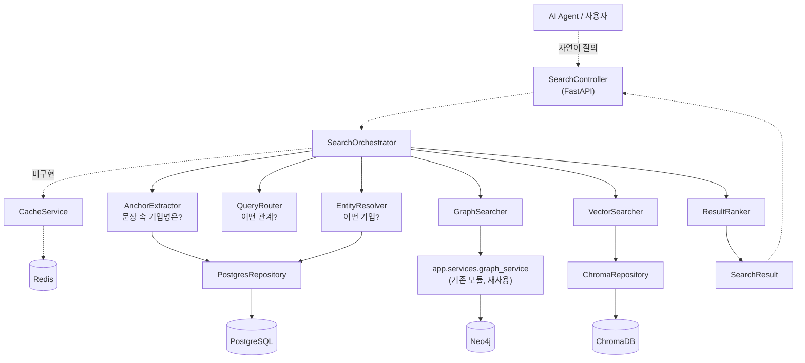
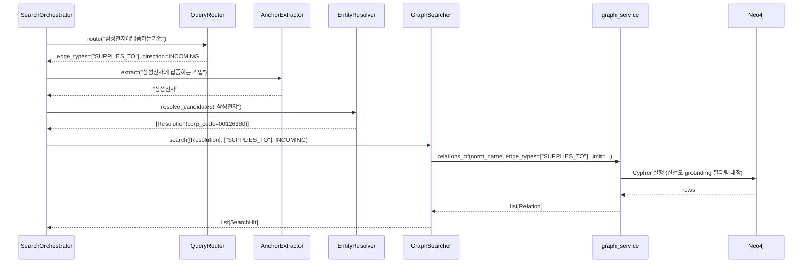

# BizNode Search Layer — 설계

> 이 문서는 **"어떻게 만들기로 했는가"만** 다룹니다. 실제로 어디까지 만들었는지·무엇이
> 미해결인지는 [`BizNode_Search_Layer_현황서.md`](BizNode_Search_Layer_현황서.md)를 보세요.

## 1. 개요

BizNode에는 기업명 해소(PostgreSQL), 그래프 관계 조회(Neo4j), 의미 검색(ChromaDB)이 각각
존재하지만, 이 셋을 하나의 검색 흐름으로 묶는 통합 진입점이 없었습니다. **Search Layer는
사용자(또는 AI Agent)의 자연어 질의 하나를 받아, 어떤 기업을 말하는지·어떤 관계를 찾는지
판단한 뒤 적절한 저장소를 조합해 하나의 결과로 돌려주는 계층**입니다.

```text
"삼성전자에 납품하는 기업은?"
    ↓
기업 식별(삼성전자) + 관계 파악(납품 → SUPPLIES_TO)
    ↓
Neo4j에서 관계 검색
    ↓
관련 기업 목록
```

새 검색 알고리즘을 만드는 것이 아니라, **이미 흩어져 있는 기능(이름 해소, 그래프 조회, 벡터
검색, 신선도/근거 검증)을 정해진 순서로 조합하고 공통 결과 형식으로 반환하는 것**이 이 설계의
핵심입니다.

---

## 2. 전체 구조



> 점선(`-.->`)은 아직 구현되지 않은 경로입니다 — SearchController와 CacheService는 설계만
> 있고 코드가 없습니다. 현재는 `SearchOrchestrator.search()`가 사실상의 진입점입니다.

### 실행 순서 원칙

- **EntityResolver는 조건부 선행**: `graph_service.relations_of()`나 ChromaDB `company` 컬렉션
  필터가 대부분 해소된 기업명(`norm_name`/`corp_code`)을 전제로 하므로, 기업명이 있는 질의는
  EntityResolver가 먼저 실행됩니다. 반대로 "HBM을 만드는 기업"처럼 특정 기업명이 없는 질의는
  EntityResolver가 결과 없이 스킵되고 VectorSearcher로 바로 갑니다.
- **AnchorExtractor는 EntityResolver 바로 앞**: EntityResolver는 넘겨받은 문자열 전체를
  기업명으로 취급하므로, "삼성전자에 납품하는 기업" 같은 문장을 그대로 넣으면 해소에
  실패합니다. AnchorExtractor가 문장에서 기업명 후보 1개를 먼저 잘라내고, 확신이 없으면
  아무것도 잘라내지 않아(`None`) 원문이 그대로 EntityResolver로 갑니다.
- **QueryRouter는 EntityResolver와 독립적으로 실행**됩니다 — 항상 `normalized_query` 원문
  전체를 보고 관계 키워드(`edge_type`)와 방향을 판단하며, EntityResolver의 결과를 입력으로
  받지 않습니다.
- **GraphSearcher와 VectorSearcher는 서로 독립**이라 병렬 실행 가능합니다(한쪽 결과가 다른 쪽
  입력이 되지 않음).
- **ResultRanker**는 GraphSearcher/VectorSearcher 결과를 모두 받은 뒤 실행됩니다.
- **CacheService**는 개별 컴포넌트가 아니라 Orchestrator 전체를 감싸는 진입/종료 지점입니다.

### 대표 검색 흐름 — 관계 검색 ("삼성전자에 납품하는 기업")



---

## 3. 저장소별 역할

| 저장소 | 역할 | 성격 |
|---|---|---|
| **PostgreSQL** | 기업명 해소(exact/fuzzy), 구조화 데이터 조회, `vector_chunks`를 통한 색인 관리 | 권위(authority) — 언제든 다시 만들 수 없는 원본 |
| **Neo4j** | 기업 간 관계 조회·확장(`graph_service`가 이미 신선도·근거검증 필터링까지 수행) | 파생(derived) — PostgreSQL로부터 재생성 가능 |
| **ChromaDB** | 의미 기반 검색 — `company`(회사 카드), `evidence`(근거 문장) 2개 컬렉션 | 파생(derived) |
| **Redis** | 검색 결과 캐시(저장소 아님) — 현재 실사용 없음, 1차 구현 후순위 | 캐시 전용 |

Search Layer는 저장소의 구현 세부를 노출하지 않습니다: `Agent → Search Tool → Search API →
SearchOrchestrator → Searcher → Repository → Storage` 순서를 반드시 지키며, AI Agent가 직접
Cypher나 ChromaDB `where` 조건을 만들지 않도록 합니다.

---

## 4. 주요 컴포넌트

| 컴포넌트 | 역할 | 입력 | 출력 | 코드 위치 |
|---|---|---|---|---|
| **SearchController** | HTTP 요청/응답 변환, 요청 검증 | HTTP `POST /api/search` body | HTTP response | `search/api/search_controller.py` *(미구현)* |
| **SearchOrchestrator** | QueryRouter → AnchorExtractor/EntityResolver → GraphSearcher/VectorSearcher → ResultRanker 전체 흐름 지휘 | `SearchRequest` | `SearchQuery`, `SearchResult` | `search/service/orchestrator.py` |
| **AnchorExtractor** | 자연어 문장에서 기업명(anchor) 후보 1개를 잘라냄. 확신 없으면 `None` | 원본 질의 문자열 | `Optional[str]` | `search/service/anchor_extractor.py` |
| **EntityResolver** | 기업명 문자열을 `corp_code`로 해소(exact/fuzzy 다중 후보) | 기업명 문자열 | `Resolution` 후보 리스트 | `search/service/entity_resolver.py` |
| **QueryRouter** | 정규화된 질의에서 관계(edge) 키워드와 방향을 감지 | `normalized_query` | `edge_types`, `direction` | `search/service/query_router.py` |
| **GraphSearcher** | 해소된 기업 + edge_types(+direction)로 Neo4j 관계 조회 → `SearchHit` 변환 | `Resolution` 목록, `edge_types`, `direction` | `SearchHit` 리스트 | `search/service/graph_searcher.py` |
| **VectorSearcher** | 질의를 임베딩해 `company`/`evidence` 컬렉션 의미 검색 → `SearchHit` 변환 | 질의 문자열, (선택) `corp_code` 선필터 | `SearchHit` 리스트 | `search/service/vector_searcher.py` |
| **ResultRanker** | 여러 소스의 `SearchHit`을 점수 정규화 후 병합·중복 제거·정렬 | `SearchHit` 리스트들 | 정렬된 `SearchHit` 리스트 | `search/service/result_ranker.py` |
| **CacheService** | `SearchQuery` → cache key 생성, Redis get/set | `SearchQuery`(+`SearchResult`) | `Optional[SearchResult]` | `search/service/cache_service.py` *(미구현)* |
| **PostgresRepository** | PostgreSQL 접근(이름 해소, 구조화 데이터, sector 필터) | 질의/조건 | `Resolution` 후보, 구조화 데이터 | `search/repository/postgres_repository.py` |
| **ChromaRepository** | ChromaDB 접근(company/evidence 검색, metadata filter) | 질의 텍스트, filter | raw 검색 결과 | `search/repository/chroma_repository.py` |
| **RedisRepository** | Redis get/set/TTL만 수행하는 얇은 어댑터 | key/value | — | `search/repository/redis_repository.py` *(미구현)* |

**Neo4jRepository는 별도로 두지 않습니다** — `app/services/graph_service.py`(기존 모듈)의
`relations_of()`가 이미 신선도·근거검증·점수 계산까지 포함한 서비스 로직이라, GraphSearcher가
이 함수를 **그대로 재사용**합니다(§6 핵심 설계 결정 참고).

---

## 5. 데이터 흐름

```text
SearchRequest (API 계약, Pydantic)
    │  query, entity_types?, edge_types?, top_k, include_evidence, filters?
    ▼
SearchQuery (내부 실행 컨텍스트, dataclass)
    │  raw_query, normalized_query, mode, resolved_entities, edge_types,
    │  direction, entity_types, top_k, include_evidence, filters, today
    ▼
QueryRouter / AnchorExtractor / EntityResolver / GraphSearcher / VectorSearcher
    │  각자 SearchHit 리스트 생성
    ▼
ResultRanker
    │  병합·중복 제거·정렬
    ▼
SearchResult (API 응답, Pydantic)
       query, hits: list[SearchHit], total, took_ms, cache_hit,
       used_semantic_fallback, warnings
```

### 핵심 DTO

| DTO | 성격 | 주요 필드 |
|---|---|---|
| `SearchRequest` | API 입력 계약(Pydantic) — 불변 | `query`, `entity_types`, `edge_types`, `top_k`, `include_evidence`, `filters` |
| `SearchQuery` | Orchestrator가 조립하는 내부 실행 컨텍스트(dataclass, Pydantic 아님) | `raw_query`, `normalized_query`, `mode`, `resolved_entities: list[Resolution]`, `edge_types`, `direction`, `today` |
| `SearchHit` | 모든 검색 결과의 공통 형태 | `entity_type`, `entity_id`, `name`, `score`, `sources`, `kind`, `freshness`, `verdict`, `relations`, `evidence` |
| `SearchResult` | API 최종 응답(Pydantic) | `query`, `hits`, `total`, `took_ms`, `cache_hit`, `used_semantic_fallback`, `warnings` |
| `Resolution` | 기업 해소 결과(기존 `pipeline/normalizer/resolver.py` 재사용) | `corp_code`, `corp_name`, `stock_code`, `method`("exact"\|"fuzzy"), `score` |

`SearchRequest`(API 계약)와 `SearchQuery`(내부 실행 컨텍스트)를 분리하는 이유: 전자는 외부에
노출되는 불변 스키마이고, 후자는 `resolved_entities`처럼 검색 실행 중에만 존재하는 상태를
담기 때문입니다. 섞으면 API 스키마가 내부 구현 세부에 오염됩니다.

---

## 6. 핵심 설계 결정

**현재 확정된 것만 정리합니다.** 미확정 항목은 [현황서의 "남은 작업/이슈"](BizNode_Search_Layer_현황서.md)를 보세요.

| 항목 | 결정 | 근거 |
|---|---|---|
| **그래프 조회** | `GraphSearcher`는 `app.services.graph_service.relations_of()`를 **그대로 함수 호출**한다. `Neo4jRepository`를 별도로 만들지 않는다. 같은 모듈의 `propagate_risk()`는 Event 검색용이라 이번 범위에서 쓰지 않는다 | `graph_service`가 이미 신선도(`freshness`)·근거검증(`grounding_verdict`)·확신도(`confidence`)·점수 계산을 전부 포함한 서비스 로직이다. 다시 만들면 필터링이 두 곳으로 갈라져 우회 위험이 생긴다 |
| **이름 해소** | `EntityResolver`는 `pipeline/normalizer/resolver.py`를 통째로 wrapping하지 않고 `Resolution` dataclass만 재사용, `PostgresRepository.resolve_candidates()`로 다중 후보를 새로 구현한다 | 기존 `resolve()`는 exact/fuzzy 모두 내부적으로 최적 1건으로 축약해 반환해 다중 후보가 필요한 검색 UX와 안 맞는다 |
| **검색 순서** | EntityResolver는 조건부 선행, GraphSearcher/VectorSearcher는 후행 | `relations_of()`/ChromaDB `where`가 이름 해소를 전제로 하는 경우가 많음 |
| **Graph/Vector 병렬 실행** | 가능 | 한쪽 결과가 다른 쪽 입력이 아님 |
| **질의 라우팅(QueryRouter)** | 조사 패턴 기반 키워드 매핑 — `SUPPLIES_TO`/`OWNS_STAKE_IN`/`SUES`는 방향까지, 나머지 9종은 대표 키워드 1개씩만 얕게 매핑 | 처음부터 LLM 라우터를 만들기보다 실제 질의 데이터를 기준으로 확장 |
| **Anchor 없는 관계 검색** | 특정 기업이 해소되지 않은 질의(`norm_name=None`)는 source 최대 5 + target 최대 5 = 최대 10건을 반환, 한쪽만 임의로 고르지 않는다 | 방향을 판별할 기준(anchor)이 없으므로 양쪽 다 후보로 취급해야 함 |
| **Ranking** | **RRF(Reciprocal Rank Fusion)로 병합한다** — `score(entity) = Σ 1/(60 + rank_s(entity))`. 소스 점수를 그대로 쓰는 가중합은 기각 | Neo4j 관계 점수와 Chroma 유사도는 스케일·의미가 달라 가중합하면 실제보다 정밀해 보이는 착시가 생긴다. 근거 있는 가중치 값도 없다 |
| **Chroma 유사도 환산** | `company` 컬렉션은 l2(제곱 유클리드) metric이므로 `score = 1 - distance²/4`(임베딩이 단위벡터임을 실측 확인) | 컬렉션 생성 시 `hnsw:space`를 지정하지 않아 ChromaDB 기본값 `l2`가 적용됨(실측). 흔히 쓰는 `1-distance`는 cosine metric 전제라 여기선 틀린 값이 나온다 |
| **CacheService 경계** | Orchestrator 전체를 감싸는 cross-cutting 캐시(개별 Searcher별 캐시 아님) | 구현 단순, EntityResolver는 이미 자체 프로세스 캐시 보유 |
| **Agent Tool 구조** | 여러 tool(`search_company`/`search_relationship`/`search_semantic`/`search_evidence`)로 노출하되 내부는 공통 `SearchOrchestrator` 공유. `search_evidence`만 Orchestrator 우회(팩트체크 목적, 랭킹 불필요) | `batch/audit/queries.py`의 Cypher 6종이 이미 "목적별로 분리된 질의 패턴"의 프로토타입 |
| **검색 범위** | Person/Event/Product 이름·벡터 검색은 이번 범위에서 제외 | pg_trgm 인덱스·Neo4j 인덱스·벡터 컬렉션이 전부 Company에만 존재 |
| **evidence 처리** | evidence 텍스트는 항상 "인용할 데이터"로 취급하고 시스템 지시문과 섞지 않는다 | 뉴스 원문 인용이라 프롬프트 인젝션 표면이 될 수 있음 |
| **검증 필터 우회 방지** | GraphSearcher가 임의 Cypher를 실행하지 않고 반드시 `graph_service`를 거치도록 강제 | CLI 도구가 필터링 없이 원본을 직접 조회하는 기존 경로가 있어, 검색 API가 이를 복붙하면 근거검증이 빠진 채 배포될 위험이 실제로 있었음 |
| **ChromaDB 배열 필터(VectorSearcher 구현 시 필수)** | `company` 컬렉션의 `sector`는 배열을 문자열로 접어 저장하므로 ChromaDB `where`로 "반도체 AND 로봇" 같은 교집합 조건을 표현할 수 없다. `sector`/`etf_list` 같은 배열 필드가 조건에 있으면 **PostgresRepository가 `companies.sector`(JSONB GIN)로 먼저 `corp_code` 목록을 거른 뒤, `ChromaRepository.search_company(..., corp_codes=[...])`로 전달**한다(2단계 조합은 배열 필드가 필터 조건에 있을 때만 필요, 단순 의미 검색은 1단계 생략) | ChromaDB 메타데이터가 스칼라만 지원 |

### 6-1. 분기 규칙과 대표 질의

**분기는 QueryRouter가 관계 키워드를 찾았는지(`edge_types` 유무)로만 결정합니다.** 검색
결과의 유무로는 분기하지 않습니다.

```text
edge_types 있음 ─→ GraphSearcher만 실행                         → mode=RELATIONSHIP
                   (0건이어도 VectorSearcher로 넘어가지 않음)
edge_types 없음 ─┬ EntityResolver가 기업 1건으로 확정 → 그 기업만 반환 → mode=NAME
                 └ 해소 실패                        → VectorSearcher  → mode=SEMANTIC
```

**"결과가 없으면 의미검색으로 폴백"은 채택하지 않았습니다.** 실측에서 "삼성전자에 납품하는
기업"을 VectorSearcher에 넣으면 실제 공급사는 0건이고 삼성전자 자신의 계열사·지사만
나왔습니다 — 관계 질의에 의미검색 결과를 섞으면 없는 관계를 있는 것처럼 보여주게 됩니다.
결과가 적더라도 "결과 없음"을 그대로 보여주는 쪽을 택합니다.

| 질의 | edge_types | mode | 주 호출 경로 |
|---|---|---|---|
| `"삼성전자"` | — | NAME | EntityResolver만으로 즉시 hit 구성 |
| `"HBM을 만드는 기업"` | — | SEMANTIC | 해소 실패 → VectorSearcher(`company` 컬렉션) |
| `"삼성전자에 납품하는 기업"` | `SUPPLIES_TO` | RELATIONSHIP | AnchorExtractor("삼성전자") → EntityResolver → GraphSearcher(direction=INCOMING) |
| `"삼성전자 최근 투자 기업"` | `OWNS_STAKE_IN` | RELATIONSHIP | 위와 동일, direction=None(양방향) |
| `"최근 소송 관련 기업"` | `SUES` | RELATIONSHIP | anchor 없음 → GraphSearcher가 source 5 + target 5 반환 |

> `SearchMode.HYBRID`는 이 규칙으로는 생성되지 않는 미사용 값입니다. 실제로 쓸지 여부는
> [현황서의 미해결 이슈](BizNode_Search_Layer_현황서.md)를 보세요.

---

## 7. API 설계 (SearchController 구현 시 기준)

```http
POST /api/search
Content-Type: application/json
```

```json
// Request
{
  "query": "삼성전자에 납품하는 기업",
  "edge_types": ["SUPPLIES_TO"],
  "top_k": 10,
  "include_evidence": true
}
```

```json
// Response
{
  "query": "삼성전자에 납품하는 기업",
  "hits": [
    {
      "entity_type": "Company", "entity_id": "00164742", "name": "세메스",
      "score": 0.0164, "sources": ["neo4j"],
      "freshness": { "status": "current" }, "verdict": "supported",
      "relations": [{ "edge_type": "SUPPLIES_TO", "target": "삼성전자" }],
      "evidence": [{ "evidence_id": "ev_599ae4f46bf15b7c" }]
    }
  ],
  "total": 1, "took_ms": 42, "cache_hit": false, "warnings": []
}
```

**구현 전에 정해야 할 것 2가지**(자세한 내용은 현황서의 미해결 이슈 참고):

- `score`는 **RRF 순위값**(1위 ≈ 0.0164)이지 유사도·확률이 아닙니다. 위 예시 값이 작아 보이는
  이유이며, 이 값을 그대로 노출할지·순위로 바꿔 노출할지 결정이 필요합니다.
- 요청 body의 `edge_types`는 현재 `SearchOrchestrator`가 읽지 않습니다 — 관계 판정은 전적으로
  QueryRouter가 질의문에서 합니다. `entity_types`/`filters`도 `SearchQuery`에 담기기만 하고
  아직 어떤 Searcher도 사용하지 않습니다.

| 상황 | HTTP status |
|---|---|
| 요청 검증 실패(`query` 누락 등) | 422 |
| `top_k` 상한 초과 등 값 오류 | 400 |
| DB 연결/검색 장애 | 503(내부 구조는 응답 본문에 노출 안 함, 로그에만) |
| 검색 결과 없음 | 200(`hits: []`, `total: 0` — 오류 아님) |
| 전체 timeout | 504 |

---

## 8. 관련 코드 — 재사용하는 기존 모듈

Search Layer가 **다시 구현하지 않고 그대로 가져다 쓰는** 코드입니다.

| 기존 코드 | 위치 | 재사용하는 곳 | 재사용 방식 |
|---|---|---|---|
| `Resolution` dataclass | `pipeline/normalizer/resolver.py` | EntityResolver, PostgresRepository | 이름 해소 결과 타입만 재사용(알고리즘은 재사용 안 함, §6) |
| `normalize_company_name()` | `pipeline/normalizer/base.py` | GraphSearcher, VectorSearcher, PostgresRepository | 기업명 정규화, 영문 alias 처리 |
| `is_generic_name()` | `pipeline/normalizer/generic_names.py` | AnchorExtractor | "기업"/"업체" 같은 일반명사를 anchor 후보에서 사전 제외 |
| `relations_of()` / `Relation` | `app/services/graph_service.py` | GraphSearcher | 그대로 호출 — 신선도·근거검증·점수 계산 재사용 |
| `EDGE_TYPES` | `pipeline/ontology.py` | `SearchRequest` | 엣지 12종 정의, `edge_types` 값 검증과 QueryRouter 키워드 매핑의 근거 |
| `NODE_TYPES` | `pipeline/validators/matrix.py` | `search/model/enums.py` | `EntityType` 값이 이 상수와 일치하도록 assert로 강제 |
| `VectorStore` Protocol / `ChromaStore` | `pipeline/vectorstore/` | ChromaRepository | 이 Protocol에 의존해 임베딩·query 재사용(Qdrant 전환 대비 추상화) |
| `fetch_texts()` | `pipeline/importer/evidence.py` | ChromaRepository | evidence_id 배열 → 본문 일괄 조회 |

`assess()`(`pipeline/freshness.py`)는 Search Layer가 직접 부르지 않습니다 — `graph_service`가
내부에서 호출해 `Relation.freshness`를 채우고, GraphSearcher는 그 값을 그대로 옮깁니다.
