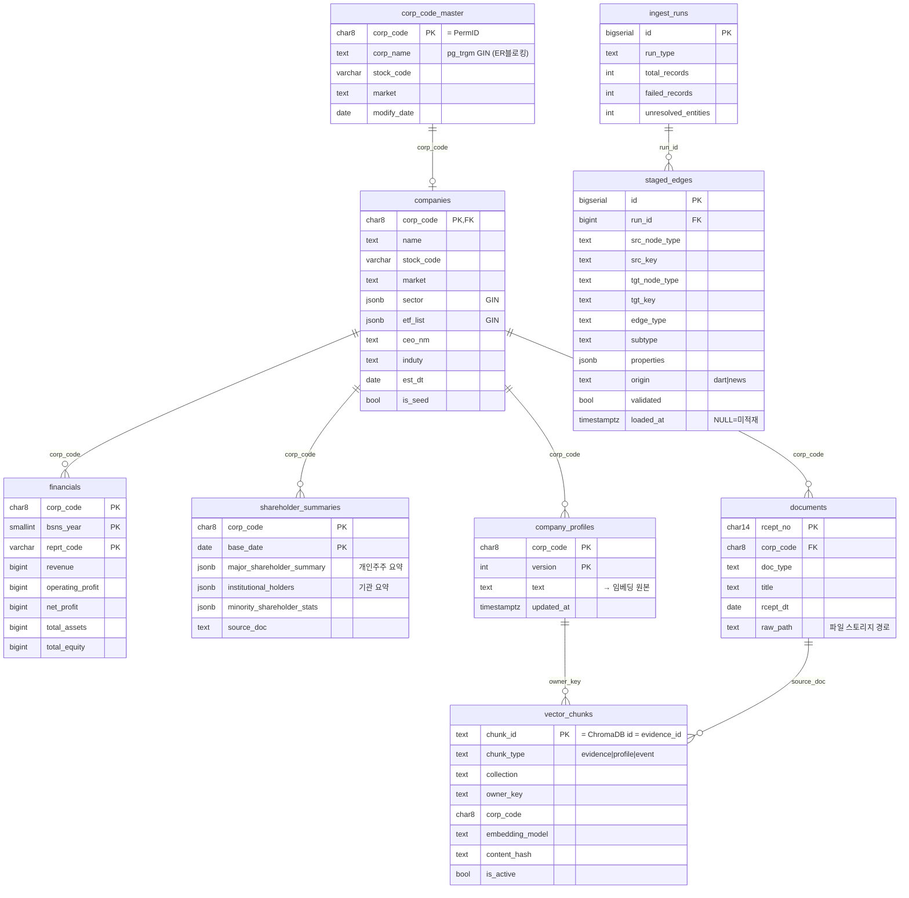
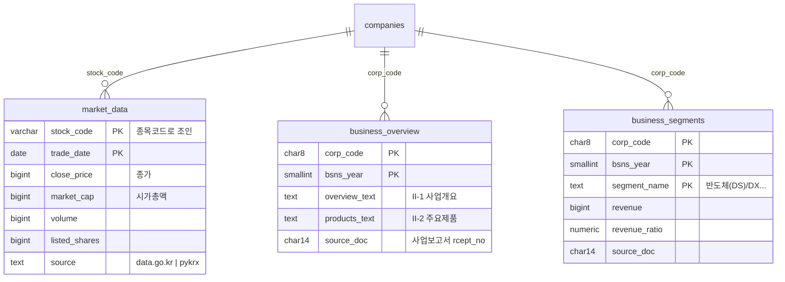
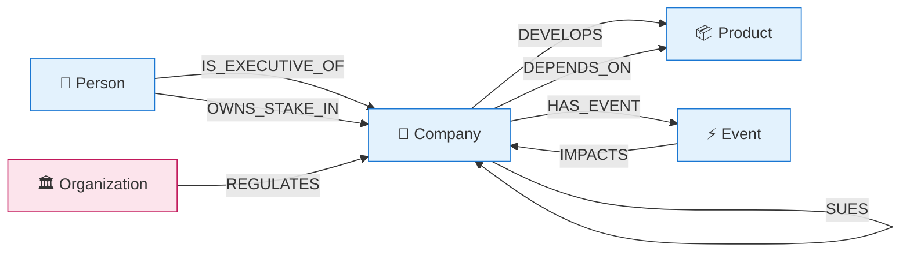
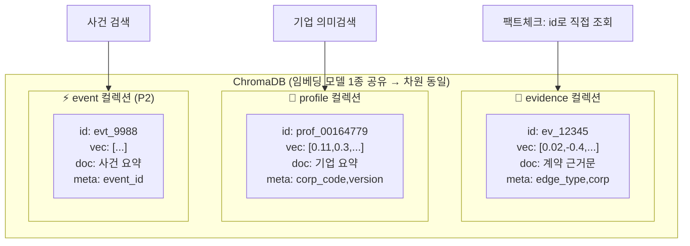
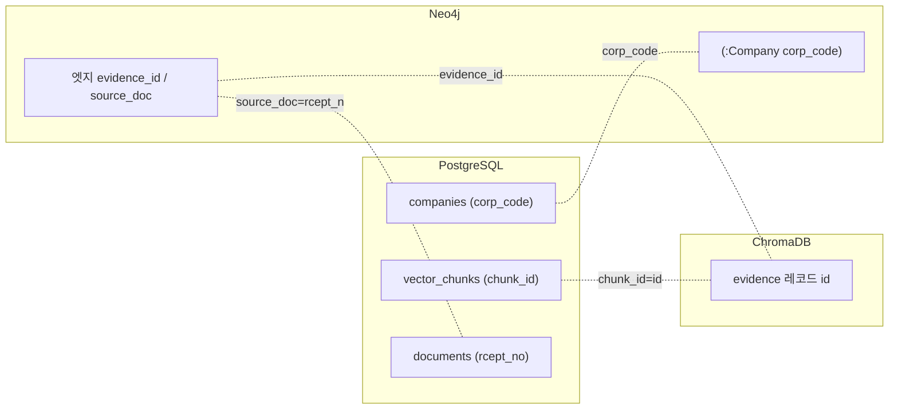

# BizNode 데이터베이스 ERD 및 구조 설명

> 4개 저장소의 데이터 형태를 도식화한다. (VSCode 마크다운 미리보기에서 mermaid 렌더링)
> 실선 = 현재 구현됨 · 점선(⬚) = 확장 예정(미구현)

---

## 핵심 경계선 — 무엇이 어디로 가는가

| 데이터 성격 | 저장소 | 예 |
|---|---|---|
| 기업의 **정량·서술 속성** (한 기업에 종속) | **PostgreSQL** | 재무, 주가, 대표자, 사업개요 텍스트, 지분요약 |
| 기업 **간의 관계** (두 개체를 잇는 것) | **Neo4j** | 공급, 지분, 경쟁, 임원, M&A |
| 관계·기업의 **의미 검색용 근거** | **ChromaDB** | 계약 근거 문장, 기업 프로파일 요약 |
| **순간적·수명 짧은** 값 | **Redis** | API 호출 카운터, 수집 큐 |

> ★ **"경쟁사"는 PostgreSQL이 아니라 Neo4j다.** 경쟁은 두 기업을 잇는 *관계*(`COMPETES_WITH` 엣지)지 삼성전자의 *속성*이 아니다. 기업 상세 페이지에서 "주요 경쟁사"를 보여줄 땐 Neo4j를 1-hop 조회한다. 이 구분이 방법서 설계 원칙의 핵심이다("관계는 그래프, 속성은 RDB").

---

# 1. PostgreSQL ERD

## 1-1. 현재 스키마 (9종)



## 1-2. "딥한 기업 정보" 커버리지 점검

말씀하신 항목별로 현재 담기는지 정직하게 정리한다.

| 원하는 정보 | 현재 | 위치 | 판단 |
|---|---|---|---|
| **재무 정보** | ✅ | `financials` (시계열) | 담김 |
| **기업 개요** (대표·업종·설립) | ✅ 부분 | `companies` | 기본은 담김. 주소·홈페이지·직원수 등은 컬럼 추가 여지 |
| **사업 개요** (서술) | ⚠️ | `company_profiles`(요약·임베딩) + `documents`(원문) | 텍스트로는 담김. **구조화(사업부문별 매출)는 아직 없음** |
| **시장 정보** (주가·시가총액) | ❌ | — | **미모델링.** 방법서는 "RDBMS가 주가 보유"라 함 → `market_data` 필요 |
| **신용/리스크** | ❌ | — | **미모델링.** 아래 1-4 참조 |
| **경쟁사** | ⚠️ 위치 다름 | **Neo4j** `COMPETES_WITH` | 설계상 그래프. RDB에 넣지 않음 |

→ **결론: 현재 9종은 "마스터·재무·지분요약·원문·프로파일"까지는 담지만, "주가·신용·사업부문 구조"는 아직 없다.** 아래 확장 레이어로 채운다.

## 1-3. 확장 테이블 (확정, 소스별 도입 시점 상이)



| 확장 테이블 | 데이터 소스 | 키 | 도입 시점 |
|---|---|---|---|
| `market_data` (일별 종가·**시총** 시계열) | **KIS OpenAPI 일별시세** (또는 초기 backfill은 pykrx) | `stock_code` | **Sprint 4+ 서빙** |
| `business_overview` (사업개요·현황) | 사업보고서 II-1/II-2 (경로 C) | `corp_code` | **Sprint 3** |
| `business_segments` (사업부문 매출) | 사업보고서 II-4 (경로 C) | `corp_code` | **Sprint 3** |

> `market_data`는 `stock_code` 기준(주가 API가 종목코드 기반) → `companies.stock_code`로 조인. Company 노드의 `market_cap_snapshot`은 이 테이블 최신 행에서 채운다.

### 주가 소스 결정 (Sprint 4+ 서빙 계층) — 2계층 분리

"주가"는 두 개의 다른 니즈다. 분리해서 다룬다.

| 니즈 | 무엇 | 신선도 | 저장 | 소스 |
|---|---|---|---|---|
| **A. 일별 종가·시총 시계열** | 주가 차트(일봉)·시총 추이 | EOD 배치 1회/일 | PostgreSQL `market_data` | KIS 일별시세 / 초기 pykrx |
| **B. 현재가(지연) 스냅샷** | 상세 패널 "현재가"·노드 `market_cap_snapshot` | **15분 TTL 캐시** | Redis `price:current:{stock_code}` | KIS 현재가 REST |

- **소스=KIS OpenAPI로 통일**: data.go.kr·pykrx는 EOD만 되고 **현재가(B)를 못 함**. KIS는 A+B 둘 다 + 깔끔한 JSON + 캐싱 통제. 대가는 **계좌 개설 + OAuth 토큰 관리**.
- **★재배포 라이선스**: 실시간 시세를 화면에 그대로 재배포하면 KRX 규정 위반. **15분 지연 캐시가 표준 회피책**(지연 데이터는 통상 재배포 허용). 상용화 시 KIS 약관 확인.
- **주가는 그래프 추론에 안 쓰인다** — 기업상세 페이지용. P1 코어 아님. `market_data`는 스키마만 두고 서빙 스프린트에서 채운다.

## 1-4. 신용/리스크는 RDB에 두지 않는다 (확정)

`신용/리스크`를 컬럼으로 생각하기 쉽지만 RDB 대상이 아니다.

| 종류 | 성격 | 처리 |
|---|---|---|
| **외부 신용등급** (NICE AA+ 등) | 정적 팩트, 유료·외부 소스 | **P2 이후** (필요 시 별도 테이블). P1 범위 밖 |
| **N차 연쇄 리스크** (BizNode 핵심) | **그래프에서 실시간 계산** | 저장 안 함 — Neo4j 다중홉 탐색 결과 |

→ "삼성전자 리스크 점수"를 컬럼에 박지 않는다. **"공장 화재 시 3단계 파급"은 질의 시점에 Neo4j를 탐색해 산출**한다(방법서 핵심 차별점). 정적 저장하면 관계가 바뀔 때마다 재계산해야 하고, 그게 곧 그래프의 역할이다.

---

# 2. Neo4j 그래프 스키마

RDB의 ERD에 대응하는 것이 그래프에선 **메타모델**(어떤 노드가 어떤 엣지로 연결 가능한가)이다.

## 2-1. 노드-엣지 메타모델 (허용 매트릭스)



> `⇄` = 대칭 엣지(id 작은 쪽→큰 쪽 단방향 저장). 실선=P1, 점선=P2(뉴스 필요).

## 2-2. 노드별 속성 (속성 점검 반영)

**모든 노드 공통:** 안정적 MERGE 키 + `last_seen`. 정량 시계열은 넣지 않는다(RDB 담당).

### Company

| 속성 | 채우는 소스 | 비고 |
|---|---|---|
| `corp_code` (UNIQUE=PermID) | corpCode.xml | resolved 노드의 키. **stub은 null** |
| **`norm_name`** 🆕 | 정규화 | ★**stub 병합 키.** corp_code=null인 미매칭 노드는 이걸로 MERGE (안 그러면 "삼성전자"/"삼성전자(주)" 분열) |
| `name` · `stock_code` · `market` | 기업개황 | 표시·필터 |
| `name_en` 🆕 | 기업개황 `corp_name_eng` | P2 뉴스 ER 앵커 |
| `aliases[]` 🆕 | 축적 | ER 정답셋 (P1부터 수집) |
| `sector[]` · `etf_list[]` | 시드 JSON | 프론트 필터 |
| `is_seed` | 시드 대조 | 처음 정한 64개인가 (수집 깊이 책임) |
| `is_stub` | 파이프라인 | 상세 없는 껍데기인가 (깊이 축) |
| `resolution_status` | 매칭 결과 | corp_code 매칭됐나 — resolved/unresolved (식별 축) |
| `lifecycle_status` 🆕 | ACQUIRES 처리 | active/absorbed/delisted — 현실의 회사 존속 상태(수집상태와 다른 축). 피인수 노드 흐리게 렌더링 |
| `revenue_snapshot` | 주요계정 fnltt | 표시용 1값 (§6-2) |
| `market_cap_snapshot` ⬚ | **DART 불가** | 시가총액은 KRX/data.go.kr 필요 → `market_data` 도입 후 (§1-3) |
| `last_seen` · `first_seen` 🆕 | 파이프라인 | 신선도·프로비넌스 |

> **상태 플래그 3축 (직교):** `is_seed`=시드 여부 / `resolution_status`=식별(corp_code) / `is_stub`=깊이(상세유무). 예) 삼성디스플레이는 corp_code 매칭됨(resolved)이지만 상세 미수집이라 stub. "매칭됨 ≠ 상세 있음". stub 중 빈출 기업을 2차 시드로 승격(§6).

### Person — 식별자에서 "소속" 제거 (겸직 대응)

| 속성 | 비고 |
|---|---|
| **`person_key`** 🆕 | ★MERGE 키 = `hash(name + birth_year_month)`. birth_ym 없으면 name+최초소속 폴백 |
| `name` · `birth_year_month` · `gender` | 임원 API |

> ⚠️ **소속을 식별자로 쓰지 않는다.** 겸직 임원(삼성전자+삼성SDS 이사)을 "이름+소속"으로 키잡으면 한 사람이 2노드로 분열 → "이 인물 관여 회사 전체" 질의 불가. 소속은 `IS_EXECUTIVE_OF` **엣지**로 표현한다. 경력·직위(`main_career`·`position`·`duty`)도 회사마다 다르므로 엣지 속성.

### Event — 근거·생명주기 보강

| 속성 | 비고 |
|---|---|
| `event_id` · `event_type` · `title` · `occurred_at` · `sign` | 경로 B 공시 |
| `source_doc` 🆕 · `evidence_id` 🆕 | ★근거 공시(rcept_no) + ChromaDB `event` 청크 FK — Event도 팩트체크 대상 |
| `confidence` 🆕 · `status` 🆕 | DART=1.0 / 소송·회생 진행중·종결 |
| `grade`(P2) · `last_seen`(P2) | TTL·롤업 |

### Product / Organization (P1 스키마, 데이터는 Sprint3·P2)

| 노드 | 속성 |
|---|---|
| **Product** | `norm_name` 🆕(병합 키) · `name` · `category` · `aliases[]` |
| **Organization** | `norm_name` 🆕 · `name` · `org_type`(규제기관/정부/협회) |

> **재무 스냅샷 주의(§6-2):** Company 노드엔 최근 매출·시총 **1개 값**만. 전체 시계열은 `financials`. 노드에 분기별 재무를 다 넣으면 갱신마다 그래프가 변하고 서브그래프 페이로드가 커진다.

## 2-3. 엣지 속성 (점검 반영 — 시점을 3층으로 재구조화)

**상태 엣지와 사건 엣지는 시점 속성이 다르다.** 이를 섞으면 안 된다.

```
┌─ 공통 (전 엣지) ─────────────────────────────────
│ subtype       L3 뉘앙스 ("파운드리_위탁생산")
│ direction     outbound / symmetric
│ confidence    DART=1.0, 뉴스=LLM점수
│ source_type   dart / news
│ source_doc    원문 FK (rcept_no)
│ evidence_id   ★ChromaDB 청크 FK
│ created_at    🆕 적재 시각 (감사·증분용, valid_from과 다름)
├─ 상태 엣지 전용 (SUPPLIES_TO, OWNS_STAKE_IN, PARTNERS_WITH...) ─
│ valid_from    관계 시작일
│ valid_until   만료일 (P1은 null)
│ last_seen     최근 언급일 → 신선도
│ is_current    현재 유효 여부
├─ 사건 엣지 전용 (ACQUIRES, SUES, HAS_EVENT, IMPACTS) ─
│ occurred_at   🆕 ★발생 시점 (시작~종료 아님. valid_from과 구분 필수)
│ sign          IMPACTS 전용 (positive/negative/neutral)
├─ 엣지별 전용 ───────────────────────────────────
│ revenue_ratio,  SUPPLIES_TO 전용 (매출 의존도)
│ contract_amount 🆕 SUPPLIES_TO 전용 (확정 계약금액, 방법서 §7)
│ ratio, purpose  OWNS_STAKE_IN 전용 (지분율·출자목적)
│ status          ACQUIRES 전용 (absorbed/subsidiary)
└─────────────────────────────────────────────────
```

> **`level_1_category`는 엣지에 저장하지 않는다.** `edge_type → L1`은 고정 매핑(12→5)이므로 **직렬화 시 백엔드가 주입**한다(방법서 §2-1). 저장하면 중복 + 매핑 변경 시 전 엣지 마이그레이션.
> **`evidence_id` 복수화(P2):** 같은 관계가 여러 공시로 재확인되면 근거가 여럿. P1(DART)은 대개 1건이라 단수, P2에서 `evidence_ids[]` 승격.

## 2-4. 실제 인스턴스 예시

```cypher
(:Company {corp_code:"00126380", name:"삼성전자", sector:["반도체","로봇"]})
  -[:SUPPLIES_TO {subtype:"파운드리_위탁생산", revenue_ratio:0.30,
                  valid_from:"2025-12-19", is_current:true, confidence:1.0,
                  source_type:"dart", source_doc:"20251219000123",
                  evidence_id:"ev_12345"}]->
(:Company {corp_code:"00164779", name:"SK하이닉스"})
```

## 2-5. 식별자·제약·MERGE 전략 (점검 반영)

속성을 "무엇으로 유일하게 식별하고 중복을 막는가". 여기가 노드 분열·중복 엣지 버그의 발원지다.

### 노드 MERGE 키

| 라벨 | resolved MERGE | stub MERGE | 제약 |
|---|---|---|---|
| Company | `{corp_code}` | `{norm_name}` (corp_code=null) | `corp_code` UNIQUE |
| Person | `{person_key}` | — | `person_key` UNIQUE |
| Product | `{norm_name}` | — | `norm_name` UNIQUE |
| Event | `{event_id}` | — | `event_id` UNIQUE |
| Organization | `{norm_name}` | — | `norm_name` UNIQUE |

### 엣지 MERGE 키 (성격별)

| 성격 | 엣지 | MERGE 키 | 재유입 |
|---|---|---|---|
| 상태 | SUPPLIES_TO·OWNS_STAKE_IN·PARTNERS_WITH·DEVELOPS·DEPENDS_ON | `(src,tgt,type,subtype)` | ON MATCH `last_seen` |
| 사건 | ACQUIRES·SUES·HAS_EVENT·IMPACTS | `(src,tgt,type,source_doc)` ★ | 재적재 멱등 |

### ★ 이슈 3가지 (적재 로직에 반영 필요)

1. **Stub 승격 3단 매칭** — norm_name stub이 나중에 corp_code를 얻을 때 노드가 분열되지 않도록: ①corp_code MATCH → ②norm_name stub MATCH 후 corp_code SET(승격) → ③없으면 CREATE. 스키마가 아니라 **적재 로직** 문제(Sprint 1).
2. **사건 엣지 멱등성** — "항상 CREATE"는 공시 1회 처리 가정. `staged_edges` 재적재 대비 `source_doc`을 MERGE 키에 포함(같은 공시=같은 엣지).
3. **Sector 필터는 PostgreSQL** — `sector`는 배열이라 Neo4j 인덱스가 멤버십 검색에 약함. `companies.sector` JSONB GIN이 담당. **방법서 §11의 company_sector 인덱스는 만들지 않는다.** Neo4j sector는 표시용.

### Neo4j DDL (제약·인덱스)

```cypher
// 노드 고유성 제약
CREATE CONSTRAINT company_corp_code IF NOT EXISTS FOR (c:Company)      REQUIRE c.corp_code  IS UNIQUE;
CREATE CONSTRAINT person_key        IF NOT EXISTS FOR (p:Person)       REQUIRE p.person_key IS UNIQUE;
CREATE CONSTRAINT product_norm_name IF NOT EXISTS FOR (p:Product)      REQUIRE p.norm_name  IS UNIQUE;
CREATE CONSTRAINT event_id          IF NOT EXISTS FOR (e:Event)        REQUIRE e.event_id   IS UNIQUE;
CREATE CONSTRAINT org_norm_name     IF NOT EXISTS FOR (o:Organization) REQUIRE o.norm_name  IS UNIQUE;

// 조회 인덱스 (sector는 제외 — PostgreSQL 담당)
CREATE INDEX company_norm_name IF NOT EXISTS FOR (c:Company) ON (c.norm_name);  // stub 매칭·ER
CREATE INDEX company_name      IF NOT EXISTS FOR (c:Company) ON (c.name);       // 검색
CREATE INDEX person_name       IF NOT EXISTS FOR (p:Person)  ON (p.name);

// 관계 속성 인덱스 (신선도·subtype 필터) — 상태 엣지 타입별로 반복
CREATE INDEX rel_supplies_current IF NOT EXISTS FOR ()-[r:SUPPLIES_TO]-()   ON (r.is_current);
CREATE INDEX rel_owns_subtype     IF NOT EXISTS FOR ()-[r:OWNS_STAKE_IN]-() ON (r.subtype);
// SUPPLIES_TO·OWNS_STAKE_IN·PARTNERS_WITH 등 빈번 조회 엣지에 반복 생성
```

## 2-6. Stub 생명주기와 승격 (확장성 핵심)

**승격은 독립된 2단계다** — 한 번의 전환이 아니다.

```
축 A 식별(Identity)  : corp_code 부여      (ER, 저렴)
축 B 보강(Enrichment): DART 상세 수집       (API 호출, 비쌈)
```

### 노드 3-상태

| 상태 | is_stub | resolution | corp_code | 식별 키 |
|---|---|---|---|---|
| `stub_unresolved` | true | unresolved | null | `norm_name` |
| `stub_resolved` | true | resolved | 값 | `corp_code` |
| `full` | false | resolved | 값 | `corp_code` |

> 국내 상장사는 적재 시 corp_code가 매칭돼 곧장 `stub_resolved`로 태어난다. `stub_unresolved`는 해외·비상장·오타만 → **식별 승격 대상은 소수**.

### 식별 승격 — 엣지 보존이 핵심

`stub_unresolved → stub_resolved`에서 stub엔 이미 엣지가 붙어 있다. 순진하게 `MERGE {corp_code}`하면 빈 새 노드 생성 + 엣지 고아. **금지.**

- **canonical(해당 corp_code 노드) 없음** → stub 제자리에 corp_code SET (엣지 그대로)
- **canonical 있음** → `apoc.refactor.mergeNodes([canonical, stub])`로 엣지 이동 후 stub 흡수

### 확장성 원칙 6

1. corp_code=영구 식별자, norm_name=임시 다리 (resolved 후 norm_name 키잡 금지)
2. 제자리 승격 — 삭제·재생성 금지 (엣지 보존)
3. 충돌은 병합 (apoc.refactor.mergeNodes)
4. **식별(ER)과 보강(DART)을 다른 큐로 분리**
5. 멱등 — 승격 잡 반복 안전
6. PostgreSQL corp_code_master가 ER 권위

### 승격 트리거 (확장 단계, P1 미구현)

| 트리거 | 동작 |
|---|---|
| ① 배치 재ER | unresolved stub을 주기적으로 재매칭 (last_attempt backoff) |
| ② 빈도 기반 | `staged_edges` 미매칭 빈출 target → 2차 시드 → 보강 (§6) |
| ③ 온디맨드(Tier3) | 사용자 stub 클릭 → Redis 큐 → 백그라운드 보강 |

> **P1은 ①②③ 미구현** — stub 그대로, seed만 보강. `norm_name`·`is_stub`·`resolution_status`·`staged_edges`를 P1부터 넣는 이유가 "나중에 이 승격을 받기 위한 자리 확보"다.

### stub과 GraphRAG 추론 품질 (놓치기 쉬움)

stub은 속성이 얇지만 추론이 애매해지지 않는다. 이유:
1. **의미는 엣지가 나른다** — 경로 추론에 필요한 건 노드 속성이 아니라 엣지(subtype·revenue_ratio·evidence_id). B가 텅 비어도 "소재공급 의존도 40%"는 엣지에 있음.
2. **stub의 문맥 = 엣지 근거들의 합집합** — B에 닿은 모든 evidence 청크(metadata `source_corp`/`target_corp`로 조회)를 모으면 프로파일 없이도 문맥 재구성.
3. **구조(degree) 자체가 정보** — "B는 3곳에 납품" 은 속성 0개여도 도출.

**단, stub 자체 심층 질문(재무 등)은 얕다 → 지어내지 말고 "정보 불완전" 표시.** GraphRAG 에이전트에 `is_stub`·`resolution_status`·`confidence`를 넘겨 답을 calibrate한다. 이게 환각 통제(XAI)의 일부이자 Tier3 승격 신호.

---

# 3. ChromaDB 구조 — "몇 개의 벡터 공간인가"

## 3-1. 답: 컬렉션 = 벡터 공간. 우리는 3개를 쓴다

ChromaDB의 저장 단위는 **컬렉션(collection)**이고, **컬렉션 하나가 독립된 벡터 공간(=독립 인덱스)**이다. 하나의 거대한 공간이 아니라 **용도별로 3개의 분리된 공간**을 둔다.



## 3-2. 왜 하나로 안 합치고 3개로 나누는가

| 이유 | 설명 |
|---|---|
| **검색 오염 방지** | 근거 문장을 찾는데 기업 요약이 섞여 나오면 안 된다. 컬렉션이 분리되면 애초에 안 섞인다 |
| **조회 방식이 다름** | evidence는 대개 `id`로 직접 조회(팩트체크), profile은 벡터 유사도 검색. 성격이 다르다 |
| **인덱스가 작아짐** | 각 공간이 작을수록 검색이 빠르다 |
| **레지스트리 정합** | `vector_chunks.collection` 컬럼이 이 3개를 가리킨다 |

## 3-3. 임베딩 모델은 공유한다

3개 컬렉션은 **분리된 공간이지만 같은 임베딩 모델**을 쓴다(차원 동일). 모델이 다르면 벡터 차원이 안 맞아 관리가 복잡해진다. `vector_chunks.embedding_model` 컬럼이 어떤 모델로 임베딩했는지 기록해, 모델 교체 시 재임베딩 대상을 특정한다.

## 3-4a. 컬렉션별 메타데이터 스키마 (필터 조건)

**`evidence`** (조회: id 직접 / 기업·엣지타입 필터+의미검색)
```
edge_id str · edge_type str★ · subtype str · source_corp str★(corp_code) ·
target_corp str · rcept_no str · occurred_at int(YYYYMMDD)★ · source_type str
```
**`profile`** (조회: 기업 의미검색)
```
corp_code str★ · version int · updated_at int(YYYYMMDD)
```
**`event`** (P2)
```
event_id str · corp_code str★ · event_type str · occurred_at int · sign str
```
(★ = 주 필터 키)

### ★ 제약: metadata는 배열 불가 → sector 필터는 PostgreSQL 선행

ChromaDB metadata 값은 스칼라(str/int/float/bool)만. `sector`(배열) 필터 불가.
→ "반도체 기업 프로파일" = ① PostgreSQL `sector @> '"반도체"'`로 corp_code 리스트 → ② ChromaDB `where={"corp_code":{"$in":[...]}}` + 의미검색. (Neo4j sector 필터를 PG로 넘긴 것과 동일 패턴)
날짜 범위 필터용으로 `occurred_at`은 **int YYYYMMDD** 저장.

### 임베딩 모델
OpenAI `text-embedding-3-small`(1536d) 권장. 3개 컬렉션 공유, `vector_chunks.embedding_model` 기록.

## 3-4. 레코드 구조 (컬렉션 공통)

```json
{
  "id":        "ev_12345",                    // = Neo4j evidence_id = vector_chunks.chunk_id
  "embedding": [0.021, -0.44, 0.18, ...],     // 임베딩 모델이 자동 생성 (예: 1536차원)
  "document":  "당사는 SK하이닉스와 파운드리 위탁생산 계약을...",  // 원문 스니펫
  "metadata":  {                              // ★필터 조건이 되는 구조화 정보
    "edge_type":   "SUPPLIES_TO",
    "source_corp": "00126380",
    "target_corp": "00164779",
    "rcept_no":    "20251219000123"
  }
}
```

> **metadata가 핵심.** `where={"source_corp":"00126380"}` 로 특정 기업 근거만 필터한 뒤 의미 검색한다. 이 복합 필터 성능이 확장 시 Qdrant 전환의 이유다.

---

# 4. 세 저장소를 잇는 키 (교차 참조)



| 키 | 잇는 것 | 의미 |
|---|---|---|
| `corp_code` | PostgreSQL 행 ↔ Neo4j Company 노드 | 마스터 식별자 (PermID) |
| `evidence_id` | Neo4j 엣지 ↔ ChromaDB 레코드 ↔ `vector_chunks` 행 | 근거 청크 |
| `rcept_no` | `documents` ↔ 엣지 `source_doc` ↔ ChromaDB metadata | 공시 원문 |

---

# 5. 크로스-DB 쓰기 순서·동기·정합성

## 5-1. 문제 — 3-DB에 걸친 트랜잭션이 없다

엣지 하나 = PostgreSQL·Neo4j·ChromaDB 3곳 쓰기. 분산 트랜잭션이 없어 중간 크래시 시 반쯤 적재됨(예: 엣지는 `evidence_id`를 갖는데 청크는 없음 → 팩트체크 깨짐).

## 5-2. 해결 — 권위 먼저 → 파생 다음 → 커밋 마커 마지막

```
① PostgreSQL  staged_edges + documents 기록      ← 권위(source of truth)
② Neo4j       노드·엣지 MERGE                     ← 파생 (재생성 가능)
③ ChromaDB    evidence 청크 upsert                ← 파생 (재생성 가능)
④ PostgreSQL  vector_chunks 레지스트리 UPSERT      ← 파생 추적
⑤ PostgreSQL  staged_edges.loaded_at = now()      ← 커밋 마커 (맨 마지막)
```

- `loaded_at`을 **마지막**에 찍어, 어디서 죽어도 `loaded_at IS NULL`=미완료로 재처리 큐에 남는다.
- ②③④는 전부 멱등(MERGE·upsert·UPSERT)이라 재실행이 안전하게 이어서 완료.
- **Neo4j·Chroma는 staged_edges로부터 재생성 가능한 파생물** (DART 재호출 없이 그래프 재구축).

## 5-3. ★ evidence_id는 결정적이어야 한다

멱등의 함정: 재실행 시 같은 `evidence_id`가 나와야 한다. 랜덤 UUID면 크래시 후 재실행에서 다른 id가 생겨 엣지-청크 불일치(고아).

→ **`evidence_id = 결정적 해시(source_doc + 엣지 식별자)`.** staged_edges에 저장해 재사용.

## 5-4. 프로파일 갱신 동기 (§10[6])

```
① company_profiles 새 version INSERT   ← 권위
② ChromaDB 기존 prof_{corp} 삭제 + 신규 upsert
③ vector_chunks 기존 is_active=false, 신규 삽입
```
안전장치: `content_hash` 비교로 무변경 재임베딩 skip + 불일치 감지.

## 5-5. 정합성 = 조정(reconciliation), 필수 잡

크로스-DB FK가 없으므로 정기 조정이 필수.

| 점검 | 이상 | 조치 |
|---|---|---|
| 엣지 `evidence_id` ∉ `vector_chunks` | 근거 누락 | 재임베딩 |
| `vector_chunks` ∉ ChromaDB | 레지스트리 불일치 | 재임베딩/삭제 |
| `staged_edges.loaded_at IS NULL` 오래됨 | 적재 실패 잔여 | 재적재 |
| Neo4j `corp_code` ∉ `corp_code_master` | 유령 노드 | 조사 |

## 5-6. 규칙 한 줄

> **권위 DB(PostgreSQL)에 먼저 쓰고 → 파생 DB(Neo4j·Chroma)를 채우고 → 커밋 마커를 권위 DB에 마지막에 찍는다. 파생 쓰기는 전부 멱등, 식별자는 전부 결정적.**

---

# 6. Redis 키 설계 (P2/선택 — 지금 미사용, 설계만)

네임스페이스 `biznode:<도메인>:<상세>` 콜론 규칙.

| 키 | 자료구조 | 용도 |
|---|---|---|
| `rl:dart:{yyyymmddhhmm}` | String + INCR/EXPIRE 60 | DART 분당 호출 카운터 |
| `rl:datagokr:{window}` | String + INCR/EXPIRE | 주가 API 한도 |
| `biznode:ingest:zqueue` | **Sorted Set** (score=빈도) | Tier3·2차시드 우선순위 큐 |
| `biznode:seen:rcept` | Set | 처리한 rcept_no (중복 공시 skip) |
| `biznode:lock:collect:{corp}` | SET NX EX | 동시 수집 방지(분산 락) |

> **ZSET을 큐로:** stub 승격은 "빈출 순"이 중요(§2-6 트리거②). List(FIFO) 대신 빈도를 score로 넣어 가장 많이 등장한 stub부터 처리.
