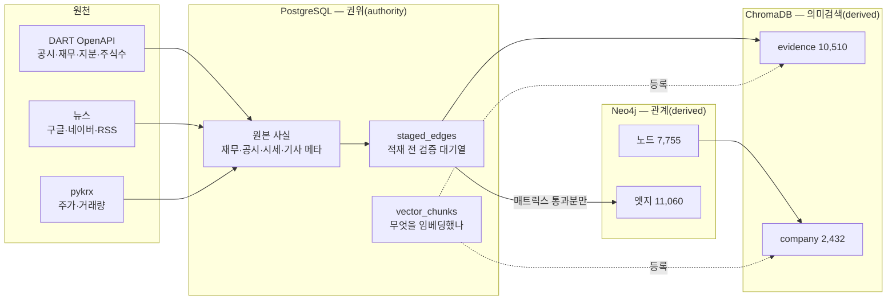
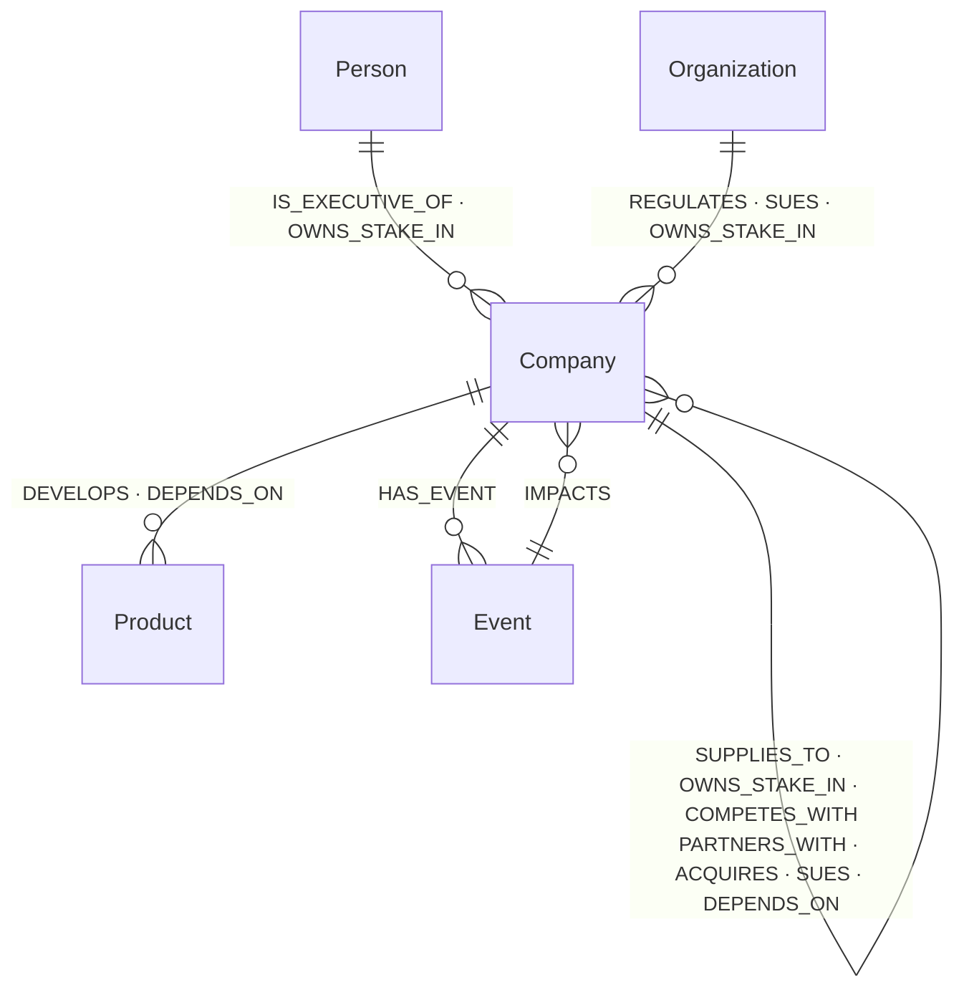

# BizNode 데이터베이스 ERD

> **2026-08-15 실측 기준.** 아래 행 수·제약·컬렉션은 전부 살아 있는 DB에서 읽은 값이다.
> 스키마를 바꿀 때 이 파일도 같이 고친다 — **문서가 스키마를 따라가지 못하면 문서가 거짓말이 된다.**
>
> 이 파일은 **구조**를 말한다 — 무엇이 어디에 있고 무엇으로 이어지는가.
> **필드 하나하나의 뜻과 채움률**은 [데이터 사전](https://claude.ai/code/artifact/89e72ec5-0435-4e5c-81b2-eab7fcccca41)에 있다.

---

## 0. 세 저장소의 경계 — 무엇을 어디에 두는가



**규칙 하나로 요약하면** — PostgreSQL이 **권위**이고, Neo4j와 ChromaDB는 **파생**이다.
파생은 언제든 지우고 다시 만들 수 있어야 한다. 그래서 쓰기 순서가 고정돼 있다:

```
staged_edges(권위) → 매트릭스 검증 → Neo4j(파생) → ChromaDB(파생) → vector_chunks(등록)
```

거꾸로 하면 「엣지는 없는데 근거만 남은」 고아가 생긴다. 실제로 274건 생겼었다.

> **예외가 하나 있다 — 뉴스 엣지.** 뉴스는 `staged_edges`를 거치지 않고 Neo4j에
> 바로 들어간다. 그래서 뉴스 파이프라인만 「그래프를 다시 만들 수 있다」가
> 성립하지 않는다. 재구축하려면 기사부터 다시 추출해야 하고, 그게 돈이 든다
> (기업당 약 90원). **Neo4j 덤프를 백업으로 챙겨야 하는 이유가 이것이다.**

---

# 1. PostgreSQL — 27 테이블 + 뷰 1

**빈 표는 없다.** 예전엔 「스키마가 곧 계획서」라며 빈 표를 남겨 뒀는데,
계획이 실현되거나 폐기되면서 전부 정리됐다(`companies`·`ingest_runs`·
`shareholder_summaries` 삭제, `market_data`·`business_overview` 적재 완료).

## 1-1. 기업 마스터와 상세 (3)

| 테이블 | PK | 행 | 무엇을 담나 |
|---|---|---:|---|
| `corp_code_master` | corp_code | 118,535 | DART 전체 법인 목록 — **개체해소(ER)의 블로킹 사전** |
| `company_attributes` | node_key | 3,414 | 기업 상세 — 대표자·설립일·영문명·업종 설명. **PK가 `node_key`**(corp_code 또는 norm_name)라 해외 기업도 담긴다 |
| `company_aliases` | alias_key | 3,247 | 「엔비디아」=「NVIDIA」. `source` 우선순위 `hand` > `dart` > `llm` > `first_seen` |

## 1-2. 숫자와 원문 (5)

| 테이블 | PK | 행 | 무엇을 담나 |
|---|---|---:|---|
| `financials` | corp_code, bsns_year, reprt_code | 1,426 | 연도별 재무. `fs_div` CFS=연결 / OFS=별도 — **기준이 다르면 비교 금지** |
| `business_segments` | corp_code, bsns_year, segment_name | 217 | 사업부문 매출·비중 + **단위 신뢰 플래그** |
| `business_overview` | corp_code, bsns_year | 64 | 사업보고서 「사업의 내용」 **원문 그대로** |
| `company_profiles` | corp_code, version | 64 | 같은 절의 **LLM 요약** — 원문과 역할이 다르다(§1-6) |
| `documents` | rcept_no | 472 | 공시 원문 메타 + 파일 경로 |

## 1-3. 시장 정보 (2 + 뷰 1)

| 테이블 | PK | 행 | 무엇을 담나 |
|---|---|---:|---|
| `market_data` | stock_code, trade_date | 53,045 | 일별 시세 — 427종목 · `pykrx` · 무료 |
| `listed_shares` | corp_code | 430 | 유통주식수 = 발행총수 − 자기주식. **보통주만** |
| `market_metrics` | *(뷰)* | 51,961 | 시가총액·PER·PBR·PSR — **저장하지 않고 조회할 때 계산**(§1-5) |

## 1-4. 뉴스와 적재 (3)

| 테이블 | PK | 행 | 무엇을 담나 |
|---|---|---:|---|
| `news_articles` | url | 14,032 | 기사 메타 — **본문은 저장하지 않는다**(§1-7) |
| `staged_edges` | id | 19,512 | 적재 대기 엣지 + 검증 결과(§1-8) |
| `vector_chunks` | chunk_id | 12,942 | 임베딩 레지스트리 — 무엇이 어느 컬렉션에 있나 |

## 1-5. 레지스트리 — 판정을 쌓아 두는 표 (7)

해외 기업에는 DART 같은 명부가 없다. 그래서 **한 번 판정한 것을 저장해 명부
노릇을 하게** 한다. 쓸수록 싸지고 정확해진다.

| 테이블 | 행 | 무엇을 판정했나 |
|---|---:|---|
| `edge_subtypes` | 2,796 | 지금까지 쓰인 subtype — **추출 프롬프트에 되먹인다** |
| `event_merge_verdicts` | 2,208 | 사건 쌍: `same` / `phase`(국면 → timeline) / `different` |
| `name_verdicts` | 1,299 | 「고유명인가 설명인가」 |
| `product_names` | 465 | 알려진 제품 표기 — **사후 병합은 안 한다**(HBM3 ≠ HBM3E) |
| `name_merge_verdicts` | 272 | 「이 두 이름이 같은 회사인가」 |
| `corp_code_verdicts` | 48 | 동명이라 못 좁힌 노드: `matched` / `none` / `unsure` |
| `person_merge_verdicts` | 1 | 동명 인물. **손 목록이 이긴다** |

## 1-6. 스스로에 대한 기록 (5)

| 테이블 | 행 | 무엇을 남기나 |
|---|---:|---|
| `edge_audits` | 11,138 | 엣지의 검사 사유·이력. `trail` JSONB에 37종 |
| `purged_edges` | 485 | 지운 엣지의 무덤 — 사유와 함께 |
| `purged_nodes` | 321 | 지운 노드의 무덤 — 속성 전체와 함께 |
| `extraction_runs` | 86 | 기업별 수집 설정·깔때기·실지출 |
| `unmapped_relations` | 43 | 12종에 못 넣은 표현 — **무엇을 놓치는지의 지표** |

> **왜 「무덤」을 두는가** — 사용자가 담아 둔 노드가 검사에 걸려 사라질 수 있다.
> 그때 조회는 404가 아니라 **「검증 결과 제외됐습니다」 + 사유**로 답해야 한다.
> 조용히 사라지는 것만 막으면 된다.

## 1-7. 계산되는 값은 저장하지 않는다

`market_metrics`가 표가 아니라 **뷰**인 이유다.

```
시가총액 = 종가 × 유통주식수
PER     = 시가총액 ÷ 당기순이익
PBR     = 시가총액 ÷ 자본총계
PSR     = 시가총액 ÷ 매출액
```

저장하면 원본이 갱신될 때 어긋난다. **엣지에서 실제로 겪었다** — 저장해 둔
`ratio_change` 1,306건 중 15건이 `ratio − previous_ratio`와 맞지 않았다.
그래서 파생 속성 6종을 엣지에서 걷어냈다(`batch/repair/edge_slim.py`).

남의 API에서 PER을 받아 오지 않는 이유가 하나 더 있다 — **기준을 모른다.**
연결인지 별도인지, 어느 분기 실적인지가 제공처마다 다르다. 우리는 `fs_div`로
구분해 두었으므로 직접 계산하면 **화면에 「2025년 연결 기준」이라고 밝힐 수 있다.**

> **원본이 틀릴 때는 지우지 않고 표시한다.** DART가 LS에코에너지 주식수를
> 30조 주로 준다(회사가 공시에 단위를 잘못 적었다). 그대로 두면 시총 146만 조가
> 되어 **순위가 통째로 뒤집힌다.** `listed_shares.suspect`로 표시하고 뷰에서만 뺀다.

## 1-8. 같은 절을 두 표에 담는 이유

```
company_profiles.text          LLM 요약   → ChromaDB 임베딩 → 챗봇이 검색
business_overview.overview_text 원문 그대로 → 상세 화면 · 인용
```

요약만 있으면 챗봇이 **「사업보고서에 이렇게 적혀 있습니다」라고 인용을 못 한다** —
우리가 쓴 문장은 근거가 되지 못한다. 갱신 주기도 비용도 달라서 배치를 나눴다
(요약은 기업당 40원, 원문은 이미 받아 둔 XML을 다시 읽을 뿐이라 0원).

## 1-9. `news_articles`에 본문 컬럼이 없는 이유

```
url · title · press · published_at · source_channel · title_hash
body_length · rule_passed · llm_relevant · matched_corps · extracted_at · collected_at
                ↑ 길이만 남긴다
```

크롤러가 언론사 robots.txt를 지키는 조건으로 본문을 받아 **관계 추출에만 쓰고 버린다**
(`extractors/news/crawler.py` 헤더). 화면이 인용하는 건 근거 한두 문장(ChromaDB)까지고,
그 이상은 원문 링크로 내보낸다. 저작권상 인용 범위 안이고, 크롤링 정당성과도 앞뒤가 맞는다.

## 1-10. `staged_edges` — 적재 전 검문소

```
19,512건 적재 시도
  ├ validated=false   1,091건   매트릭스 위반 → Neo4j에 안 올림, 기록만
  └ validated=true   18,421건
       └ 고유 (src,tgt,type,subtype) 14,433건   ← 같은 관계의 반복 보도가 접힌다
```

**검증 실패를 지우지 않고 남기는 게 핵심이다.** 무엇이 왜 막혔는지 봐야
온톨로지를 넓힐지 추출기를 고칠지 판단할 수 있다.

`origin`이 `dart` 2,690 · `news` 16,684 · `dart_filing` 138. 한동안 **전부 `dart`**
였는데, INSERT 문에 `'dart'`가 상수로 박혀 있어서였다 — 16,822행을 소급 교정했다.

---

# 2. Neo4j — 노드 7,755 · 엣지 11,060

## 2-1. 노드-엣지 허용 행렬 (L2 = 고정 12종)



| 라벨 | 수 | 식별자 | 유니크 제약 |
|---|---:|---|---|
| `Company` | 3,432 | `corp_code`(해소됨) 또는 `norm_name`(stub) | **`corp_code`만** ⚠ |
| `Product` | 1,949 | `norm_name` | ✅ |
| `Event` | 1,058 | `event_id` | ✅ |
| `Person` | 752 | `person_key` | ✅ |
| `Organization` | 564 | `norm_name` | ✅ |

> ⚠ **`Company.norm_name`에 유니크 제약이 없다.** 그런데 stub은 그 키로 MERGE한다.
> 예전엔 `케이씨텍` 1쌍이 중복이라 제약을 못 걸었는데 **지금은 중복이 0이다** —
> 걸 수 있는 상태가 됐다(§5).

| 엣지 | 수 | | 엣지 | 수 |
|---|---:|---|---|---:|
| `OWNS_STAKE_IN` | 2,157 | | `IS_EXECUTIVE_OF` | 722 |
| `DEVELOPS` | 2,050 | | `REGULATES` | 398 |
| `PARTNERS_WITH` | 1,410 | | `SUES` | 339 |
| `SUPPLIES_TO` | 1,179 | | `ACQUIRES` | 288 |
| `HAS_EVENT` | 1,087 | | `COMPETES_WITH` | 205 |
| `IMPACTS` | 1,083 | | `DEPENDS_ON` | 142 |

## 2-2. MERGE 키 — 무엇을 같은 것으로 볼 것인가

```python
# graph_loader._company_ident
8자리 숫자 → {corp_code: key}      # 해소된 기업 (시드·마스터 매칭)
그 외      → {norm_name: key}      # stub (이름만 아는 회사)

# graph_loader._rel_ident
{subtype: props["subtype"]}        # 상태·사건 모두 subtype 기준
```

**엣지를 `source_doc`으로 식별하지 않는 이유** — 그러면 같은 사건의 반복 보도가
전부 별개 엣지가 된다. 실측으로 `삼성전자 -ACQUIRES-> 레인보우로보틱스`가 **32개**였다
(하루에 10건 보도). 지금은 **엣지 하나, 근거는 배열**이다.

## 2-3. 엣지 속성 3층 — 시점·근거·검증

| 층 | 속성 | 쓰임 |
|---|---|---|
| **시점** | `observed_at` `as_of` `valid_from` `valid_to` `last_seen` `is_current` `loaded_at` | 신선도는 **조회 때 계산**한다(저장 안 함) |
| **근거** | `evidence_id` `evidence_ids[]` `source_doc` `source_docs[]` `confidence` `corroboration` | 근거 없는 엣지는 만들지 않는다 |
| **검증** | `grounding_suspect` `grounding_stage1` `grounding_verdict` `grounding_reason` `retype_suspect` `parsed_suspect` `*_checked_at` | **지우지 않고 표시만** |
| **타입 전용** | `subtype` `ratio` `amount` `role` `sign` `revenue_ratio` `direction` | 타입마다 뜻이 다르다(아래) |

속성 종류는 2026-08-15에 **102가지 → 69가지**로 줄였다. 뺀 것은 셋이다 —
계산되는 파생값(6종), 검사 사유·이력(37종 → PG `edge_audits`),
`subtype`과 겹치는 `position`.

> **`loaded_at`은 PG로 옮기면 안 된다.** 한 번 옮겼다가 되돌렸다 —
> `audit/freshness.run_dart`가 이 값으로 「이번 재적재에서 빠진 엣지 = 종료됨」을
> 판정하는데, 옮기니 「적재시각 있는 것 0건」이 되어 검사가 통째로 멈췄다.

### 타입 전용 속성 — 숫자는 문자열로 넣지 않는다

| 속성 | 붙는 타입 | 단위 | 무엇을 세는가 |
|---|---|---|---|
| `ratio` | `OWNS_STAKE_IN` `ACQUIRES` | **% (0~100)** | 지분율 |
| `amount` | `ACQUIRES` `SUPPLIES_TO` `REGULATES` `SUES` `OWNS_STAKE_IN` | **원** | 인수 대금 · 계약 규모 · 과징금 · 청구액 |
| `role` | `HAS_EVENT` | — | `subject` / `counterparty` / `mentioned` |
| `sign` | `IMPACTS` | — | `positive` / `negative` / `neutral` |

> **왜 전용 칸을 두는가** — 전에는 「지분 61.6%」·「420억원」이 `subtype` 문자열로
> 밀려 있었다. 61.6%면 경영권이고 5%면 단순 투자인데, 문자열로는 **조회도 비교도
> 안 된다.** 「100억 넘는 계약」을 셀 수 없었다.

> **`ratio`의 단위가 섞였던 적이 있다**(2026-08-15). 모델이 67.96%를 `0.6796`으로
> 넣은 게 18건. 검증기가 `0~100` 범위만 봐서 0.6796을 통과시켰다. 고친 것 셋 —
> 프롬프트에 「퍼센트 숫자 그대로」 명시, **근거 문장의 % 숫자와 대조**하는 검증기,
> 기존분 소급 교정. 다만 subtype 「5%이상주주」의 5%는 **기준선이지 지분율이 아니라**
> 보호 목록에 넣었다.

> **`grounding_suspect`가 리스크 점수를 직접 움직인다.** `propagate_risk`가 이 표시로
> 경로를 거르는데, 실측상 파급 대상의 9.5%를 빼고 64.5%의 점수를 바꾼다
> (허브 감점이 「보이는 엣지 수」로 계산되기 때문). 그래서 이 속성들의
> 정합성 검사가 `audit/graph.py`에 있다 — 서로 모순이면 곧 리스크 숫자가 틀린다.

## 2-4. Company 속성 11가지 — 그래프에 남길 것만

2026-08-15에 **49가지 → 11가지**로 줄였다. 기준은 하나다.

```
Neo4j 에      그래프 위에서 쓰는 것 — 노드·엣지를 가르거나, 탐색 중 거르거나,
              카드에 바로 띄우는 값
              name · norm_name · entity_kind · is_stub · first_seen · last_seen
              corp_code · stock_code · market · ksic · also_names

PostgreSQL 에  한 건씩 들여다보는 것 — 상세 화면에서 조회할 뿐 탐색에 안 쓰는 값,
              그리고 시계열 전체
```

> **Neo4j에는 「빈칸」이 없다.** 속성에 `null`을 넣으면 저장되는 게 아니라
> **속성이 삭제된다.** 다만 읽을 때는 구분되지 않으므로(없는 속성도 `null`),
> 조회하는 쪽은 신경 쓸 필요가 없다.
>
> 그래서 **판정 결과는 반드시 채운다** — 속성이 없으면 「아니다」와 「아직 안 봤다」가
> 조회에서 똑같이 `null`이 된다. `name`·`norm_name`·`is_stub`·`entity_kind`·
> `first_seen`·`last_seen`이 전부 100%다.

## 2-5. stub 3-상태

```
stub          이름만 안다 · corp_code 없음        2,268곳
  ↓ 개체해소(ER) — corp_code_master 118,535건과 대조
resolved      corp_code가 붙었다                  1,100곳(stub 중)
  ↓ 시드 지정 + 뉴스·공시 추출
seed          우리가 깊이 파는 대상                  64곳
```

**stub을 지우지 않는 이유** — 엔비디아·TSMC·마이크론이 전부 stub이다.
연결 상위 8곳이 전부 해외 기업이라, stub을 버리면 공급망이 국경에서 끊긴다.

**업종은 `ksic` 2자리로 적는다.** 예전엔 `sector_label`(LLM 자유 문자열)을 같이
뒀는데 「국내 IT 서비스 기업」과 「국내 IT 서비스 제공사」가 다른 값이 됐다 —
세지도 못하고 같은 업종 경쟁사도 못 찾는다. 사람이 읽는 한 줄은 PG로 내렸다.
DART `induty`(5자리)의 앞 2자리를 쓴다. 목록은 `pipeline/normalizer/ksic.py`(59종).

---

# 3. ChromaDB — 컬렉션 2개

| 컬렉션 | 수 | 한 레코드 = | id 규칙 |
|---|---:|---|---|
| `evidence` | 10,510 | 관계를 뒷받침하는 근거 1~2문장 | `ev_` + sha1(출처\|출발\|도착\|유형\|subtype)[:16] |
| `company` | 2,432 | 회사 소개 카드(개요+제품+거래처) | `co_{corp_code}` 또는 `co_n{sha1(이름)[:12]}` |

임베딩 모델은 **둘이 공유**한다(`text-embedding-3-small`). 모델을 바꾸면
`vector_chunks.embedding_model`로 재임베딩 대상을 특정한다.

**컬렉션을 나누는 이유** — 벡터 공간이 곧 컬렉션이다. 「문장 조각」과 「회사 카드」는
길이도 의미 단위도 달라서, 한 공간에 넣으면 *「HBM 만드는 회사」* 질의에
근거 문장이 섞여 나온다.

> ChromaDB 메타데이터는 **스칼라만** 받는다. 배열이 필요하면 문자열로 접거나,
> PostgreSQL에서 먼저 거르고 id 목록으로 넘긴다.

---

# 4. 세 저장소를 잇는 키

```mermaid
flowchart TB
  subgraph K1["corp_code — 기업 정체성"]
    P1["PG.company_attributes.corp_code"] --- N1["Neo4j Company.corp_code"] --- V1["vector_chunks.corp_code"]
  end
  subgraph K2["evidence_id — 근거 추적"]
    N2["Neo4j edge.evidence_id / evidence_ids[]"] --- C2["Chroma evidence.id"] --- V2["vector_chunks.chunk_id"]
  end
  subgraph K3["source_doc — 출처 원문"]
    N3["Neo4j edge.source_doc / Event.source_docs[]"] --- P3["PG.news_articles.url<br/>PG.documents.rcept_no"]
  end
  subgraph K4["stock_code — 시세"]
    N4["Neo4j Company.stock_code"] --- P4["PG.market_data.stock_code<br/>PG.listed_shares.stock_code"]
  end
```



| 키 | 형태 | 무엇을 잇나 |
|---|---|---|
| `corp_code` | CHAR(8) | 세 저장소 전부의 기업 식별자. **해외 기업엔 없다** |
| `node_key` | corp_code 또는 norm_name | corp_code가 없는 기업까지 잇는 PG 쪽 키 |
| `evidence_id` | `ev_` + 해시 16자 | 엣지 → 근거 원문 (**결정적 해시** — 재실행해도 같다) |
| `source_doc` | 기사 URL 또는 `rcept_no` 14자리 | 엣지·사건 → 기사·공시 메타 |
| `stock_code` | VARCHAR(6) | 기업 → 시세·유통주식수. **있으면 상장사** |
| `chunk_id` | `ev_…` / `co_…` | ChromaDB ↔ 레지스트리 |
| `title_hash` | sha1 | 같은 기사의 중복 수집·**재추출 방지**(돈) |

**교차 정합성은 `audit/graph.py`가 매번 확인한다** — 「엣지의 evidence_id가
vector_chunks에 없음」, 「Company.corp_code가 master에 없음」, 「어느 엣지도
가리키지 않는 고아 청크」.

---

# 5. 아직 정하지 않은 것

| 항목 | 지금 | 남은 판단 |
|---|---|---|
| **해외 기업 식별** | 확실한 필드가 없다 | `corp_code` 없는 2,268곳에 해외와 「동명이라 못 좁힌 국내」가 섞여 있다. `entity_kind='해외'`는 9곳뿐이라 못 쓴다 — 판정 근거를 새로 정해야 한다 |
| `Company.norm_name` 유니크 | 제약 없음 | **중복이 0이 됐으므로 이제 걸 수 있다** |
| `Event.is_risk` | 노드 속성 | 기업마다 다를 수 없다 — 엣지로 옮겨야 함 |
| 종료된 관계 탐지 | 판정 불가 | `loaded_at`이 2026-07-31 도입이라 비교 대상이 없다. **다음 DART 재적재 이후** 가능 |
| 리서치 보관함 | 미구현 | **백엔드 소관** — 사용자 데이터라 그래프 쪽이 아니다 |
| 허브 감점 분모 | 보이는 엣지 수 | 전체 엣지 수로 셀지 — 리스크 점수가 달라진다 |
