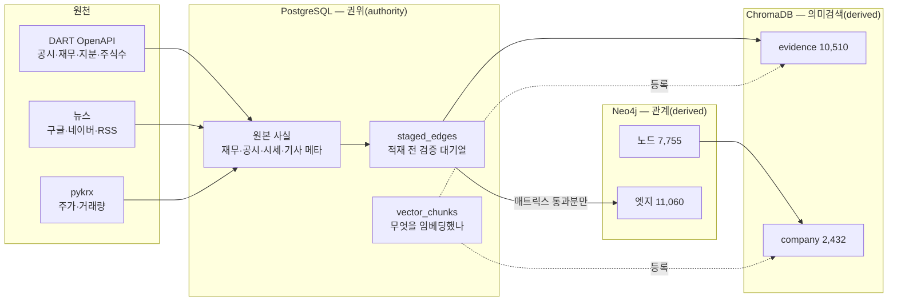
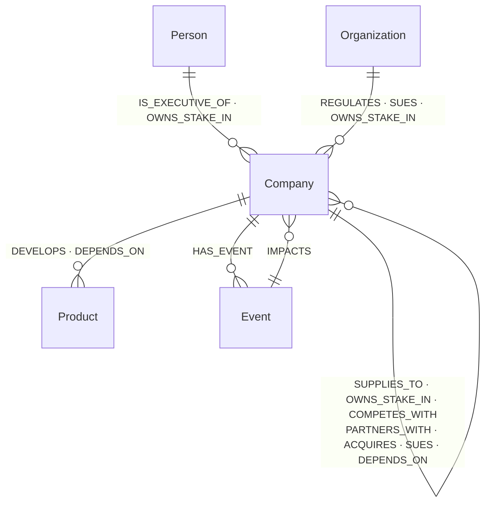

# BizNode 데이터베이스 ERD · 데이터 사전

> **2026-08-16 실측 기준.** 행 수·채움률·값 분포는 전부 살아 있는 DB에서 읽은 값이다.
> 스키마를 바꿀 때 이 파일도 같이 고친다 — **문서가 스키마를 따라가지 못하면 문서가 거짓말이 된다.**
>
> 관련: [README](README.md)(서비스 구성) · [연동 계획](BizNode_연동_계획.md) ·
> [방법서](BizNode_데이터수집_방법서.md)(설계 근거) ·
> [API 명세](https://claude.ai/code/artifact/8d108b2d-540d-46c3-bfcc-c11e9867a178)

```
Neo4j        노드 7,755 · 엣지 11,060 (12종)      관계 탐색
PostgreSQL   27표 + 뷰 1 · 110MB                 숫자와 이력
ChromaDB     evidence 10,510 · company 2,432      근거 원문
```

---

## 0. 세 저장소의 경계



**규칙 하나로 요약하면** — PostgreSQL이 **권위**이고, Neo4j와 ChromaDB는 **파생**이다.
파생은 언제든 지우고 다시 만들 수 있어야 한다. 그래서 쓰기 순서가 고정돼 있다:

```
staged_edges(권위) → 매트릭스 검증 → Neo4j(파생) → ChromaDB(파생) → vector_chunks(등록)
```

거꾸로 하면 「엣지는 없는데 근거만 남은」 고아가 생긴다. 실제로 274건 생겼었다.

> **예외가 하나 있다 — 뉴스 엣지.** 뉴스는 `staged_edges`를 거치지 않고 Neo4j에
> 바로 들어간다. 그래서 뉴스 파이프라인만 「그래프를 다시 만들 수 있다」가
> 성립하지 않는다. 재구축하려면 기사부터 다시 추출해야 하고, 그게 돈이 든다
> (기업당 약 90원). **Neo4j 덤프를 백업으로 챙겨야 하는 이유가 이것이다.**

### 어느 저장소에 둘지 정하는 규칙

| Neo4j 에 두는 것 | PostgreSQL 에 두는 것 |
|---|---|
| **그래프 위에서 쓰는 것** — 노드·엣지를 가르거나, 경로를 따라갈 때 거르거나, 카드에 바로 띄우는 값 | **한 건씩 들여다보는 것** — 상세 화면에서 조회할 뿐 탐색에 안 쓰는 값, 그리고 시계열 전체 |
| 이름 · 식별자 · 종류 · 업종코드 | 대표자 · 설립일 · 연도별 재무 · 시세 · 업종 설명 |

> **Neo4j에는 「빈칸」이 없다.** 속성에 `null`을 넣으면 저장되는 게 아니라
> **속성이 삭제된다.** 다만 읽을 때는 구분되지 않으므로(없는 속성도 `null`),
> 조회하는 쪽은 신경 쓸 필요가 없다.
>
> 그래서 **판정 결과는 반드시 채운다** — 속성이 없으면 「아니다」와 「아직 안 봤다」가
> 조회에서 똑같이 `null`이 된다. Company의 `name`·`norm_name`·`is_stub`·
> `entity_kind`·`first_seen`·`last_seen` 여섯이 여기 해당하고 **전부 100%**다.
> 반면 `ksic`·`corp_code` 같은 사실 데이터는 없으면 없는 것이라 비어도 된다.

---

# 1. Neo4j 노드 5종

그래프에 들어갈 수 있는 「것」은 다섯 종류뿐이다. **종류를 늘리지 않는 것이 규칙**이다 —
늘면 관계 조합이 제곱으로 늘고, 어디에 넣을지 매번 흔들린다.

## 1-1. `Company` 기업 — 3,432곳 · 속성 11가지

MERGE 키: `corp_code`(있으면) 또는 `norm_name`

| 필드 | 채움 | 뜻 |
|---|---:|---|
| `name` | 100% | 표시명 |
| `norm_name` **KEY** | 100% | 공백·법인격 제거형. corp_code가 없을 때 식별자 |
| `entity_kind` | 100% | 기업 2,789 · 펀드·조합 321 · 금융기관 139 · 공공기관 78 · 사업부문 71 · 불명 18 · 해외 9 · 대학·연구소 7 |
| `is_stub` | 100% | `false` = 깊이 수집한 시드 64곳 |
| `first_seen` `last_seen` | 100% | 처음 본 날 · 마지막 언급일 |
| `ksic` | 99% | 업종 중분류 2자리. **묶어 세기·같은 업종 찾기**용 |
| `market` | 40% | 비상장 773 · KOSDAQ 254 · 펀드 204 · KOSPI 168 · KONEX 4 |
| `corp_code` | 33% | DART 8자리. **해외·미등록에는 없다** |
| `stock_code` | 13% | 6자리 종목코드. **있으면 상장사**이고 시세와 잇는 열쇠 |
| `also_names` | 2% | 병합된 옛 표기(**배열**). 옛 링크가 안 깨지게 한다 |

속성은 2026-08-15에 **49가지 → 11가지**로 줄였다. 남긴 기준은 §0의 규칙 하나다.

> ⚠ **`entity_kind`로 해외 여부를 판정하면 안 된다.** `해외`가 9곳뿐이고
> 엔비디아·TSMC·ASML이 전부 `기업`으로 들어가 있다. 채우는 규칙이 **빈칸일 때만**
> 도는데 이들은 추출 단계에서 이미 값이 박혀 있었다. §9 참고.

## 1-2. `Person` 인물 — 752명 · 속성 7가지

MERGE 키: `person_key` = `이름|생년월` 또는 `이름@corp_code`

| 필드 | 채움 | 뜻 |
|---|---:|---|
| `name` `person_key` **KEY** | 100% | |
| `first_seen` `last_seen` | 100% | |
| `birth_year_month` | 65% | 동명이인을 가르는 유일한 근거. DART 임원 현황에서 온다 |
| `gender` | 64% | 같은 출처 |
| `merged_keys` | 1% | 병합된 옛 키(**배열**) |

## 1-3. `Organization` 기관 — 564곳 · 속성 9가지

MERGE 키: `norm_name`. 회사가 아닌 조직 — 규제와 소송의 **주체**가 여기서 나온다.

| 필드 | 채움 | 뜻 |
|---|---:|---|
| `name` `last_seen` | 100% | |
| `norm_name` **KEY** `first_seen` | 99% | |
| `org_type` | 99% | **10종** — 기타 130 · 연구교육 87 · 정부부처 85 · 협회단체 66 · 규제기관 46 · 지자체 40 · 공공기관 36 · 노동조합 29 · 수사사법 27 · 국가 16 |
| `classified_at` | 99% | 분류한 시각. **「아직 안 봤다」와 「보고 기타로 뒀다」를 가른다** |
| `node_suspect` `node_suspect_why` | 2% | 노드로 두기 부적절한 14곳 — 「협력업체들」 같은 집합 명사. **지우지 않고 표시** |
| `corp_code` | 0% | DART에 등록된 기관 1곳(한국산업기술진흥협회) |

> **「규제기관」과 「수사사법」을 가르는 이유** — 공정위·금감원은 행정 제재를 내리고
> 검찰·법원은 형사 절차를 밟는다. 화면에서 리스크 무게가 다르다.

## 1-4. `Product` 제품·기술 — 1,949개 · 속성 6가지

MERGE 키: `norm_name`

| 필드 | 채움 | 뜻 |
|---|---:|---|
| `name` `norm_name` **KEY** | 100% | |
| `category` | 100% | 제품 917 · 부품 358 · 기술 224 · 장비 223 · 서비스 132 · 소재 95 |
| `first_seen` `last_seen` | 100% | |
| `name_suspect` | 0% | 이름이 아닌 설명으로 보이는 3건 |

> **「HBM3」와 「HBM3E」는 다른 노드다.** 비슷해 보인다고 합치면 세대 구분이 사라진다.
> 그래서 제품은 **사후 병합을 하지 않는다.**

## 1-5. `Event` 사건 — 1,058개 · 속성 15가지

MERGE 키: `event_id` = `evt_news_` + 해시.
화재·파업·압수수색·수주처럼 **날짜를 댈 수 있는 일**. 「매출이 늘고 있다」 같은
지속 상태는 사건이 아니다.

| 필드 | 채움 | 뜻 |
|---|---:|---|
| `event_id` **KEY** `name` | 100% | |
| `event_type` | 100% | **12종** — 사업확장 442 · 기타 134 · 분쟁소송 85 · 자본거래 84 · 노무 70 · 실적 60 · 규제수사 51 · 사고재해 49 · 공급망 30 · 제품기술 18 · 품질 18 · 정보유출 17 |
| `is_risk` | 100% | 리스크성인가. **유형과 별개 축**이다 |
| `article_count` | 100% | 기사 수. 여러 기사가 같은 사건을 말하면 신뢰도가 올라간다 |
| `source_doc` `source_docs` `evidence_ids` | 100% | 대표 출처 + 전체(**배열**) |
| `first_seen` `last_seen` | 100% | |
| `eventness_checked_at` | 100% | 「이게 정말 사건인가」를 검사한 시각 |
| `classified_at` | 63% | 유형을 판정한 시각 |
| `timeline` | 18% | **시계열 배열** 193건 — `"연월\|이름\|원래id"` |
| `eventness_suspect` `eventness_why` | 7% | 사건이 아닌 것으로 보이는 83건. **표시만 하고 안 지운다** |

> **`timeline`은 배열이다. 문자열로 펴면 안 된다** — 실제로 28건이 펴진 적이 있어
> `size()`가 글자 수를 셌다.

**유형과 `is_risk`는 별개 축이다.** 같은 유형이라도 방향이 갈린다 —
「특허 소송 패소」=true / 「승소」=false, 「공장 화재」=true / 「신공장 착공」=false.

> **사건 날짜는 Event 노드에 없다.** `HAS_EVENT`·`IMPACTS` **엣지의 `occurred_at`**에
> 있다. 같은 사건이라도 기업마다 엮인 시점이 다를 수 있어서다.

## 1-6. 유니크 제약

| 라벨 | 식별자 | 제약 |
|---|---|---|
| `Company` | `corp_code` 또는 `norm_name` | **`corp_code`만** ⚠ |
| `Product` | `norm_name` | ✅ |
| `Event` | `event_id` | ✅ |
| `Person` | `person_key` | ✅ |
| `Organization` | `norm_name` | ✅ |

> ⚠ **`Company.norm_name`에 유니크 제약이 없다.** 그런데 stub은 그 키로 MERGE한다.
> 예전엔 `케이씨텍` 1쌍이 중복이라 못 걸었는데 **지금은 중복이 0이라 걸 수 있다**(§10).

## 1-7. stub 3-상태

```
stub          이름만 안다 · corp_code 없음        2,268곳
  ↓ 개체해소(ER) — corp_code_master 118,535건과 대조
resolved      corp_code가 붙었다                  1,100곳(stub 중)
  ↓ 시드 지정 + 뉴스·공시 추출
seed          우리가 깊이 파는 대상                  64곳
```

**stub을 지우지 않는 이유** — 엔비디아·TSMC·마이크론이 전부 stub이다.
연결 상위가 해외 기업이라, stub을 버리면 **공급망이 국경에서 끊긴다.**

---

# 2. Neo4j 엣지 12종

## 2-1. 노드-엣지 허용 매트릭스 (L2 = 고정 12종)

**이 표가 스키마 견고함의 핵심이다.** 적재 전 `pipeline/validators/matrix.py`가
이 표로 검증해 잘못된 조합을 차단한다.



**⇄ 대칭 엣지**(`PARTNERS_WITH`·`COMPETES_WITH`) — Neo4j는 무방향을 저장 못 하므로
**키 작은 쪽 → 큰 쪽 단방향 고정**, 조회는 화살표 없는 패턴.

**3계층 구조**

```
L1 Category (5)    프론트 필터·범례
L2 Edge Type (12)  Cypher 탐색·다중홉 추론  ← 유한해야 함
L3 Subtype (개방)   상세 패널 표시. 관리 목록으로 수렴
```

## 2-2. 타입별 수와 전용 속성

| 엣지 | 수 | 전용 속성 (채움률) |
|---|---:|---|
| `OWNS_STAKE_IN` | 2,157 | `ratio`(75%) · `settlement_date`(68%) · `previous_ratio`(62%) · `first_acquired`(62%) · `purpose`(62%) · `book_value`(55%) · `investee_total_assets`(43%) |
| `DEVELOPS` | 2,050 | 없음 — Product 이름이 이미 「무엇을」을 말한다 |
| `PARTNERS_WITH` | 1,410 | 없음 (대칭) |
| `SUPPLIES_TO` | 1,179 | `amount`(11%) |
| `HAS_EVENT` | 1,087 | **`role`(100%)** |
| `IMPACTS` | 1,083 | **`sign`(100%)** |
| `IS_EXECUTIVE_OF` | 722 | `employment_type`(68%) · `main_career`(68%) · `duty`(65%) · `tenure_end`(50%) · `shareholder_relation`(40%) |
| `REGULATES` | 398 | `amount`(13%) |
| `SUES` | 339 | `amount`(9%) |
| `ACQUIRES` | 288 | `amount`(19%) · `ratio`(9%) |
| `COMPETES_WITH` | 205 | 없음 (대칭) |
| `DEPENDS_ON` | 142 | 없음 — subtype이 `공급의존`/`매출의존` 둘 중 하나 |

## 2-3. 공통 속성 — 3층

속성 종류는 2026-08-15에 **102가지 → 69가지**로 줄였다. 뺀 것은 셋이다 —
계산되는 파생값(6종), 검사 사유·이력(37종 → PG `edge_audits`),
`subtype`과 겹치는 `position`.

**① 시점**

| 필드 | 채움 | 뜻 |
|---|---:|---|
| `first_seen` `last_seen` | 100% | 처음 본 날 · **최근 관측일**(공시·기사 날짜) |
| `refresh_cycle_days` | 100% | 출처별 예상 갱신 주기. DART 365 · 뉴스 180 |
| `is_current` | 100% | `false` = 종료가 확인됨 |
| `valid_from` | 69% | 관계 시작 |
| `loaded_at` | 66% | **우리가 적재한 때** — 재적재 누락 판정용 |
| `occurred_at` | 26% | 사건 발생일 (`HAS_EVENT`·`IMPACTS`) |
| `valid_until` | 1% | 명시적 종료일 |

> **`last_seen`과 `loaded_at`을 혼동하면 안 된다.** 국민연금 2024년 공시를 오늘
> 적재하면 각각 2024년·오늘이다. 「재적재에서 사라졌나」는 `loaded_at`으로만 판정된다.
>
> **그래서 `loaded_at`은 PG로 옮기면 안 된다.** 한 번 옮겼다가 되돌렸다 —
> `audit/freshness.run_dart`가 이 값을 쓰는데 「적재시각 있는 것 0건」이 되어
> 검사가 통째로 멈췄다.

**② 근거**

| 필드 | 채움 | 뜻 |
|---|---:|---|
| `evidence_id` `source_doc` | 100% | 근거 청크 id · 출처 원문 |
| `source_type` | 100% | news 8,384 · dart 2,563 · dart_filing 113 |
| `confidence` | 100% | 0.9 뉴스 기본 · 1.0 DART · 0.8 · 0.7 약한 추론 |
| `source_docs` `evidence_ids` | 7% | 클러스터링 시 누적(**배열**) |
| `corroboration` | 7% | 뒷받침 출처 수 |

> ⚠ **`corroboration`이 7%뿐이다.** 「선 굵기 = 출처 수」로 그리려면 `source_docs`
> 길이나 같은 쌍의 엣지 수로 대신 세야 한다.

**③ 검증 — 지우지 않고 표시만**

| 필드 | 채움 | 뜻 |
|---|---:|---|
| `grounding_checked_at` | 75% | 근거가 관계를 뒷받침하는지 검사한 시각 |
| `direction_checked_at` | 27% | 파는 쪽·사는 쪽이 뒤집혔는지 |
| `parallel_checked_at` | 17% | 병렬 언급을 관계로 오인했는지 |
| `grounding_suspect` | 4% | **조회에서 제외되는 표시** |
| `retype_suspect` `parsed_suspect` | 1% 미만 | 유형오류·파싱오류 의심 |

> **`grounding_suspect`가 리스크 점수를 직접 움직인다.** `propagate_risk`가 이
> 표시로 경로를 거르는데, 실측상 파급 대상의 9.5%를 빼고 64.5%의 점수를 바꾼다.
> 그래서 정합성 검사가 `audit/graph.py`에 있다 — **서로 모순이면 곧 리스크 숫자가 틀린다.**

## 2-4. 타입 전용 속성 — 숫자는 문자열로 넣지 않는다

| 속성 | 붙는 타입 | 단위 | 무엇을 세는가 |
|---|---|---|---|
| `ratio` | `OWNS_STAKE_IN` `ACQUIRES` | **% (0~100)** | 지분율 |
| `amount` | `ACQUIRES` `SUPPLIES_TO` `REGULATES` `SUES` `OWNS_STAKE_IN` | **원** | 인수 대금 · 계약 규모 · 과징금 · 청구액 |
| `role` | `HAS_EVENT` | — | `subject` 953 / `counterparty` 69 / `mentioned` 65 |
| `sign` | `IMPACTS` | — | `negative` 585 / `positive` 452 / `neutral` 46 |

> **왜 전용 칸을 두는가** — 전에는 「지분 61.6%」·「420억원」이 `subtype` 문자열로
> 밀려 있었다. 61.6%면 경영권이고 5%면 단순 투자인데, 문자열로는 **조회도 비교도
> 안 된다.** 「100억 넘는 계약」을 셀 수 없었다.

> **`ratio`의 단위가 섞였던 적이 있다**(2026-08-15). 모델이 67.96%를 `0.6796`으로
> 넣은 게 18건. 검증기가 `0~100` 범위만 봐서 통과시켰다. 고친 것 셋 — 프롬프트에
> 「퍼센트 숫자 그대로」 명시, **근거 문장의 % 숫자와 대조**하는 검증기, 소급 교정.
> 다만 subtype 「5%이상주주」의 5%는 **기준선이지 지분율이 아니라** 보호 목록에 넣었다.

## 2-5. subtype(L3) — 무엇을 담고 무엇을 담지 않나

**subtype은 근거에서 읽어낸 「무엇을」이다.** 엣지 타입이 이미 하는 말을 되풀이하지
않고, 다른 필드가 이미 담고 있으면 비운다.

| 담는다 (8종) | 비운다 (4종) |
|---|---|
| `SUPPLIES_TO` 무엇을 파는가 · `PARTNERS_WITH` 무엇을 함께 · `SUES` 무엇을 두고 · `COMPETES_WITH` 어느 시장 · `REGULATES` 무엇을 하는가 · `ACQUIRES` 무엇을 인수 · `OWNS_STAKE_IN` 지분 성격 · `IS_EXECUTIVE_OF` 직위 | `HAS_EVENT`·`IMPACTS` 사건 이름이 말한다 · `DEVELOPS` 제품 이름이 말한다 · `DEPENDS_ON` `공급의존`/`매출의존` 둘뿐 |

**빈 subtype 분포** — `DEVELOPS` 2,050 · `HAS_EVENT` 1,087 · `IMPACTS` 1,083
(**셋은 100%가 정상**) · `SUPPLIES_TO` 197 · `OWNS_STAKE_IN` 109 · `PARTNERS_WITH` 101

**`OWNS_STAKE_IN.subtype`** — 출자 858 · 자회사 533 · 5%이상주주 137 · *빈값* 109 ·
최대주주 92 · 지분투자 55 · 특수관계인 53 · 지분보유 38

## 2-6. MERGE 키 — 무엇을 같은 것으로 볼 것인가

```python
# graph_loader._company_ident
8자리 숫자 → {corp_code: key}      # 해소된 기업
그 외      → {norm_name: key}      # stub

# graph_loader._rel_ident
{subtype: props["subtype"]}        # 상태·사건 모두 subtype 기준
```

**엣지를 `source_doc`으로 식별하지 않는 이유** — 그러면 같은 사건의 반복 보도가
전부 별개 엣지가 된다. 실측으로 `삼성전자 -ACQUIRES-> 레인보우로보틱스`가 **32개**였다
(하루에 10건 보도). 지금은 **엣지 하나, 근거는 배열**이다.

---

# 3. PostgreSQL — 27표 + 뷰 1

**빈 표는 없다.** 예전엔 「스키마가 곧 계획서」라며 빈 표를 남겨 뒀는데, 계획이
실현되거나 폐기되면서 전부 정리됐다(`companies`·`ingest_runs`·`shareholder_summaries`
삭제, `market_data`·`business_overview` 적재 완료).

## 3-1. 기업 마스터와 상세 (3)

| 표 | 행 | 주요 컬럼 | 무엇을 담나 |
|---|---:|---|---|
| `corp_code_master` | 118,535 | `corp_code` **PK** · `corp_name` · `stock_code` · `market` · `modify_date` | **DART 전 법인 명부.** 개체해소(ER)의 블로킹 사전. 동명이 13,452곳(11.3%)이라 `modify_date`로 소멸 법인을 가른다 |
| `company_attributes` | 3,414 | `node_key` **PK** · `corp_code` · `name` · `induty` · `ceo_nm` · `est_dt` · `name_en` · `sector_label` · `vehicle_type` · `revenue_snapshot` | **기업 상세 — 그래프에서 내려온 것들.** `node_key`가 corp_code 또는 norm_name이라 **해외 기업도 담긴다** |
| `company_aliases` | 3,247 | `alias_key` **PK** · `canonical_key` · `canon_name` · `block_key` · `source` | 「엔비디아」=「NVIDIA」. `source` 우선순위 **`hand` > `dart` > `llm` > `first_seen`** — hand는 다른 출처가 못 덮는다 |

> `sector_label`은 2,521/3,414(73%)만 차 있고, **비어 있는 893곳이 국내 기업**이다.
> `stub_profiles`가 「DART가 모르는 회사」에만 LLM으로 한 줄을 써 줬기 때문이다.
> 국내 기업은 `ksic` 이름으로 대신한다(비용 0원).

## 3-2. 숫자와 원문 (5)

| 표 | 행 | 주요 컬럼 | 무엇을 담나 |
|---|---:|---|---|
| `financials` | 1,426 | `corp_code`+`bsns_year`+`reprt_code` **PK** · `fs_div` · `revenue` · `operating_profit` · `net_profit` · `total_assets` · `total_liabilities` · `total_equity` | 연도별 재무 **시계열**. 477개사. `fs_div` CFS 1,265 / OFS 161 — **기준이 다르면 비교 금지** |
| `business_segments` | 217 | `corp_code`+`bsns_year`+`segment_name` **PK** · `revenue` · `revenue_ratio` · `revenue_trusted` · `ratio_trusted` · `trust_reason` | 사업부문 매출·비중. **`*_trusted`가 false면 화면에서 감춘다** |
| `business_overview` | 64 | `corp_code`+`bsns_year` **PK** · `overview_text` · `products_text` · `source_doc` | 사업보고서 「사업의 내용」 **원문 그대로** |
| `company_profiles` | 64 | `corp_code`+`version` **PK** · `text` | 같은 절의 **LLM 요약**. ChromaDB `company` 컬렉션의 원본 |
| `documents` | 472 | `rcept_no` **PK** · `corp_code` · `doc_type` · `title` · `rcept_dt` · `raw_path` | 공시 원문 메타. 전문은 파일로 두고 경로만 |

> **사업보고서 표는 단위가 표 밖 캡션에 있어 자주 1,000배 틀린다.** 56개사 중
> 39개사가 어긋나 있었고 8개사는 교정 불가로 보류했다. 그래서 신뢰 플래그를 둔다.

**같은 절을 두 표에 담는 이유**

```
company_profiles.text           LLM 요약   → ChromaDB 임베딩 → 챗봇이 검색
business_overview.overview_text  원문 그대로 → 상세 화면 · 인용
```

요약만 있으면 챗봇이 **「사업보고서에 이렇게 적혀 있습니다」라고 인용을 못 한다** —
우리가 쓴 문장은 근거가 되지 못한다. 비용도 다르다(요약 기업당 40원, 원문 0원).

## 3-3. 시장 정보 (2 + 뷰 1)

| 표 | 행 | 주요 컬럼 | 무엇을 담나 |
|---|---:|---|---|
| `market_data` | 53,045 | `stock_code`+`trade_date` **PK** · `open_price` · `high_price` · `low_price` · `close_price` · `volume` · `trade_value` · `change_pct` | 일별 시세 — 427종목 · 2026-02-10~08-14. `pykrx`(KRX 공개·인증 없음·무료) |
| `listed_shares` | 430 | `corp_code` **PK** · `stock_code` · `listed` · `issued` · `treasury` · `suspect` · `suspect_why` | 유통주식수 = 발행총수 − 자기주식. **보통주만** 센다 |
| `market_metrics` **뷰** | 51,961 | `market_cap` · `per` · `pbr` · `psr` · `fin_year` · `fs_div` | **저장하지 않고 조회할 때 계산** |

**계산되는 값은 저장하지 않는다** — `market_metrics`가 표가 아니라 뷰인 이유다.

```
시가총액 = 종가 × 유통주식수
PER     = 시가총액 ÷ 당기순이익      ← 적자면 null. 음수 PER 을 만들지 않는다
PBR     = 시가총액 ÷ 자본총계
PSR     = 시가총액 ÷ 매출액
```

저장하면 원본이 갱신될 때 어긋난다. **엣지에서 실제로 겪었다** — 저장해 둔
`ratio_change` 1,306건 중 15건이 원본과 안 맞아 파생 속성 6종을 걷어냈다.

남의 API에서 PER을 받아 오지 않는 이유가 하나 더 있다 — **기준을 모른다.**
연결인지 별도인지, 어느 분기 실적인지가 제공처마다 다르다. 우리는 `fs_div`로
구분해 두었으므로 화면에 **「2025년 연결 기준」이라고 밝힐 수 있다.**

> **원본이 틀릴 때는 지우지 않고 표시한다.** DART가 LS에코에너지 주식수를 30조 주로
> 준다(회사가 공시에 단위를 잘못 적었다). 그대로 두면 시총 146만 조가 되어
> **순위가 통째로 뒤집힌다.** `suspect`로 표시하고 뷰에서만 뺀다.

## 3-4. 뉴스와 적재 (3)

| 표 | 행 | 주요 컬럼 | 무엇을 담나 |
|---|---:|---|---|
| `news_articles` | 14,032 | `url` **PK** · `title` · `press` · `published_at` · `source_channel` · `title_hash` · `body_length` · `rule_passed` · `llm_relevant` · `extracted_at` | 기사 메타. **본문은 저장하지 않는다** |
| `staged_edges` | 19,512 | `id` **PK** · `src_key` · `tgt_key` · `edge_type` · `subtype` · `properties` · `origin` · `validated` · `validation_error` | **Neo4j로 가기 전 착지대** |
| `vector_chunks` | 12,942 | `chunk_id` **PK** · `collection` · `owner_key` · `corp_code` · `embedding_model` · `is_active` | ChromaDB에 무엇이 들어 있는지의 목록 |

**`news_articles`에 본문 컬럼이 없는 이유** — 크롤러가 언론사 robots.txt를 지키는
조건으로 본문을 받아 **관계 추출에만 쓰고 버린다.** 화면이 인용하는 건 근거 한두
문장까지고, 그 이상은 원문 링크로 내보낸다. 저작권상 인용 범위 안이고 크롤링
정당성과도 앞뒤가 맞는다. 채널은 gnews 10,044 · naver 2,974 · rss 1,014.

**`staged_edges` — 적재 전 검문소**

```
19,512건 적재 시도
  ├ validated=false   1,091건   매트릭스 위반 → Neo4j에 안 올림, 기록만
  └ validated=true   18,421건
       └ 고유 (src,tgt,type,subtype) 14,433건   ← 같은 관계의 반복 보도가 접힌다
```

**검증 실패를 지우지 않고 남기는 게 핵심이다.** 무엇이 왜 막혔는지 봐야 온톨로지를
넓힐지 추출기를 고칠지 판단할 수 있다.

`origin`은 news 16,684 · dart 2,690 · dart_filing 138. 한동안 **전부 `dart`**였는데
INSERT 문에 `'dart'`가 상수로 박혀 있어서였다 — 16,822행을 소급 교정했다.

## 3-5. 레지스트리 — 판정을 쌓아 두는 표 (7)

해외 기업에는 DART 같은 명부가 없다. 그래서 **한 번 판정한 것을 저장해 명부 노릇을
하게** 한다. 쓸수록 싸지고 정확해진다.

| 표 | 행 | 무엇을 판정했나 |
|---|---:|---|
| `edge_subtypes` | 2,796 | 지금까지 쓰인 subtype — **추출 프롬프트에 되먹인다** |
| `event_merge_verdicts` | 2,208 | 사건 쌍: `same` / `phase`(국면 → timeline) / `different` |
| `name_verdicts` | 1,299 | 「고유명인가 설명인가」. `kind`가 `entity`냐 `product`냐로 기준이 다르다 |
| `product_names` | 465 | 알려진 제품 표기 — **사후 병합은 안 한다** |
| `name_merge_verdicts` | 272 | 「이 두 이름이 같은 회사인가」 |
| `corp_code_verdicts` | 48 | 동명이라 못 좁힌 노드: `matched` / `none` / `unsure` |
| `person_merge_verdicts` | 1 | 동명 인물. **손 목록이 이긴다** |

## 3-6. 스스로에 대한 기록 (5)

| 표 | 행 | 무엇을 남기나 |
|---|---:|---|
| `edge_audits` | 11,138 | 엣지의 검사 사유·이력. `trail` JSONB에 37종 |
| `purged_edges` | 485 | 지운 엣지의 무덤 — 사유와 함께 |
| `purged_nodes` | 321 | 지운 노드의 무덤 — **속성 전체와 함께** |
| `extraction_runs` | 86 | 기업별 수집 설정·깔때기·실지출 |
| `unmapped_relations` | 43 | 12종에 못 넣은 표현 — **무엇을 놓치는지의 지표** |

> **왜 「무덤」을 두는가** — 사용자가 담아 둔 노드가 검사에 걸려 사라질 수 있다.
> 그때 조회는 404가 아니라 **「검증 결과 제외됐습니다」 + 사유**로 답해야 한다.
> 조용히 사라지는 것만 막으면 된다.

---

# 4. ChromaDB — 컬렉션 2개

| 컬렉션 | 수 | 한 레코드 = | id 규칙 |
|---|---:|---|---|
| `evidence` | 10,510 | 관계를 뒷받침하는 근거 1~2문장 | `ev_` + sha1(출처\|출발\|도착\|유형\|subtype)[:16] |
| `company` | 2,432 | 회사 소개 카드(개요+제품+거래처) | `co_{corp_code}` 또는 `co_n{sha1(이름)[:12]}` |

임베딩 모델은 **둘이 공유**한다(`text-embedding-3-small`). 모델을 바꾸면
`vector_chunks.embedding_model`로 재임베딩 대상을 특정한다.

**컬렉션을 나누는 이유** — 벡터 공간이 곧 컬렉션이다. 「문장 조각」과 「회사 카드」는
길이도 의미 단위도 달라서, 한 공간에 넣으면 *「HBM 만드는 회사」* 질의에 근거 문장이
섞여 나온다.

**둘뿐이다.** 스키마 주석에 `profile`·`document`도 적혀 있었지만 만들지 않았다 —
원문 전체 임베딩은 비용뿐 아니라 **검색 정확도를 떨어뜨린다.**

> ChromaDB 메타데이터는 **스칼라만** 받는다. 배열이 필요하면 문자열로 접거나,
> PostgreSQL에서 먼저 거르고 id 목록으로 넘긴다.

---

# 5. 세 저장소를 잇는 키



```mermaid
flowchart TB
  subgraph K1["corp_code — 기업 정체성"]
    P1["PG.company_attributes.corp_code"] --- N1["Neo4j Company.corp_code"] --- V1["vector_chunks.corp_code"]
  end
  subgraph K2["evidence_id — 근거 추적"]
    N2["Neo4j edge.evidence_id / evidence_ids[]"] --- C2["Chroma evidence.id"] --- V2["vector_chunks.chunk_id"]
  end
  subgraph K3["source_doc — 출처 원문"]
    N3["Neo4j edge.source_doc / Event.source_docs[]"] --- P3["PG.news_articles.url<br/>PG.documents.rcept_no"]
  end
  subgraph K4["stock_code — 시세"]
    N4["Neo4j Company.stock_code"] --- P4["PG.market_data.stock_code<br/>PG.listed_shares.stock_code"]
  end
```

| 키 | 형태 | 무엇을 잇나 |
|---|---|---|
| `corp_code` | CHAR(8) | 세 저장소 전부의 기업 식별자. **해외 기업엔 없다** |
| `node_key` | corp_code 또는 norm_name | corp_code가 없는 기업까지 잇는 PG 쪽 키 |
| `evidence_id` | `ev_` + 해시 16자 | 엣지 → 근거 원문 (**결정적 해시** — 재실행해도 같다) |
| `source_doc` | 기사 URL 또는 `rcept_no` 14자리 | 엣지·사건 → 기사·공시 메타 |
| `stock_code` | VARCHAR(6) | 기업 → 시세·유통주식수. **있으면 상장사** |
| `chunk_id` | `ev_…` / `co_…` | ChromaDB ↔ 레지스트리 |
| `title_hash` | sha1 | 같은 기사의 중복 수집·**재추출 방지**(돈) |

**교차 정합성은 `audit/graph.py`가 매번 확인한다** — 「엣지의 evidence_id가
vector_chunks에 없음」, 「Company.corp_code가 master에 없음」, 「어느 엣지도
가리키지 않는 고아 청크」.

---

# 6. 값 목록

정해진 값만 들어가는 필드들. 실제 분포를 함께 적었다.

| 필드 | 가능한 값과 실제 분포 |
|---|---|
| `Company.entity_kind` | 기업 2,789 · 펀드·조합 321 · 금융기관 139 · 공공기관 78 · 사업부문 71 · 불명 18 · 해외 9 · 대학·연구소 7 |
| `Company.market` | 비상장 773 · KOSDAQ 254 · 펀드 204 · KOSPI 168 · KONEX 4 — **국내 시장만**(DART가 출처라 해외 시장 값이 없다) |
| `Company.is_stub` | true 3,368 · false 64 |
| `Product.category` | 제품 917 · 부품 358 · 기술 224 · 장비 223 · 서비스 132 · 소재 95 |
| `Event.event_type` | 사업확장 442 · 기타 134 · 분쟁소송 85 · 자본거래 84 · 노무 70 · 실적 60 · 규제수사 51 · 사고재해 49 · 공급망 30 · 제품기술 18 · 품질 18 · 정보유출 17 |
| `Organization.org_type` | 기타 130 · 연구교육 87 · 정부부처 85 · 협회단체 66 · 규제기관 46 · 지자체 40 · 공공기관 36 · 노동조합 29 · 수사사법 27 · 국가 16 |
| `HAS_EVENT.role` | subject 953 · counterparty 69 · mentioned 65 |
| `IMPACTS.sign` | negative 585 · positive 452 · neutral 46 |
| 엣지 `source_type` | news 8,384 · dart 2,563 · dart_filing 113 |
| 엣지 `confidence` | 0.9 5,651 · 1.0 2,805 · 0.8 2,305 · 0.7 157 · 0.95 115 · 0.85 26 |
| 엣지 `direction` | outbound · symmetric(`PARTNERS_WITH`·`COMPETES_WITH`) |
| `DEPENDS_ON.subtype` | `공급의존` 또는 `매출의존` 둘 중 하나여야 함 |
| `company_aliases.source` | first_seen 2,219 · dart 953 · hand 75 — `llm` 행은 아직 0 |
| `staged_edges.origin` | news 16,684 · dart 2,690 · dart_filing 138 |
| `staged_edges.validated` | true 18,421 · false 1,091 — **false가 곧 미적재분** |
| `financials.fs_div` | CFS 연결 1,265 · OFS 별도 161 |
| `financials.reprt_code` | 적재분은 `11011`(사업보고서)뿐 1,426건 — 분기 재무는 아직 안 받는다 |
| `news_articles.source_channel` | gnews 10,044 · naver 2,974 · rss 1,014 |
| `vector_chunks.chunk_type` | `evidence` · `company` |

---

# 7. 아직 정하지 않은 것

| 항목 | 지금 | 남은 판단 |
|---|---|---|
| **해외 기업 식별** | 확실한 필드가 없다 | `corp_code` 없는 2,268곳에 해외와 「동명이라 못 좁힌 국내」가 섞여 있다. `entity_kind='해외'`는 9곳뿐이라 못 쓴다 — 판정 근거를 새로 정해야 한다 |
| `Company.norm_name` 유니크 | 제약 없음 | **중복이 0이 됐으므로 이제 걸 수 있다** |
| `Event.is_risk` | 노드 속성 | 기업마다 다를 수 없다 — 엣지로 옮겨야 함 |
| 종료된 관계 탐지 | 판정 불가 | `loaded_at`이 2026-07-31 도입이라 비교 대상이 없다. **다음 DART 재적재 이후** 가능 |
| `corroboration` 7% | 「선 굵기」의 근거가 안 됨 | `source_docs` 길이나 같은 쌍의 엣지 수로 대체 |
| 허브 감점 분모 | 보이는 엣지 수 | 전체 엣지 수로 셀지 — 리스크 점수가 달라진다 |
