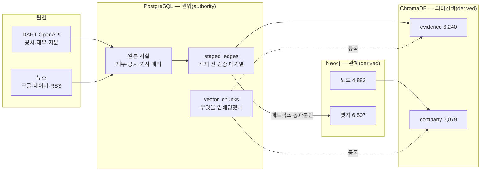
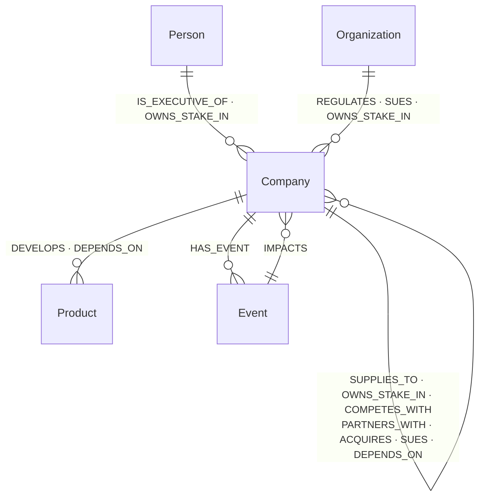
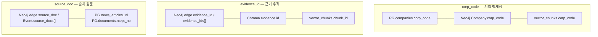

# BizNode 데이터베이스 ERD

> **2026-08-02 실측 기준.** 아래 행 수·제약·컬렉션은 전부 살아 있는 DB에서 읽은 값이다.
> 이전 판(2026-07 작성)은 「PostgreSQL 9종 · ChromaDB 3개 컬렉션」이라 적혀 있었는데
> 실제는 16종 · 2개다. **문서가 스키마를 따라가지 못하면 문서가 거짓말이 된다** —
> 스키마를 바꿀 때 이 파일도 같이 고친다.

---

## 0. 세 저장소의 경계 — 무엇을 어디에 두는가



**규칙 하나로 요약하면** — PostgreSQL이 **권위**이고, Neo4j와 ChromaDB는 **파생**이다.
파생은 언제든 지우고 다시 만들 수 있어야 한다. 그래서 쓰기 순서가 고정돼 있다:

```
staged_edges(권위) → 매트릭스 검증 → Neo4j(파생) → ChromaDB(파생) → vector_chunks(등록)
```

거꾸로 하면 「엣지는 없는데 근거만 남은」 고아가 생긴다. 실제로 274건 생겼었다.

---

# 1. PostgreSQL — 16 테이블

## 1-1. 실사용 중 (12종)

| 테이블 | PK | 행 | 무엇을 담나 |
|---|---|---:|---|
| `corp_code_master` | corp_code | 118,535 | DART 전체 법인 목록 — **개체해소(ER)의 블로킹 사전** |
| `companies` | corp_code | 64 | 시드 기업 기본정보 (이름·시장·업종·대표) |
| `financials` | corp_code, bsns_year, reprt_code | 186 | 3개년 재무 (매출·영업이익·순이익·자산·자본·부채) |
| `documents` | rcept_no | 470 | 수집한 공시 원문 메타 + 파일 경로 |
| `business_segments` | corp_code, bsns_year, segment_name | 201 | 사업부문 매출·비중 + **단위 신뢰 플래그** |
| `company_profiles` | corp_code, version | 60 | 사업보고서 「사업의 개요」 요약 (LLM) |
| `news_articles` | url | 7,185 | 기사 메타 — **본문은 저장하지 않는다**(§1-3) |
| `staged_edges` | id | 9,748 | 적재 대기 엣지 + 검증 결과 |
| `vector_chunks` | chunk_id | 8,319 | 임베딩 레지스트리 — 무엇이 어느 컬렉션에 있나 |
| `edge_subtypes` | edge_type, subtype | 415 | L3 subtype 등장 횟수 (개방 어휘 관리) |
| `extraction_runs` | corp_code, run_at | 32 | 기업별 수집 설정·깔때기·실지출 |
| `unmapped_relations` | expression | 28 | 12종에 못 넣은 관계 표현 — 온톨로지 확장 후보 |

## 1-2. 스키마만 있고 비어 있는 것 (4종)

| 테이블 | 왜 비어 있나 |
|---|---|
| `market_data` | **주가 미수집.** 서빙 계층에서 채울 자리 |
| `business_overview` | `company_profiles`가 같은 역할을 하게 되어 사용 안 함 |
| `shareholder_summaries` | 소액주주 통계 — 사업보고서 파싱 미구현 |
| `ingest_runs` | `extraction_runs`가 대체 |

> 비어 있는 테이블을 지우지 않는 이유 — 스키마가 곧 **계획서**다. 지우면
> 「주가는 원래 안 하기로 했다」로 오해된다. 비어 있음 자체가 정보다.

## 1-3. `news_articles`에 본문 컬럼이 없는 이유

```
url · title · press · published_at · source_channel · title_hash
body_length · rule_passed · llm_relevant · matched_corps · extracted_at · collected_at
                ↑ 길이만 남긴다
```

크롤러가 언론사 robots.txt를 지키는 조건으로 본문을 받아 **관계 추출에만 쓰고 버린다**
(`extractors/news/crawler.py` 헤더). 화면이 인용하는 건 근거 한두 문장(ChromaDB)까지고,
그 이상은 원문 링크로 내보낸다. 저작권상 인용 범위 안이고, 크롤링 정당성과도 앞뒤가 맞는다.

## 1-4. `staged_edges` — 적재 전 검문소

```
9,748건 적재 시도
  ├ validated=false   319건   매트릭스 위반 → Neo4j에 안 올림, 기록만
  └ validated=true  9,429건
       └ 고유 (src,tgt,type,subtype) 7,298건   ← 같은 관계의 반복 보도가 접힌다
            └ Neo4j 엣지 6,507건               ← 정리·클러스터링 후
```

**검증 실패를 지우지 않고 남기는 게 핵심이다.** 무엇이 왜 막혔는지 봐야
온톨로지를 넓힐지 추출기를 고칠지 판단할 수 있다.

---

# 2. Neo4j — 노드 4,882 · 엣지 6,507

## 2-1. 노드-엣지 허용 행렬 (L2 = 고정 12종)



| 라벨 | 수 | 식별자 | 유니크 제약 |
|---|---:|---|---|
| `Company` | 2,331 | `corp_code`(해소됨) 또는 `norm_name`(stub) | **`corp_code`만** ⚠ |
| `Product` | 1,175 | `norm_name` | ✅ |
| `Person` | 581 | `person_key` | ✅ |
| `Event` | 566 | `event_id` | ✅ |
| `Organization` | 229 | `norm_name` | ✅ |

> ⚠ **`Company.norm_name`에 유니크 제약이 없다.** 그런데 stub은 그 키로 MERGE한다
> (`graph_loader._company_ident`). 지금 중복은 1쌍(`케이씨텍`, corp_code 두 개라
> 분할 전후로 보임)뿐이지만, 제약이 없으면 **막아 주는 것이 없다**.
> corp_code가 둘이라 유니크를 걸면 적재가 깨지므로, 걸기 전에 그 쌍을 정리해야 한다.

| 엣지 | 수 | | 엣지 | 수 |
|---|---:|---|---|---:|
| `OWNS_STAKE_IN` | 1,873 | | `PARTNERS_WITH` | 456 |
| `DEVELOPS` | 1,256 | | `REGULATES` | 153 |
| `SUPPLIES_TO` | 638 | | `SUES` | 148 |
| `IMPACTS` | 569 | | `ACQUIRES` | 127 |
| `IS_EXECUTIVE_OF` | 566 | | `DEPENDS_ON` | 113 |
| `HAS_EVENT` | 521 | | `COMPETES_WITH` | 87 |

## 2-2. MERGE 키 — 무엇을 같은 것으로 볼 것인가

```python
# graph_loader._company_ident
8자리 숫자 → {corp_code: key}      # 해소된 기업 (시드·마스터 매칭)
그 외      → {norm_name: key}      # stub (이름만 아는 회사)

# graph_loader._rel_ident
{subtype: props["subtype"]}        # 상태·사건 모두 subtype 기준
```

**엣지를 `source_doc`으로 식별하지 않는 이유** — 그러면 같은 사건의 반복 보도가
전부 별개 엣지가 된다. 실측으로 `삼성전자 -ACQUIRES-> 레인보우로보틱스`가 **32개**였다
(하루에 10건 보도). 지금은 **엣지 하나, 근거는 배열**이다.

## 2-3. 엣지 속성 3층 — 시점·근거·검증

| 층 | 속성 | 쓰임 |
|---|---|---|
| **시점** | `observed_at` `as_of` `valid_from` `valid_to` `last_seen` `is_current` | 신선도는 **조회 때 계산**한다(저장 안 함) |
| **근거** | `evidence_id` `evidence_ids[]` `source_doc` `source_docs[]` `confidence` `corroboration` | 근거 없는 엣지는 만들지 않는다 |
| **검증** | `grounding_suspect` `grounding_stage1` `grounding_verdict` `grounding_reason` `retype_suspect` `retype_hint` `*_checked_at` | **지우지 않고 표시만** |

> **`grounding_suspect`가 리스크 점수를 직접 움직인다.** `propagate_risk`가 이 표시로
> 경로를 거르는데, 실측상 파급 대상의 9.5%를 빼고 64.5%의 점수를 바꾼다
> (허브 감점이 「보이는 엣지 수」로 계산되기 때문). 그래서 이 세 속성의
> 정합성 검사가 `audit/graph.py`에 있다 — 서로 모순이면 곧 리스크 숫자가 틀린다.

## 2-4. stub 3-상태

```
stub          이름만 안다 · corp_code 없음        2,267곳
  ↓ 개체해소(ER) — corp_code_master 118,535건과 대조
resolved      corp_code가 붙었다                   764곳(stub 중)
  ↓ 시드 지정 + 뉴스·공시 추출
seed          우리가 깊이 파는 대상                  64곳
```

**stub을 지우지 않는 이유** — 엔비디아·TSMC·마이크론이 전부 stub이다.
연결 상위 8곳이 전부 해외 기업이라, stub을 버리면 공급망이 국경에서 끊긴다.
대신 `sector_label`·`entity_kind`·`sector_confidence`로 **무엇인지 표시**한다.

---

# 3. ChromaDB — 컬렉션 2개

| 컬렉션 | 수 | 한 레코드 = | id 규칙 |
|---|---:|---|---|
| `evidence` | 6,240 | 관계를 뒷받침하는 근거 1~2문장 | `ev_` + sha1(출처\|출발\|도착\|유형\|subtype)[:16] |
| `company` | 2,079 | 회사 소개 카드(개요+제품+거래처) | `co_{corp_code}` 또는 `co_n{sha1(이름)[:12]}` |

임베딩 모델은 **둘이 공유**한다(`text-embedding-3-small`). 모델을 바꾸면
`vector_chunks.embedding_model`로 재임베딩 대상을 특정한다.

**컬렉션을 나누는 이유** — 벡터 공간이 곧 컬렉션이다. 「문장 조각」과 「회사 카드」는
길이도 의미 단위도 달라서, 한 공간에 넣으면 *「HBM 만드는 회사」* 질의에
근거 문장이 섞여 나온다.

> ChromaDB 메타데이터는 **스칼라만** 받는다. `sector`는 설계상 배열이라
> (한 회사가 반도체이면서 로봇일 수 있다) 카드에 넣을 때 문자열로 접는다.
> 배열 필터가 필요하면 PostgreSQL에서 먼저 거르고 id 목록으로 넘긴다.

---

# 4. 세 저장소를 잇는 키



| 키 | 형태 | 무엇을 잇나 |
|---|---|---|
| `corp_code` | CHAR(8) | 세 저장소 전부의 기업 식별자 |
| `evidence_id` | `ev_` + 해시 16자 | 엣지 → 근거 원문 (**결정적 해시** — 재실행해도 같다) |
| `source_doc` | 기사 URL 또는 `rcept_no` 14자리 | 엣지·사건 → 기사·공시 메타 |
| `chunk_id` | `ev_…` / `co_…` | ChromaDB ↔ 레지스트리 |
| `title_hash` | sha1 | 같은 기사의 중복 수집·**재추출 방지**(돈) |

**교차 정합성은 `audit/graph.py`가 매번 확인한다** — 「엣지의 evidence_id가
vector_chunks에 없음」, 「Company.corp_code가 master에 없음」, 「어느 엣지도
가리키지 않는 고아 청크」.

---

# 5. 아직 정하지 않은 것

| 항목 | 지금 | 남은 판단 |
|---|---|---|
| 주가 | `market_data` 빈 테이블 | 소스 선정 (KRX / 증권사 API) |
| `Event.is_risk` | **노드 속성** | 기업마다 다를 수 없다 — 엣지로 옮겨야 함 |
| `Company.norm_name` 유니크 | 제약 없음 | `케이씨텍` 중복 정리 후 제약 추가 |
| 리서치 보관함 | 미구현 | `research_notes` 스냅샷 테이블 (인증 없이) |
| 허브 감점 분모 | 보이는 엣지 수 | 전체 엣지 수로 셀지 — 리스크 점수가 달라진다 |
