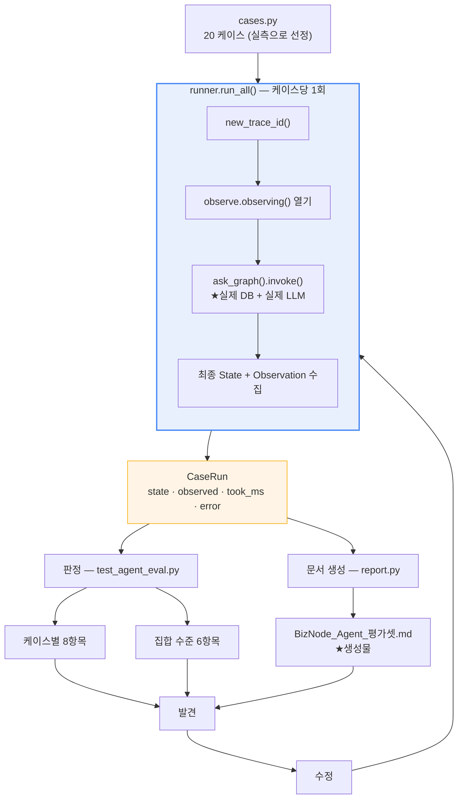

# BizNode Agent — Evaluation Specification & Report

> **대상 코드**: `yun-phase2` · HEAD `709496a` (2026-08-28 23:08)
> **평가셋 코드**: `tests/agent/eval/` · **생성 결과**: [BizNode_Agent_평가셋.md](BizNode_Agent_평가셋.md)
> **함께 읽을 문서**: [Architecture & Design](BizNode_Agent_Architecture_Design.md) · [개발 이력](BizNode_Agent_Development_History.md)

---

## 1. 평가 목적

### 1-1. 무엇을 재려고 만들었나

**Agent 를 붙였는데, 그것이 실제로 무엇을 얼마나 쓰는지 아무도 몰랐습니다.**

Agent 도입 전 `/ask` 에는 대표 20질문(2026-08-23)이 있었지만, 그것은 **도구 5종이 생기기 전에** 작성된 질문 목록이었습니다. `search_dart` · `get_business_overview` · `get_market` · `get_filings` 를 끌어오는 질문이 하나도 없어서, **새 도구가 실제로 도는지 확인할 방법이 없었습니다.**

### 1-2. Phase 8 의 완료 기준 — ★「답을 더 잘 쓰나」가 아닙니다

```text
재는 것       Agent 가 무엇을 · 얼마나 · 어떤 순서로 썼나
안 재는 것    답변 문장이 좋은가 (내용 품질)
```

★**답변 내용 품질은 이 평가셋의 대상이 아니며, 현재까지 사람이 채점한 적이 없습니다**(현황서 §0 「🟡 미검증」). 이 평가셋이 재는 것은 **구조적 안전성과 비용**입니다.

### 1-3. 평가가 실제로 만든 것 셋

| # | 무엇 | 근거 |
|---|---|---|
| ① | **예산 상한 4개의 실측 근거** — 그 전까지 「실측 근거 없는 잠정치」였습니다 | §8-2 |
| ② | **`propagations_used` 단위 불일치 발견** — 상한 12 에 실측 303. ★**2026-08-29 해소**(Phase 10) | §9-2 |
| ③ | **링 랭킹 가설의 반증** — 수정해도 R2 가 안 살아나는 구조적 이유 | §10-3 |
| ④ | ★**링 계측 자체의 결함 발견·해소** — 관측이 「호출 × 관계」를 세고 있었습니다 | §9-7 |

★**④ 가 ③ 을 한 번 더 정정했습니다.** 평가는 시스템만 재는 것이 아니라 **자기 자신도 재야 한다**는 것을 보여준 자리입니다.

---

## 2. 평가 대상

### 2-1. 평가 경계 — Search 평가셋과 섞지 않습니다

| | `tests/search/eval/` | `tests/agent/eval/` |
|---|---|---|
| 무엇을 재나 | 검색이 **설계대로 갈리나** | ★**Agent 가 무엇을 얼마나 쓰나** |
| 범위 | `SearchOrchestrator.search()` 까지 | `ask_graph()` **끝까지** |
| LLM | 안 부름 | ★**실제로 부름** |
| 케이스 | 20 (회귀 기준선 — **그대로 보존**) | 20 (신설) |

★**저쪽은 검색 계층의 회귀 기준선입니다.** 여기 케이스를 섞으면 검색 회귀가 LLM 변덕에 흔들립니다.

### 2-2. 실행 대상 — 실제 저장소 + 실제 LLM

```bash
pytest tests/agent -m needs_llm -q \
       --agent-eval-report=docs/BizNode_Agent_평가셋.md
```

- 실제 **PostgreSQL · Neo4j · ChromaDB**
- ★**실제 OpenAI 호출** — Agent 가 도구를 고르는 것이 평가 대상이라, 고정 응답을 물리면 **잴 것이 사라집니다**
- `needs_llm` 마커로 **기본 실행에서 빠집니다** — 비용이 들고, API 키가 없는 환경에서 실패하면 「내 변경이 깼나」를 매번 다시 가려야 합니다

### 2-3. 실행 경로 — `run_ask()` 를 안 쓰는 이유

```python
# tests/agent/eval/runner.py
new_trace_id()
with observe.observing() as seen:
    state = ask_graph().invoke(initial_state(build_request(case)))
```

`run_ask()` 는 `AskResponse` 만 돌려주는데, 평가는 **그 안을 봐야** 합니다 — 어떤 도구가 불렸나 · 재료가 몇 건 들어왔나 · 링이 어떻게 갈렸나. 그래서 `invoke()` 를 직접 불러 **최종 State 를 통째로** 받습니다.

★**다른 경로를 타는 것이 아니라 같은 경로를 더 많이 보는 것입니다** — `run_ask()` 가 하는 일(trace id 발급 → invoke → 응답 꺼내기)을 여기서 그대로 합니다.

---

## 3. 평가셋 구성

### 3-1. 20 케이스 — `anchor_source` 3분법이 척추입니다

```text
QUERY       질문이 대상을 지정했고 해소됐다        → Agent 호출됨            12 케이스
WORKSPACE   질문이 대상을 지정하지 않았다          → Agent 호출됨 · 의미검색   6 케이스
UNRESOLVED  지정했는데 못 찾았다                   → ★Agent 미호출            2 케이스
                                                                        ─────────
                                                                          20 케이스
```

★**가운데가 「기업이 명시되지 않은 산업·주제·이벤트 탐색형」입니다.** 코드에 `NOT_SPECIFIED` 라는 이름은 **없습니다** — `AnchorSource.WORKSPACE` 가 그 상태이고, `UNRESOLVED` 와 갈리는 지점은 **Agent 를 부르느냐**입니다.

### 3-2. 케이스 전량 (`tests/agent/eval/cases.py`)

#### A. `anchor:QUERY` — 12 케이스

| # | id | 질문 | 끌어오려는 도구 | 무엇을 덮나 |
|---:|---|---|---|---|
| 1 | `query-relations-supplies` | 삼성전자에 납품하는 기업은? | `get_relations` | 관계 질의 · 단일 도구 |
| 2 | `query-events-labor` | SK하이닉스 노조 관련 리스크 알려줘 | `get_events` `search_news` | 사건:노무 |
| 3 | `query-overview-context-only` | HD현대는 무슨 사업을 하는 회사야? | `get_business_overview` | ★**인용 불가(사업개요)** |
| 4 | `query-market-no-evidence-id` | 삼성전자 시가총액이랑 PER 알려줘 | `get_market` | ★**근거 id 없음(계산값)** |
| 5 | `query-filings-list` | HD현대가 낸 공시 목록을 보여줘 | `get_filings` | 목록형 |
| 6 | `query-dart-evidence` | 현대로템 사업보고서 내용에서 주요 제품을 찾아줘 | `search_dart` `get_business_overview` | 공시 근거 |
| 7 | `query-news-citable` | 파두 실적 논란 어떻게 됐어? | `search_news` `get_events` | ★**인용 가능(뉴스)** · 사건:실적 |
| 8 | `query-multi-company-suit` | 삼성전자와 SK하이닉스 둘 다 관련된 소송 있어? | `get_relations` `get_events` `search_news` | 복수 기업 · multi-tool |
| 9 | `query-multi-company-relation` | 한미반도체와 SK하이닉스 관계 알려줘 | `get_relations` | 두 기업 **사이** 관계 |
| 10 | `query-multitool-invest-and-price` | 레인보우로보틱스 최근 투자 상황이랑 주가도 같이 알려줘 | `get_relations` `get_market` `get_events` | ★**성격이 다른 두 도구** |
| 11 | `query-event-info-leak` | 현대오토에버 정보유출 사건 | `get_events` `search_news` | 사건 유형의 **꼬리** |
| 12 | `query-event-capital-smallcap` | 심텍 최근 자본거래 알려줘 | `get_events` `search_news` `search_dart` | ★**중소형 · 얇은 재료** |

#### B. `anchor:WORKSPACE` — 6 케이스 (기업 미지정 탐색형)

| # | id | 질문 | 끌어오려는 도구 | 무엇을 덮나 |
|---:|---|---|---|---|
| 13 | `ws-semantic-strike` | 반도체 업계 파업 위험이 있나? | `search_news` `get_events` | 산업·주제 탐색 |
| 14 | `ws-semantic-capital-trend` | 최근 자본거래 동향 알려줘 | `search_news` `get_events` `search_dart` | 기업·관계 키워드 **둘 다 없음** |
| 15 | `ws-semantic-collusion` | 메모리 가격 담합 관련 소식 | `search_news` `get_relations` | 제품·행위만 있는 질문 |
| 16 | `ws-semantic-quality` | 품질 문제로 논란된 사례 있어? | `search_news` `get_events` | 사건 유형 중 **가장 얇은 축** |
| 17 | `ws-market-across-workspace` | 우리 워크스페이스 기업들 주가 어때? | `get_market` | 미지정 + **계산값 도구** |
| 18 | `ws-relationship-regulator` | 최근 규제당국 조사 동향 | `get_relations` `get_events` | ★**대조군** — 미지정인데 SEMANTIC 이 아니라 RELATIONSHIP |

★**18번이 대조군인 이유**: 기업 미지정이 곧 의미검색은 아닙니다. 관계 키워드(「규제」)가 잡히면 `RELATIONSHIP` 으로 갑니다 — **WORKSPACE 앵커와 의미검색이 1:1 이 아님**을 드러냅니다.

#### C. `anchor:UNRESOLVED` — 2 케이스 (★Agent 미호출)

| # | id | 질문 | must_not_call | 무엇을 덮나 |
|---:|---|---|---|---|
| 19 | `unresolved-unknown-company` | 무한상사 실적 알려줘 | **도구 7종 전부** | ★워크스페이스로 **안 갈아탐** |
| 20 | `unresolved-gibberish` | storminmvpsdjfk 이 뭐야 | **도구 7종 전부** | 의미검색 10건이 나와도 이름 해소로 둔갑 안 함 |

### 3-3. 커버리지 선언 — `REQUIRED_COVERAGE` 26 태그

케이스를 지우다 분기가 통째로 비면 `test_coverage_is_complete` 가 잡습니다.

```text
anchor:      QUERY · WORKSPACE · UNRESOLVED
agent:       호출됨 · 미호출
tool:        get_relations · get_events · search_news · search_dart ·
             get_business_overview · get_market · get_filings          (7종 전부)
scale:       단일 도구 · multi-tool
company:     단일 · 복수
topic:       산업·주제 탐색 · 이벤트 탐색
citation:    인용 가능(뉴스) · 인용 불가(사업개요) · 근거 id 없음(계산값)
event:       노무 · 실적 · 정보유출 · 자본거래 · 품질
```

### 3-4. 워크스페이스 고정

```python
WORKSPACE = ("00126380", "00164779")   # 삼성전자 · SK하이닉스
```

`batch/audit/ask_graph_parity._WORKSPACE` 와 **같은 값**입니다 — 대조 스크립트와 평가셋이 같은 문맥을 씁니다.

---

## 4. 평가 케이스 선정 방법

### 4-1. ★질문을 지어내지 않았습니다 — 실측으로 골랐습니다

**두 단계를 거쳤습니다.**

**① 데이터 대조** — 각 질문이 실제로 재료를 끌어올 수 있는지 DB 로 확인했습니다.

| 케이스 | 대조한 실측치 |
|---|---|
| `query-relations-supplies` | `SUPPLIES_TO` 1,179건 · 삼성전자 차수 1,169 |
| `query-events-labor` | SK하이닉스 사건 69건에 노무 포함 · 노무는 28사 94건 |
| `query-overview-context-only` | HD현대 사업개요 **16,623자 — 64사 중 가장 길다** |
| `query-market-no-evidence-id` | `market_data` 53,045행 · 64사 × 125거래일 |
| `query-filings-list` | HD현대 documents 82건 — 파두 68 · 현대로템 55 다음 |
| `query-dart-evidence` | 현대로템 dart 32 + dart_filing 27 (`dart_filing` 은 전 기업 통틀어 113건뿐) |
| `query-news-citable` | 파두 news 97건 · 사건 26건에 실적 포함 |
| `query-multi-company-suit` | `SUES` 339건 · 분쟁소송 36사 88건 |
| `query-multi-company-relation` | 한미반도체 차수 164 · 근거 200건(news 169 · dart 28) |
| `query-multitool-invest-and-price` | 레인보우로보틱스 차수 181 · 사건 21건 · 근거 246건 |
| `query-event-info-leak` | 정보유출은 **14사 19건뿐** — 사건 유형의 꼬리 |
| `query-event-capital-smallcap` | 심텍 근거 42건 — **삼성전자 1,247건의 3%** · 자본거래 47사 72건 |
| `ws-semantic-*` | SEMANTIC 10건 |
| `ws-relationship-regulator` | RELATIONSHIP 10건 · `REGULATES` 398건 · 규제수사 26사 50건 |
| `ws-semantic-quality` | 품질 **7사 18건** — 사건 유형 중 가장 얇다 |

**② 경로 대조** — 후보를 `search` + `resolve_anchor` 에 **실제로 통과시켜** 어느 갈래로 떨어지는지 보고 확정했습니다.

★**추측으로 적으면 케이스가 기대와 다른 경로를 잽니다.**

### 4-2. 실측에서 걸러낸 후보 넷 — ★이것이 이 방법의 값어치입니다

| 후보 질문 | 실제 판정 | 왜 뺐나 |
|---|---|---|
| 「요즘 공급망 리스크 큰 이슈가 뭐야?」 | **QUERY · 0건** | ★「요즘」이 **실존 법인**(01719318)으로 잡힙니다. 동음이의 결함(현황서 §4-5)과 같은 부류 |
| 「인텔 파운드리 사업 어떻게 됐어?」 | **QUERY** | 「파운드리서울」(01354528)에 붙습니다 |
| 「존재하지않는기업 관련 뉴스」 | ★**WORKSPACE** (UNRESOLVED 아님) | 이름 토큰이 안 잡혀 「지정했다」로 안 읽힙니다 |
| 「TSMC 최근 실적」 | **QUERY** | TSMC 가 그래프에 실재합니다 |

★**넷 다 「이 케이스가 무엇을 잰다」는 의도와 실제 경로가 어긋난 경우**입니다. 특히 3번은 UNRESOLVED 케이스를 만들려다 WORKSPACE 로 떨어지는 것을 발견한 것으로, **평가셋이 자기 전제를 검증한 사례**입니다.

### 4-3. 무엇을 못 박고 무엇을 안 박나

```python
expected_anchor_source   # ★못 박는다 — 서버가 정하는 결정론적 값
expects_agent            # ★못 박는다 — UNRESOLVED 면 Agent 미호출
must_not_call            # ★못 박는다 — 계약 위반을 잡는 자리
expects_tools            # 기대일 뿐 — 판정은 「이 중 최소 하나」
min_relations/events/evidence   # 하한만 (상한은 예산이 본다)
```

★**기업명·순위는 못 박지 않습니다.** 관계 점수와 임베딩 유사도는 데이터가 늘면 순서가 바뀝니다. `tests/search/eval/cases.py` 의 `kind="structural"` 과 같은 규약이고, 여기는 **앵커에만** 고정값을 씁니다 — 앵커는 서버가 정하는 결정론적 값이라 데이터가 늘어도 안 흔들립니다.

### 4-4. ★「심텍 공급 리스크 케이스 교체」 — 확인되지 않음

작업 지시서에 이 항목이 있었으나, **git 이력(`git log -S`)과 문서 어디에서도 「심텍 공급 리스크」 케이스를 찾지 못했습니다.**

현재 12번 케이스는 `query-event-capital-smallcap`(「심텍 최근 자본거래 알려줘」)이며, 선정 근거는 **「중소형 기업 · 얇은 재료」**입니다 — 기존 20질문이 삼성전자·SK하이닉스에 쏠려 못 보던 자리를 덮기 위한 것입니다.

**교체가 있었다면 커밋 전 세션 내에서 일어나 기록이 남지 않은 것으로 보입니다.** 근거가 없으므로 **「현재 자료에서 확인되지 않음」**으로 기록합니다.

---

## 5. 평가 축

### 5-1. 축 8개 — 판정하는 것과 관측만 하는 것

| 축 | 판정? | 어떻게 재나 | 어디서 |
|---|---|---|---|
| **Answer Correctness** | ★**부분** | `failed=False` 인가 — **문장 내용은 안 봄** | `test_case` ⑥ |
| **Tool Coverage** | ★**집합 수준만** | 20 케이스 전체에서 7종이 한 번씩은 불렸나 | `test_every_tool_is_exercised` |
| **Evidence Grounding** | ○ | 재료 하한(`min_evidence`) | `test_case` ⑤ |
| **Citation Quality** | ○ | ① 화이트리스트 밖 근거가 안 나가나 ② 인용 불가 도구가 근거가 안 되나 | `test_case` ⑧ · `test_context_only_material_never_becomes_a_citation` |
| **Ring Distribution** | ✕ **관측만** | `ring_seen` / `ring_kept` / `cited_rings` | `observe.record_rings` |
| **Budget Usage** | ○ | 상한 준수 + 소진돼도 응답이 나오나 | `test_case` ④ · `test_budget_is_never_exceeded` |
| **Provenance** | ○ (단위) | 관통 + 프롬프트 비노출 | `tests/graph/test_provenance.py` |
| **Unresolved handling** | ○ | Agent 미호출 · 도구 0 · 근거 0 | `test_unresolved_never_reaches_the_agent` |

### 5-2. ★ranking 을 판정하지 않는 이유

**Phase 8 은 ranking 을 고정한 채 Agent 의 효과와 비용을 재는 단계입니다.**

링 임계값을 평가셋에 넣으면 **재는 도구가 판정기가 되어** 「링 랭킹을 바꿔야 하나」의 판단을 미리 해버립니다. 링 랭킹을 바꿀지는 **이 관측 결과를 보고** 정합니다.

★같은 원칙이 `observe.py` 에도 적용됩니다 — **거기에 임계값이 없습니다.**

### 5-3. Answer Correctness 가 「부분」인 이유

```text
잽니다     failed=False 인가 (LLM 이 답을 냈나 · 빈 답이 아닌가)
안 잽니다  답변 문장이 사실인가 · 질문에 맞나 · 잘 쓰였나
```

★내용 품질 채점은 **사람이 하는 일**이고, 아직 안 했습니다. 이 평가셋은 「구조적 안전성」을 재는 자리입니다.

### 그림 5. 평가 구조



★**판정과 문서 생성이 같은 `CaseRun` 을 씁니다** — 재측정에서 고친 부분입니다(§10-4).

---

## 6. 집합 수준 평가

### 6-1. ★왜 케이스마다 도구를 고정하지 않았나

```text
판정한다     서버가 결정론으로 정하는 것
             anchor_source · Agent 호출 여부 · 예산 상한 준수 · 범위 준수 ·
             재료 하한 · 인용 규칙

판정 안 한다  ★어떤 도구를 골랐는가
             LLM 이 정하고, 같은 질문에 다른 조합이 나올 수 있다
```

**케이스마다 「이 도구를 반드시 불러야 한다」로 박으면 모델을 바꿀 때마다 평가셋이 빨간불이 됩니다.** 그것은 Agent 의 결함이 아니라 평가셋의 경직성입니다.

**실측이 이 판단을 뒷받침합니다** — 같은 코드로 3회 돌렸을 때 총 도구 호출이 **36 · 33 · 37** 로 흔들렸습니다(재측정에서 34). 케이스별 도구를 고정했다면 이 노이즈가 전부 실패로 나타났을 것입니다.

### 6-2. 대신 집합 수준에서 강제합니다

「도구가 전부 실제 호출되게 구성한다」는 요구는 **케이스 하나가 아니라 평가셋 전체의 성질**입니다.

| 테스트 | 무엇을 강제하나 |
|---|---|
| `test_every_tool_is_exercised` | ★**도구 7종이 전부 한 번씩은 실제로 불렸나** |
| `test_workspace_anchor_actually_reaches_the_agent` | 기업 미지정 케이스가 Agent 를 부르고, **그중 의미검색 도구가 실제로 도나** |
| `test_unresolved_never_reaches_the_agent` | UNRESOLVED 는 Agent 미호출 · 도구 0 · **근거 0** |
| `test_budget_is_never_exceeded` | 상한 준수 + 소진돼도 **응답은 나감** |
| `test_context_only_material_never_becomes_a_citation` | 인용 불가 도구의 결과가 근거 화이트리스트를 안 늘림 |
| `test_out_of_scope_keys_are_never_used_as_material` | 거부가 있어도 그래프가 안 죽고, 재료가 안 늚 |

### 6-3. 평가셋 자체를 검증하는 테스트 둘

LLM 을 안 부르고 케이스 정의만 봅니다.

| 테스트 | 무엇을 막나 |
|---|---|
| `test_coverage_is_complete` | 케이스를 지우다 **분기가 통째로 비는 것** |
| `test_every_case_declares_a_tool_it_is_designed_to_pull` | 선언 없는 케이스 · **존재하지 않는 도구를 기대하는 케이스** |

★후자가 없으면 `test_every_tool_is_exercised` 가 빨간불일 때 **어느 케이스를 고쳐야 할지 되짚을 수 없습니다.**

---

## 7. Baseline

### 7-1. 세 시점 — ★둘이 아니라 셋입니다

| | 잰 코드 상태 | 링 계측 | 무엇을 위한 실행인가 |
|---|---|---|---|
| **① Baseline** | `a7925ae` | ★중복 계수 | 링 안 의도 정렬이 **꺼진** 상태의 기준선 |
| **② After (fix)** | `41bb1bb` | ★중복 계수 | 정렬 **복구** 후 |
| **③ 정본** | `9ae14c4` | **dedup 적용** | 계측을 고친 뒤 다시 잼 — ★**이 값이 정본입니다** |

★**①만 부풀어 있습니다.** ②③ 은 같은 값인데, 그 실행들에 **겹치는 도구 호출이 없어서**이지 dedup 덕분이 아닙니다 (§8-5).

### 7-2. ★두 실행 사이에 무엇이 바뀌었나

**`41bb1bb` — `edge_types`·`direction` 을 `ToolContext` 로 옮김** (Architecture §17-4)

```text
바뀐 것    링 안에서 질문이 물은 엣지 타입이 앞으로 오는가
안 바뀐 것 도구 스키마 · 시스템 프롬프트 · Agent 인자 · 링 분류 · 자르는 규칙
```

★그래서 **도구 호출 분포는 원리적으로 안 바뀝니다** — 실제 차이는 실행마다 흔들리는 노이즈 범위(33~37) 안입니다.

### 7-3. 재현 방법

```bash
# 판정 + 문서를 한 실행으로
pytest tests/agent -m needs_llm -q \
       --agent-eval-report=docs/BizNode_Agent_평가셋.md

# 판정 없이 문서만
.venv-wsl/bin/python -m tests.agent.eval.report -o docs/BizNode_Agent_평가셋.md
```

★**기준선으로 쓰려면 `EMBED_CACHE_STRICT=1`** 로 다시 재야 합니다 — 캐시가 빗나가면 그 실행은 임베딩을 직접 계산하고, 그 값은 실행마다 흔들립니다(현황서 §8-13).

---

## 8. 실제 평가 결과

**★두 실행 모두 실측입니다. 추정치가 아닙니다.**

### 8-1. 판정 결과

| | ① `a7925ae` | ② `41bb1bb` | ③ `9ae14c4` (정본) |
|---|---|---|---|
| 케이스 | 20 | 20 | 20 |
| **PASS** | **20** | **20** | **20** |
| FAIL | 0 | 0 | 0 |
| Agent 가 불린 케이스 | 18 / 20 | 18 / 20 | 18 / 20 |
| 집합 수준 판정 | 전부 통과 | 전부 통과 (28 passed) | 전부 통과 |

★**Agent 미호출 2건은 설계대로입니다** — UNRESOLVED 케이스입니다.

### 8-2. 비용 — ★예산 4개의 실측 근거를 처음 만들었습니다

`app/graph/budget.py` 의 네 값은 「실측 근거가 없다」고 코드에 적혀 있었습니다. 이 표가 그 근거입니다.

| 카운터 | 상한 | ① 최대 | ② 최대 | ③ 최대 (정본) | 상한에 닿은 케이스 | 읽는 법 |
|---|---:|---:|---:|---:|---:|---|
| `tool_calls_used` | 12 | 5 | 3 | **4** | 0 | 한 번도 안 뭅니다. **12 는 넉넉합니다** |
| `events_used` | 40 | 20 | 20 | **20** | 0 | 한 번도 안 뭅니다 |
| `propagations_used` | 12 | 303 | 303 | ★**303** | **9** | ↓ **상한을 25배 넘겼습니다** |
| `hops_used` | 6 | 0 | 0 | **0** | 0 | 아무도 안 씁니다 (`explore_impact` 미구현) |

★`tool_calls_used` 최대가 5 → 3 → 4 로 움직이는 것은 **코드 변화가 아니라 LLM 의 도구 선택 변동**입니다(§9-5). 셋 다 상한 12 에 한참 못 미칩니다.

★**`propagations_used` 의 303 은 계측 결함의 값입니다** — 2026-08-29(Phase 10)에 세는 단위를 사건 수로 고쳤으므로 **다음 실행부터는 12 이하**입니다. 위 수치는 고치기 전의 기록으로 남깁니다(§9-2).

### 8-3. 도구 호출

| | ① `a7925ae` | ② `41bb1bb` | ③ `9ae14c4` (정본) |
|---|---:|---:|---:|
| 총 호출 | 37 | 34 | **35** |
| 케이스당 (최소·중앙·최대) | 1 · 2 · 5 | 1 · 2 · 3 | **1 · 2 · 4** |
| 거부(`tool_errors`) | 0 | 0 | **0** |

**도구별 (정본 `9ae14c4`):**

| 도구 | 호출 | 쓴 케이스 | 인용 |
|---|---:|---:|---|
| `get_relations` | 3 | 3 | 불가 |
| `get_events` | 11 | 9 | 불가 |
| `search_news` | 6 | 6 | ★**가능** |
| `search_dart` | 3 | 3 | 불가 |
| `get_business_overview` | 2 | 2 | 불가 |
| `get_market` | 4 | 3 | 불가 |
| `get_filings` | 6 | 5 | 불가 |

★**세 실행에서 총 호출이 37 · 34 · 35 로 흔들립니다.** 코드가 그 사이 바뀌었지만(`41bb1bb`), 도구 스키마·시스템 프롬프트는 **무변경**이므로 이 변동은 **LLM 의 선택 변동**으로 읽어야 합니다(§9-5).

★**7종 전부 실제로 불렸습니다** — `test_every_tool_is_exercised` 통과. 이 평가셋의 존재 이유가 이것입니다.

★**범위 밖 key 거부가 0건입니다** — Agent 가 프롬프트에 실린 key 목록 안에서 골랐다는 뜻입니다(이중 방어 중 1차가 작동).

### 8-4. 예산 — ★두 줄을 갈라 읽어야 합니다

| | 세 실행 모두 |
|---|---:|
| **Agent 루프가 예산으로 잘린** 케이스 | ★**0 / 20** |
| 최종 `budget_exhausted` 플래그 | 9 / 20 |

★**플래그 9건은 `fetch_propagation` 이 Agent 루프 뒤에 파급 예산을 채워서 켜진 것**입니다. 루프가 잘린 것과 섞으면 「상한을 올려야 하나」의 답이 갈립니다 — **루프가 잘렸으면 도구 예산 얘기고, 뒤에서 찬 것이면 파급 예산 얘기**입니다.

이 구분을 위해 `observe.agent_stopped_by_budget` 을 State 플래그와 별도로 둡니다(Architecture §19-3).

### 8-5. 링 분포 — ★관측만 (판정 아님) · 정본은 `9ae14c4`

★**이 표는 계측을 고친 뒤 다시 잰 값입니다.** 그 전 수치가 왜 못 쓰는지는 §10-3 에 있습니다.

| 링 | 도구가 본 관계 | 상한에 남은 것 | **최종 인용** |
|---|---:|---:|---:|
| **R0** 양끝 모두 워크스페이스 안 | 9 | 9 | 1 |
| **R1** 워크스페이스 ↔ 바깥 기업 | 746 | 101 | 6 |
| **R2** 워크스페이스 ↔ 비-Company | 203 | ★**0** | 0 |
| **R3** 워크스페이스와 안 닿음 | 50 | ★**0** | 0 |
| **합계** | **1,008** | **110** | 7 |

- 관계 kept **110** · cut **898**
- 최종 인용 45건 중 **38건이 관계가 아닙니다** (사건·뉴스 근거 — 링이 없습니다)

#### 세 시점 대조 — 무엇이 오염이었나

| 시점 | 계측 | `get_relations` 호출 | R1 본 것 / 남은 것 | R3 본 것 / 남은 것 | kept |
|---|---|---:|---|---|---:|
| `a7925ae` | ★중복 계수 | **7회** / 3케이스 | 754 / 109 | 63 / 8 | 126 |
| `41bb1bb` | ★중복 계수 | 3회 / 3케이스 | 746 / 101 | 50 / 0 | 110 |
| `9ae14c4` | **dedup 적용** | 3회 / 3케이스 | **746 / 101** | **50 / 0** | **110** |

**읽는 법이 중요합니다.**

- ★**`a7925ae` 만 부풀어 있었습니다.** 그 실행에서 Agent 가 `get_relations` 를 **7회** 불렀고(케이스는 3개 — 한 케이스가 여러 번 불렀습니다), 중복 목격이 그대로 더해졌습니다. R1 +8 · R3 +13 이 그 몫입니다
- **뒤의 두 실행은 값이 정확히 같습니다.** 둘 다 호출이 3회 · 케이스 3개라 **겹치는 호출이 없었고**, dedup 이 실제로 접을 것이 없었습니다. ★**이 둘이 같은 것은 우연이지 dedup 의 증거가 아닙니다** — dedup 이 보장하는 것은 「겹치는 호출이 있어도 안 흔들린다」이고, 그 보장은 `tests/graph/test_observe_rings.py` 가 못 박습니다
- ★**같은 두 실행에서 도구 호출 총계는 34 → 35 로 흔들렸는데 링 수치는 안 움직였습니다.** 이것이 계측 정정으로 얻은 것입니다 — **링 분포를 이제 랭킹에 귀속시킬 수 있습니다**

### 8-6. 임베딩

| | ① `a7925ae` | ② `41bb1bb` | ③ `9ae14c4` (정본) |
|---|---:|---:|---:|
| 호출 | 33회 | 33회 | **33회** |
| 캐시 적중 | 1,157 | 1,163 | **1,165** |
| 캐시 빗나감 | 15 | 15 | ★**17** |

★**빗나감은 「그 실행에서 직접 계산했다」는 뜻**이고, 그 값은 실행마다 흔들립니다(§4-5). 기준선으로 쓰려면 `EMBED_CACHE_STRICT=1` 로 다시 재야 합니다.

---

## 9. 실패 케이스 분석

### 9-1. ★판정 실패(FAIL)는 0건입니다 — 하지만 결함은 발견됐습니다

**판정 통과와 결함 없음은 다릅니다.** 평가셋은 「계약을 지키나」를 재는데, 계약 자체가 못 잡는 결함이 관측치에 드러났습니다.

### 9-2. 발견 ① — `propagations_used` 단위 불일치

| 항목 | 내용 |
|---|---|
| **분류** | ★**Instrumentation 문제** (계측 단위 불일치) |
| **현상** | 상한 12 인데 최대 사용 **303** (25배) · 20 중 9 케이스가 상한에 닿음 |
| **원인** | `fetch_propagation` 이 **입력(파급을 계산할 사건 수)** 을 잘라 놓고 **출력(파급 행 수)** 을 씁니다. 사건 하나가 수십 행을 내므로 잘라도 카운터는 상한을 넘습니다 |
| **근거** | 상한값 12 의 주석이 「`_MAX_RISK_EVENTS_FOR_PROPAGATION`(=3)의 4배」 — **세려던 단위는 사건 수**였습니다 |
| **현재 피해** | ★**무해** — 플래그가 루프 **뒤에** 켜지고 그 뒤로 아무도 안 읽습니다 |
| **진짜 문제** | 「막는다」고 적힌 예산이 **실제로는 못 막고 있습니다** |
| **조치** | Phase 8 에서는 일부러 안 고쳤습니다(동작을 고정한 채 재는 단계). ★**2026-08-29 · Phase 10 에서 고쳤습니다** — `propagations_used=len(risky)`(사건 수). 자른 값과 센 값이 같아집니다 |
| **회귀 방어** | `tests/graph/test_propagation_budget.py` **5건** — 단위를 되돌리면 전부 실패. 평가셋에 `propagations_used <= MAX_PROPAGATIONS` 단언 추가 |
| **부수 발견** | ★**`MAX_PROPAGATIONS=12` 는 죽은 상한**입니다 — `get_propagation` 이 목록 전체에 자기 상한 **3** 을 먼저 겁니다. 예산이 자른다고 적힌 `risky[:room]` 은 **한 번도 자른 적이 없습니다.** ★**2026-08-29 · Phase 12 에서 소진 판정 대상에서 뺐습니다**(`budget._CAPS`) — 값을 바꾸는 대신, 계약 4 의 전제(반복 호출 우회)가 결정론 노드에는 성립하지 않는다는 이유로 |
| **상태** | ★**해소** (2026-08-29 · Phase 10) |

### 9-3. 발견 ② — R2·R3 가 상한에 하나도 못 남음

| 항목 | 내용 |
|---|---|
| **분류** | ★**Search / Retrieval 문제** (랭킹 구조) |
| **현상** | R2 는 203건을 봤는데 **kept 0** · R3 는 50건 봤는데 **kept 0** (정본 `9ae14c4`) |
| **원인** | 정렬은 링 **안에서만** 순서를 바꾸고, 자르기는 링 **순서대로** 먹습니다. **R1 이 혼자 746건**이라 상한을 다 채우고 끝나므로 R2 는 차례가 오지 않습니다 |
| **조치** | 미수정 — **링 사이 배분(fair-share)** 결정이 선행돼야 합니다 |
| **상태** | **미결정** `[DECIDE]` (현황서 §5-17 · §7-3) |

### 9-4. 발견 ③ — 인용의 84%가 관계가 아님

| 항목 | 내용 |
|---|---|
| **분류** | **관측 사실** (결함 아님) |
| **현상** | 최종 인용 45건 중 **38건이 사건·뉴스 근거** — 링이 없습니다 (정본 `9ae14c4`) |
| **읽히는 것** | ★**링 랭킹을 손대도 인용의 대부분은 안 움직입니다.** 랭킹 개선의 기대 효과 상한이 여기서 드러납니다 |
| ★**단서 (2026-08-29 · Phase 11)** | 이 **38건은 순수하지 않습니다.** 당시 `cited_without_ring` 한 통에 ⓐ 관계가 아닌 근거(정상)와 ⓑ 관계인데 되짚기가 끊긴 것(결함)이 섞여 있었습니다. 계수를 갈랐으므로 **다음 실행부터 84% 가 순수해집니다**(§9-8) |
| **조치** | 랭킹 실험의 **우선순위 판단 근거**로 기록 |

### 9-5. 발견 ④ — 도구 선택의 실행 간 변동

| 항목 | 내용 |
|---|---|
| **분류** | ★**외부 모델 의존 문제** |
| **현상** | 같은 코드로 총 도구 호출이 **36 · 33 · 37 · 34** 로 흔들림 |
| **원인** | 도구 선택이 LLM 몫이라 구조적으로 결정론이 아닙니다 |
| **조치** | ★**케이스별 도구 고정을 하지 않는 설계의 근거**로 채택. 대신 집합 수준(7종 커버리지)에서 강제 |
| **부수 조치** | 판정과 문서 생성을 **한 실행**으로 합쳐 「테스트는 통과인데 문서 수치는 다르다」를 구조적으로 차단(§10-4) |

### 9-6. 발견 ⑤ — 후보 질문 4건의 경로 불일치

| 항목 | 내용 |
|---|---|
| **분류** | ★**Evaluation Set 문제** (케이스 선정 단계에서 발견·해소) |
| **현상** | 「요즘 공급망 리스크…」가 QUERY·0건 · 「존재하지않는기업…」이 UNRESOLVED 가 아니라 WORKSPACE 등 |
| **원인** | 「요즘」이 실존 법인(01719318)으로 잡히는 동음이의 결함(현황서 §4-5) 등 |
| **조치** | **케이스에서 제외**하고 사유를 `cases.py` 독스트링에 기록 |
| **상태** | **해소** — 다만 동음이의 결함 자체는 별개 항목으로 남음 |

### 9-7. 발견 ⑥ — ★링 계측이 「관계」가 아니라 「호출 × 관계」를 세고 있었다

| 항목 | 내용 |
|---|---|
| **분류** | ★**Instrumentation 문제** (중복 계수) |
| **현상** | 증상 없음. 링 수치가 그럴듯하게 나왔고, 그 변화를 `41bb1bb` 의 효과로 **잘못 귀속**했습니다 |
| **원인** | `observe.record_rings()` 가 `get_relations` **호출마다** 불리는데 `edge_id` 중복을 안 접었습니다 |
| **왜 흔들렸나** | ★**몇 번 부를지는 LLM 이 정합니다** — 같은 20 케이스에서 한 실행 **7회**, 다른 실행 **3회** |
| **어떻게 잡았나** | 구조적 논증 — `order()` 는 길이 보존 순열이고 `[:limit]` 은 프리픽스 컷이라 **링 안 순서가 링별 kept 개수를 바꿀 수 없다.** 「그럴 수가 없다」에서 출발했습니다 |
| **해결** | `edge_id` dedup (`e6c70f4`). ★`cut` 만은 안 접습니다 — 자른 **횟수**로 읽어야 하는 값입니다 |
| **검증** | `tests/graph/test_observe_rings.py` 8건 · 953 → **961 passed**. 재측정에서 도구 호출 총계가 34 → 35 로 흔들렸는데 **링 수치는 안 움직였습니다** |
| **상태** | **해소 · 재측정 완료** (`9ae14c4` 가 정본) |

★**이것이 §4-5(임베딩 드리프트)와 같은 종류의 귀속 문제**라는 점이 중요합니다 — 그때는 결함이 **데이터**에 있었고 이번에는 **계측기**에 있었습니다. 임베딩 쪽에는 영속 캐시라는 장치가 있었지만 도구 선택 쪽에는 없었습니다.

### 9-8. 발견 ⑦ — ★`cited_without_ring` 이 **정상과 결함을 한 통에** 세고 있었다

| 항목 | 내용 |
|---|---|
| **분류** | ★**Instrumentation 문제** (계측 의미 혼재) |
| **발단** | 수동 실행에서 `cited_rings {}` + 「링 없는 인용 2건」이 나왔는데, **정상인지 결함인지 읽을 수가 없었습니다** |
| **원인** | 인용 근거의 출처는 **네 갈래**입니다 — ① `relations` 의 `evidence_id`(링이 **있어야** 함) ② `events` ③ 검색 히트 ④ `search_news`. ②③④ 는 링이 없는 것이 정상인데, `observe.record_cited_relations` 가 그 위에 **「①인데 `ring_by_edge` 에 없는 것」** 을 같은 통에 또 더했습니다 |
| **왜 문제인가** | 「인용이 전부 사건·뉴스 근거였다」(정상)와 「관계를 인용했는데 되짚기가 끊겼다」(결함)가 **같은 숫자**로 보입니다. 그러면 `cited_rings {}` 를 해석할 수 없습니다 |
| **조치** | ★**계수를 갈랐습니다**(2026-08-29 · Phase 11) — `cited_without_ring`(관계 아닌 근거 · **정상**) / `cited_relation_without_ring`(관계인데 링 없음 · **0 이어야 정상**) |
| **설계 준수** | ★`observe.py` 에 **임계값을 넣지 않았습니다**(모듈 계약: 「재기만 한다」). 판정은 평가셋 단언과 보고서 문구가 합니다. `graph_tools` 의 `suspect_dropped` 와 같은 관례입니다 |
| **회귀 방어** | `tests/graph/test_observe_rings.py` **+4건**(8 → 12) · 평가셋에 `test_a_cited_relation_never_loses_its_ring` 추가 |
| **상태** | ★**해소** — 단 아래 한계가 남습니다 |

#### 9-8-1. ★남은 한계 — 배열에만 있는 근거는 아직 **정상 통으로 샙니다**

엣지의 근거는 단수 `evidence_id` 말고 **`evidence_ids` 배열**에도 있는데(`relation_service.py:120` 이 둘 다 읽습니다), `graph_tools._relation_dto:116` 이 **단수만 싣습니다.** 배열에만 있는 근거가 (검색 히트 등으로) 인용되면 `by_evidence` 가 못 찾아 **관계인데도 정상 통으로 갑니다.**

실측 (실 Neo4j · 2026-08-29):

| 항목 | 값 |
|---|---:|
| 근거가 있는 엣지 | 11,060 |
| 단수 `evidence_id` 보유 | 11,060 (전부) |
| `evidence_ids` 배열 보유 | 875 |
| 배열이 2개 이상 | 836 (최대 **41**) |
| 배열만 있고 단수가 없음 | **0** |
| ★**단수로 못 닿는 근거 id** | **1,631개 · 840 엣지** |

★**해소됐습니다**(2026-08-29 · Phase 13). `RelationDTO` 는 **안 건드렸습니다** — `agent_tools._dump` 가 `model_dump` 로 DTO 를 Agent 에게 그대로 보내므로 필드를 더하면 **Agent 가 보는 재료가 바뀝니다.**

대신 `company_service._relation()` 의 **raw row** 에만 배열을 실었습니다. 같은 파일이 `confidence`·`verdict` 를 「도구 계층 전용」으로 싣는 것과 **같은 선례**이고, `Relation(**row)` 가 extra 를 떨궈 API 에는 안 나갑니다. 관측 계층은 `ring_by_evidence`(단수 + 배열)로 담고, `record_cited_relations` 가 못 되짚은 근거 id 를 **2차 조회**합니다.

실측 확인 3건:

| 확인 | 결과 |
|---|---|
| 배열이 raw row 까지 오나 | 삼성전자 관계 526건 중 **88건 보유** |
| `Relation(**row)` 에 남나 | **아니오** — API 무변경 |
| Agent 가 보는 JSON 이 바뀌나 | **아니오** — `_dump` 필드 18종 그대로 |

### 9-9. 분류별 정리

| 분류 | 건수 | 항목 |
|---|---:|---|
| Agent 구현 문제 | 0 | — |
| **Search / Retrieval 문제** | 1 | ② R2·R3 미보존 (링 사이 배분) |
| Grounding 문제 | 0 | — |
| Citation 문제 | 0 | — |
| **Evaluation Set 문제** | 1 | ⑤ 후보 4건 경로 불일치 (해소) |
| **Instrumentation 문제** | **3** | ① `propagations_used` 단위 불일치 (★**해소** 2026-08-29)<br>★⑥ 링 계측 중복 계수 (**해소**)<br>★⑦ `cited_without_ring` 이 정상과 결함을 한 통에 셈 (★**해소** 2026-08-29) |
| **외부 모델 의존 문제** | 1 | ④ 도구 선택 변동 |

★**Agent 구현 자체의 결함은 0건입니다.** 발견된 것은 **계측 2 · 랭킹 1 · 평가셋 1 · 모델 의존 1** 이며, 이것은 **Agent 를 감싼 결정론 방어선이 설계대로 작동했다**는 뜻이기도 합니다.

★**계측 문제가 가장 많다는 것이 이 평가 단계의 성격을 보여줍니다** — Phase 8 은 동작을 고정한 채 **재는** 단계이고, 그러면 결함은 재는 쪽에서 나옵니다.

---

## 10. 개선 및 재평가

### 10-1. 개선 대상 — `edge_types`/`direction` 전달 누락

Phase 2 진행 중 조사(현황서 §8-18)에서 **링 안의 의도 정렬이 무력화돼 있음**이 확인됐습니다.

```python
matched = frozenset(edge_types or ())   # → 언제나 빈 집합
if not matched: return ordered          # → 정렬이 통째로 꺼진다
```

**영향 규모**: 라우터가 `edge_types` 를 잡는 질의가 **20 중 12건(60%)** 이므로, `/ask` 질문의 상당수에서 「무슨 관계를 물었나」가 순서에 반영되지 않았습니다.

### 10-2. ★수정을 측정 **앞에서** 한 이유

```text
측정 뒤에 고치면 → 순서가 바뀌어 ordered[:limit] 의 자르는 지점이 바뀜
                → 평가셋을 두 번 재게 됨
```

**수정 자체의 검증은 LLM 없이** 했습니다 (실 Neo4j · 삼성전자 526관계 · 라우터가 `edge_types` 를 잡는 고유 질의 11건):

| 대조 | 결과 | 뜻 |
|---|---|---|
| 1.5차 경로 vs 고친 경로 | **순서까지 11/11 동일** | ★**개선이 아니라 복구** |
| 1.5차 경로 vs 고치기 전 | **8건에서 순서가 다름** | 회귀의 크기 |

### 10-3. ★재평가 결과 — 가설이 뒤집혔습니다

**착수 전 예상**: 정렬이 켜지면 `IS_EXECUTIVE_OF`·`REGULATES`·`HAS_EVENT` 가 R2 안에서 앞으로 올라와 **R2 가 살아난다.**

**실제**: ★**R2 는 전후 모두 kept 0** 입니다.

이유는 구조적입니다 — **정렬은 링 *안에서만* 순서를 바꾸고, 자르기는 링 *순서대로* 먹습니다.** R1 이 혼자 700건대라 R0+R1 이 `limit` 을 다 채우고 끝나므로 **R2 는 애초에 차례가 오지 않습니다.**

#### ★그런데 「개수 변화」는 이 수정의 효과가 아니었습니다 — 계측 오귀속

재측정 직후에는 `41bb1bb` 의 효과를 **kept 개수 변화**로 적었습니다(`kept 126→110 · R1 109→101 · R3 8→0`). ★**그것은 틀렸습니다.** 그럴 수가 없습니다:

```text
ordered = [R0 블록] + [R1 블록] + [R2 블록] + [R3 블록]   ← 링 순서 고정
kept    = ordered[:limit]                                  ← 프리픽스 컷
```

`relation_selector.order()` 는 `ordered = list(rows)` 뒤 `sort()` 만 합니다 — **길이를 보존하는 순열**이라 블록 크기를 못 바꿉니다. 프리픽스 컷에서 링별 kept **개수**는 블록 크기와 `limit` 만으로 정해지므로, **링 안 순서는 개수에 영향을 줄 수 없습니다.**

**진짜 원인은 계측기였습니다** (`e6c70f4`) — `observe.record_rings()` 가 `get_relations` **호출마다** 불리는데 `edge_id` 중복을 안 접어, `ring_seen` 이 「관계 몇 개」가 아니라 ★**「호출 × 관계」**였습니다. 몇 번 부를지는 LLM 이 정합니다 — 실측에서 같은 20 케이스의 `get_relations` 호출이 한 실행은 **7회**, 다른 실행은 **3회**였습니다. 즉 `754→746` · `63→50` 은 재료가 달라진 것이 아니라 **중복 계수량이 달라진 것**입니다.

★**이것은 §4-5(임베딩 드리프트)와 같은 종류의 귀속 문제입니다** — 그때는 결함이 **데이터**에 있었고 이번에는 **계측기**에 있었습니다. 2차의 완료 기준이 평가셋 점수인데, 점수 차이를 **랭킹에 귀속시킬지 도구 선택에 귀속시킬지** 못 가르면 기준 자체가 성립하지 않습니다. 임베딩 쪽에는 영속 캐시라는 장치가 있었지만 **도구 선택 쪽에는 없었습니다.**

**고친 것** — `record_rings` 가 `edge_id` 로 중복을 접습니다. `tests/graph/test_observe_rings.py` **8건** 신설, 특히 `test_call_count_does_not_change_ring_numbers`(같은 입력을 1회 넣든 5회 넣든 링 수치가 같아야 한다). ★`cut` 만은 **안 접습니다** — 같은 관계가 한 호출에서 남고 다른 호출에서 잘릴 수 있어 「어느 쪽이 참인가」가 없고, 자른 **횟수**로 읽어야 하는 값입니다.

**고친 뒤 다시 쟀습니다** (`9ae14c4` · §8-5 가 그 값입니다). ★**얻은 것은 수치가 바뀐 것이 아니라 「안 바뀐다」가 보장된 것**입니다 — 그 실행과 직전 실행은 도구 호출 총계가 **34 → 35** 로 흔들렸는데 **링 수치는 안 움직였습니다.** 이제 링 분포의 변화를 **랭킹에 귀속시킬 수 있습니다.**

**결론 셋 — 계측 정정 후:**

1. ★**§5-17(비-Company 관계가 Ring 2 로 밀려 잘린다)은 이 수정으로 닫히지 않았습니다.** 링 **사이** 배분(fair-share) 문제로 남습니다. ★이 결론은 **계측 결함과 무관하게 성립**합니다 — R2 는 두 실행 모두, 중복 계수와 상관없이 kept 0 이고 이유가 구조적입니다
2. `41bb1bb` 가 바꾸는 것은 **「몇 개가 남나」가 아니라 「무엇이 남나」**입니다. 링 표는 그것을 **보여주지 못합니다** — 보여주려면 링별로 **어떤 `edge_id` 가 남았나**를 대조해야 합니다 (실제로 LLM 없이 한 대조에서 **순서까지 11/11 동일**이 나왔고, 달라진 것은 어떤 엣지가 남나뿐이었습니다)
3. 도구 호출 분포는 원리적으로 **안 바뀝니다** — 도구 스키마·시스템 프롬프트가 동일하고, 실측 총 호출 34 는 노이즈 범위(33~37) 안입니다

> ★**이 절이 이 평가셋의 가장 값어치 있는 결과입니다 — 두 번 값어치를 했습니다.**
> 한 번은 「고쳤으니 좋아졌겠지」를 **「고쳤는데 R2 는 안 바뀌었고 이유가 다른 곳에 있다」**로 뒤집었고,
> 또 한 번은 그 **뒤집은 근거마저 계측 결함이었음**을 잡아 「개수 변화」 서사를 걷어냈습니다.
> 남은 결론(R2 = 0 · fair-share 문제)은 **두 번의 정정을 다 견딘 것**이라 그만큼 단단합니다.

### 10-4. 재평가 과정에서 함께 고친 것 — 실행 비용 절반

**문제**: 판정(`pytest`)과 문서 생성(`report.py`)이 **각각 LLM 1회**를 쓰고 있었습니다. 20 케이스 × (Agent 턴 + 도구 루프 + 생성)이 두 번 나갔습니다.

**게다가 두 실행은 같은 값을 안 줍니다** — 도구 선택이 LLM 몫이라 실행마다 총 호출이 흔들립니다(36 · 33 · 37). 그러면 **「테스트는 통과했는데 문서 수치는 다르다」**가 생기고, 그때 어느 쪽이 참인지 가릴 방법이 없습니다.

★`report.py` 독스트링이 「판정과 같은 실행 경로를 쓴다」고 적어 놓고도 **경로만 같고 실행은 달랐습니다.**

**해결**: `--agent-eval-report` 플래그로 **한 실행**에 합쳤습니다.

```bash
pytest tests/agent -m needs_llm --agent-eval-report=docs/BizNode_Agent_평가셋.md
```

| 배치 | 어디 | 왜 |
|---|---|---|
| 옵션 등록 | **루트 `conftest.py`** | pytest 는 `pytest_addoption` 을 rootdir 에서만 읽습니다 — 하위에 두면 `unrecognized arguments` 로 죽습니다 |
| `runs` fixture | `tests/agent/eval/conftest.py` | 옵션을 **쓰는 자리 옆**에 둡니다 |
| 문서 쓰기 | fixture **finalizer** | ★판정이 다 끝난 **뒤에** 씁니다 — 먼저 쓰면 판정이 실패해도 문서가 남아 「통과한 결과」로 읽힙니다 |

**부수 효과가 더 큽니다** — 「테스트는 통과인데 문서 수치는 다르다」가 **구조적으로 불가능**해집니다.

### 10-5. 재평가 검증

```text
② 41bb1bb 재측정   Agent 평가셋 28 passed · 전체 953 passed · 기존 실패 7건 · 신규 0
③ 9ae14c4 재측정   전체 961 passed · 기존 실패 7건 · 신규 0
                   (test_observe_rings.py 8건 신설분 포함)
```

### 10-6. 다음 측정에 필요한 것

| # | 무엇 | 왜 | 상태 |
|---|---|---|---|
| ① | 링 계측 중복 계수 수정 후 재측정 | 링 분포를 랭킹에 귀속시킬 수 있어야 합니다 | ★**완료** (`9ae14c4`) |
| ② | `EMBED_CACHE_STRICT=1` 로 재측정 | 캐시 빗나감 17건이 실행마다 값을 흔듭니다 | 미착수 |
| ③ | `propagations_used` 단위 수정 후 재측정 | 「막는다」가 실제로 막는지 확인 | 미착수 |
| ④ | 링 사이 배분 규칙 결정 후 재측정 | R2·R3 가 살아나는지 | 미결정 `[DECIDE]` |
| ⑤ | 답변 **내용 품질** 채점 설계 | ★현재 평가셋이 안 재는 축 | 미착수 |
| ⑥ | 동일 실행 **N회 반복**으로 변동폭 확정 | 33~37 이 관측 4회의 범위일 뿐입니다 | 미착수 |

---

## 부록. 평가셋 파일 구성

| 파일 | 역할 |
|---|---|
| `tests/agent/eval/cases.py` | 케이스 20 정의 · `REQUIRED_COVERAGE` · 선정 사유 |
| `tests/agent/eval/runner.py` | 케이스 1건을 그래프로 끝까지 실행 → `CaseRun` |
| `tests/agent/eval/conftest.py` | `runs` fixture (세션 스코프 · 1회 실행) + 문서 finalizer |
| `tests/agent/eval/test_agent_eval.py` | 판정 — 케이스별 8항목 + 집합 6항목 |
| `tests/agent/eval/report.py` | 결과 문서 생성기 |
| `conftest.py` (루트) | `--agent-eval-report` 옵션 등록 |
| `docs/BizNode_Agent_평가셋.md` | ★**생성물** — 손으로 고치지 않습니다 |
