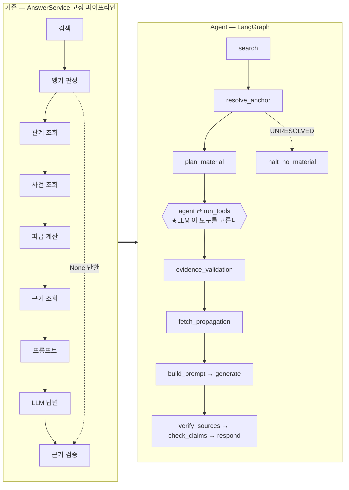
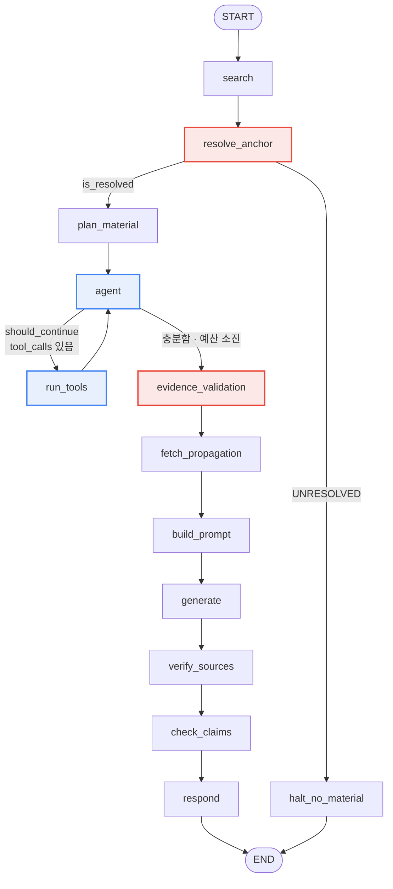
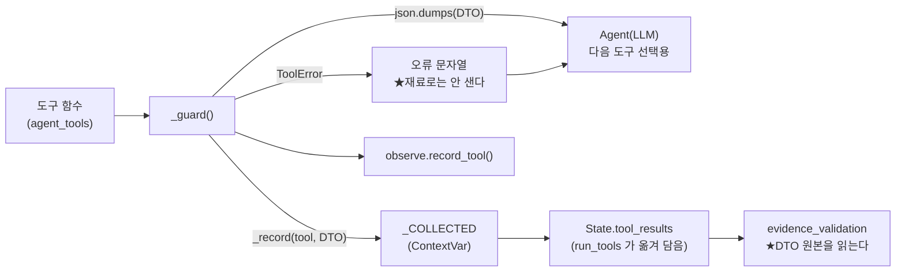
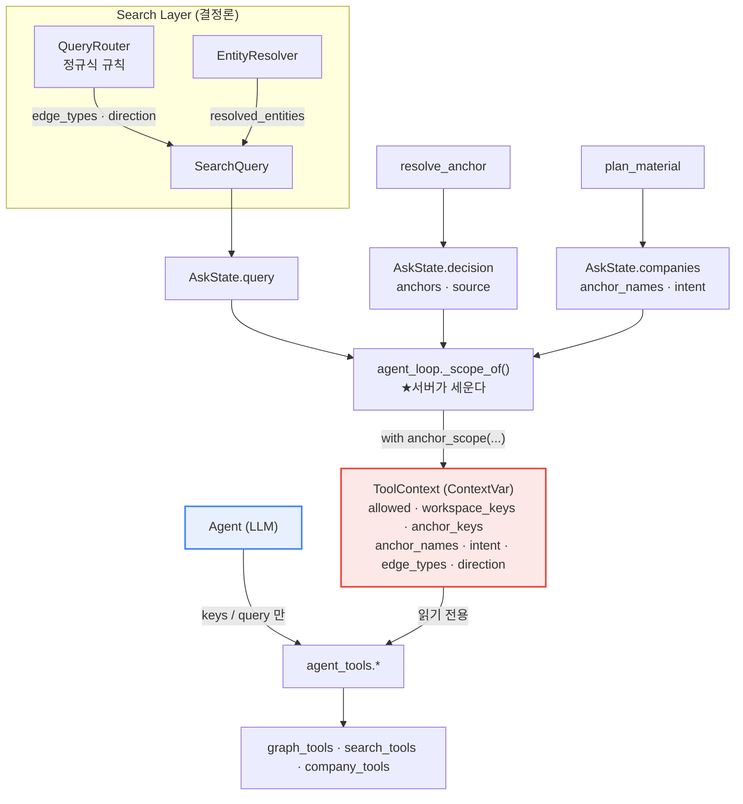
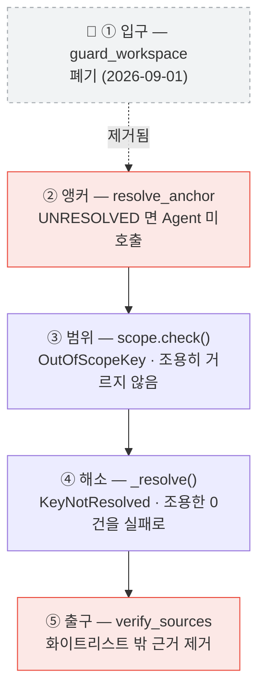
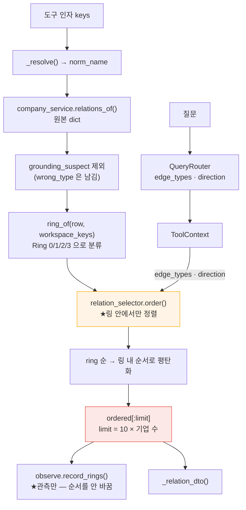

# BizNode Agent — 설계

> **`/ask` 안의 실행 그래프와 도구 루프**를 다룹니다. 그 아래 검색·재료·답변
> 규약은 [검색·챗봇 설계](BizNode_Search_설계.md), 현재 상태·결함·실측은 [현황](BizNode_검색챗봇_현황.md) 입니다.
>
> **짝을 이루는 세 문서입니다.** 설계 둘과 현황 하나 —
> [검색·챗봇 설계](BizNode_Search_설계.md) · [Agent 설계](BizNode_Agent_설계.md) · [현황](BizNode_검색챗봇_현황.md).
> 현황은 두 계층을 함께 다룹니다. 한 커밋이 두 계층을 같이 건드리는 일이 잦아
> 계층별로 가르면 같은 항목이 양쪽에 나뉩니다.

본문은 `709496a`(2026-08-28) 기준 · 폐기 절 표시만 2026-09-05 갱신

---

> **본문 기준 코드**: `yun-phase2` · HEAD `709496a` (2026-08-28 23:08)
> **폐기 절 표시 갱신**: `yun` · `6c39289` (2026-09-05) — 아래 🔴 참조

> 🔴 **2026-09-01 최종 설계가 이 문서의 일부를 폐기했습니다.**
>
> 워크스페이스를 **검색 경계**로 보던 정책이 폐기되면서 둘이 코드에서 사라졌습니다 —
> `guard_workspace` 게이트(그래프의 첫 노드)와 `AnchorSource.WORKSPACE`(앵커 승격).
> 그래프의 출발점은 이제 `search` 이고(`ask_graph.py` 의 `add_edge(START, "search")`),
> 앵커가 없는 질의는 `ANCHORLESS` 로 **정상 처리**됩니다.
>
> 영향받은 절 여덟에 🔴 표시를 달았습니다 — §3 그림 1 · §5 그림 2 · §5-1 · §7-1 · §7-2 ·
> §14-1 · §16-2 · §16-3.
> 근거는 [최종 설계 §6-1·§17-1·§17-3](BizNode_Workspace_Contextual_Agent_Final_Design.md),
> 이력은 [현황 §8-22](BizNode_검색챗봇_현황.md) 입니다.
>
> ★**본문의 나머지 서술은 `709496a` 기준 그대로입니다** — 이번에 전면 재검증하지
> 않았습니다. 값이 어긋나면 현황서가 정본입니다.

> ★**이 편은 설계편의 `/ask` 위에 얹힌 층입니다.** 설계편이 「무엇을 재료로 쓰고 어떤
> 규약으로 답하는가」를 정하고, 이 편은 **그 안에서 LLM 이 도구를 골라 재료를 더 모으는
> 루프**를 정합니다. 현재 상태·결함·실측은 [현황편](BizNode_검색챗봇_현황.md) 이 정본입니다.
>
> ★**절 번호가 설계편과 겹칩니다**(둘 다 §1 부터). 제목이 달라 앵커는 안 겹치지만,
> 헷갈릴 자리에서는 「Agent §5」처럼 편을 함께 적습니다.

---

## 이 문서의 표기 규약

이 문서는 **코드에 실재하는 것**과 **설계 의도**와 **아직 없는 것**을 섞지 않습니다.

| 표기 | 뜻 |
|---|---|
| **구현됨** | 코드가 있고 테스트가 묶고 있습니다. 파일·심볼을 함께 적습니다 |
| **설계 확정 · 미구현** | 문서에 결정이 있고 코드는 아직 없습니다 |
| **미구현** | 자리만 있거나 아예 없습니다 |
| **검증 필요** | 코드는 있으나 실측·평가가 없습니다 |
| **확인되지 않음** | 코드·테스트·문서·커밋 어디에서도 근거를 찾지 못했습니다 |

수치는 전부 코드 주석·현황서·평가셋 실행 결과에 기록된 **실측치**이며, 출처를 함께 적습니다.

---

## 1. 프로젝트 개요

### 1-1. BizNode 가 푸는 문제

BizNode 는 **기업 리스크를 근거와 함께 설명하는** 시스템입니다. 사용자는 관심 기업을 워크스페이스에 담아 두고 자연어로 묻습니다 — 「삼성전자에 납품하는 기업은?」, 「SK하이닉스 노조 관련 리스크 알려줘」.

답은 세 층에서 나옵니다.

```text
Graph QA              그래프가 아는 사실 — 관계·사건·파급
Evidence-grounded RAG 그 사실을 뒷받침하는 원문 — 뉴스·공시 청크
Insight               위 둘 위에서만 쓰는 해석
```

**이 순서는 고정입니다**(설계서 §8). 근거 없이 해석을 먼저 쓰면 그럴듯한 거짓말이 나오고, 그 거짓말은 근거가 없어서 **탐지되지 않습니다.**

### 1-2. 저장소 셋과 각자의 대답

| 저장소 | 무엇을 대답하나 | 규모 (실측) |
|---|---|---|
| **Neo4j** | 관계·사건·파급 — 「무엇이 무엇과 이어져 있나」 | Company 3,432 · 엣지 11,060 · Event 1,058 |
| **PostgreSQL** | 정형 사실 — 시세·공시목록·사업보고서 원문 | `market_data` 53,045행 (64사 × 125거래일) · `overview_text` 64행 (평균 2,294자 · 최대 16,623자) |
| **ChromaDB** | 근거 원문 청크 — 의미검색 | `vector_chunks` 2종: `evidence` 10,510 · `company` 2,432 |

**근거 id 와 청크의 관계** (현황서 §8-9 실측):

```text
엣지 source_type       news 8,384 · dart 2,563 · dart_filing 113 = 11,060
evidence_id(스칼라)     11,060건 → 유일 id 9,228개  (충돌 0건)
Chroma evidence 청크    10,510개
```

★**`evidence_id` 는 있는데 청크를 못 꺼내는 경우가 실재합니다.** `agent_loop.evidence_validation` 독스트링이 이것을 「엣지 11,060건 대비 Chroma 청크 10,510건이라 약 5%」로 적고 있습니다. 중요한 것은 **이것이 정상 상태이지 조회 실패가 아니라는 판정**입니다 — `missing=True` 로 남기되 「근거를 못 꺼냈다」로 세지 않습니다.

### 1-3. 외부 계약 — 라우트 둘

```http
POST /retrieve   재료만 (문장 생성 없음)     workspace_keys 선택
POST /ask        답변 문장 + 검증된 근거      workspace_keys 필수
```

**Agent 는 `/ask` 안에만 있습니다.** `/retrieve` 는 결정론 파이프라인 그대로입니다.

### 1-4. Agent 가 담당하는 것과 담당하지 않는 것

이것이 이 프로젝트의 **가장 중요한 설계 경계**입니다.

| | 누가 정하나 | 어디서 |
|---|---|---|
| 어떤 도구를 · 어떤 순서로 · 몇 번 부를까 | **LLM (Agent)** | `agent_loop.agent` |
| 대상 기업(앵커) | 서버 (결정론) | `resolve_anchor` — **Agent 앞** |
| 도구가 만질 수 있는 key 범위 | 서버 | `scope.anchor_scope()` |
| 자르는 기준 (limit) | 도구 내부 상수 | `graph_tools` · `company_tools` · `search_tools` |
| 값의 표기 (단위·방향·주의문구) | DTO | `app/tools/dto.py` |
| 무엇을 인용할 수 있나 | 서버 | `app/tools/citation.py` |
| 어떤 근거를 답변에 쓰나 | 서버 (결정론) | `evidence_validation` — **Agent 뒤** |
| 탐색 총량 | 서버 | `app/graph/budget.py` |

**한 줄로**: Agent 는 **무엇을 물어볼지**를 고르고, **무엇이 답이 되는지**는 서버가 정합니다.

---

## 2. Agent 도입 배경

### 2-1. 도입 이전 구조 — 고정 파이프라인

Phase 0 이전 `/ask` 는 `AnswerService.ask()` 한 메서드였고, 그 안에서 `RetrieveService.retrieve_for_ask()` 를 불러 재료를 받았습니다. 재료 조립은 **질문과 무관하게 항상 같은 순서**였습니다.

```text
검색 → 앵커 판정 → 관계 조회 → 사건 조회 → 파급 계산 → 근거 조회 → 프롬프트 → LLM → 검증
       (전부 매 요청마다 실행)
```

### 2-2. 이 구조가 만든 문제 넷

**① 질문이 무엇이든 같은 재료를 모읍니다.**
「삼성전자 시가총액이랑 PER 알려줘」에도 관계 조회가 나갑니다. 삼성전자는 관계가 **526건**(2026-08-25 실측)이라 조회·정렬·자르기가 전부 헛돕니다. 반대로 시세는 **애초에 파이프라인에 없어서** 답할 수 없었습니다.

**② 새 데이터 소스를 붙일 자리가 없었습니다.**
PostgreSQL 의 시세·공시목록·사업보고서는 그래프 파이프라인 어디에도 안 들어갑니다. 고정 순서에 분기를 더하려면 `if 질문에 "주가"가 있으면...` 같은 키워드 조건문이 늘어나는데, 그것은 **자연어 이해를 정규식으로 하는 일**입니다.

**③ 판정을 결과로 되짚고 있었습니다.**
`AnswerService.ask()` 에 게이트가 셋 있었는데 그중 하나가 중복이었습니다.

```text
① 워크스페이스가 비었나
② 앵커를 못 찾았나                    ← 여기서 판정
③ retrieve_for_ask() 가 None 을 줬나   ← ②의 결과를 보고 같은 결론을 다시 냄
```

`retrieve_for_ask()` 가 `UNRESOLVED` 를 보고 `None` 을 돌려주면, `ask()` 가 그 `None` 을 보고 **같은 판정을 되풀이**했습니다(`ask_graph.py` 모듈 독스트링).

**④ 도구가 도는지 아무도 못 봤습니다.**
기존 `/ask` 대표 20질문(2026-08-23)은 도구 5종이 생기기 **전에** 작성됐습니다. `search_dart`·`get_business_overview`·`get_market`·`get_filings` 를 끌어오는 질문이 하나도 없어, 새 도구의 동작을 관측할 방법이 없었습니다(`test_agent_eval.test_every_tool_is_exercised` 독스트링).

### 2-3. Agent 가 필요한 이유 — 한 문장

**질문마다 필요한 재료가 다른데, 그 판단을 규칙으로 쓸 수 없기 때문입니다.**

「어떤 도구를 부를지」는 자연어 이해 문제이고, 「무엇을 답으로 인정할지」는 안전 문제입니다. **앞은 LLM 이 잘하고 뒤는 LLM 이 못합니다.** 그래서 앞만 넘겼습니다.

---

## 3. 기존 구조와 Agent 구조 비교

### 그림 1. 기존 구조 → Agent 구조 전환



> 🔴 **`guard_workspace` 는 2026-09-01 에 제거됐습니다.** 「담아 둔 기업도 보고 있는
> 기업도 없으면 검색조차 하지 않는다」는 게이트였는데, 워크스페이스를 검색 경계로 보는
> 정책이 폐기되면서 함께 나갔습니다([최종 설계 §17-1](BizNode_Workspace_Contextual_Agent_Final_Design.md)).
> 워크스페이스가 없어도 Global Search 를 하고 Global Ranking 으로 답합니다.

### 3-1. 무엇이 바뀌었나

| | 기존 | Agent |
|---|---|---|
| 재료 선택 | 고정 순서, 전부 조회 | **LLM 이 도구를 고른다** |
| 데이터 소스 | 그래프 + 근거 | 그래프 + 근거 + **PostgreSQL 정형 3종** |
| 게이트 | 3개 (하나는 결과 되짚기) | **2개 조건부 엣지** — 판정 자리에서 바로 갈라짐 |
| 재료 없음 판정 | 조회 후 `None` 확인 | **조회 전에 분기** — Neo4j 왕복도 안 나감 |
| 총량 제한 | 조회당 상한만 | **누적 예산** (`budget.py`) |
| 관측 | 로그 문자열 | **구조화된 `Observation`** (`observe.py`) |

### 3-2. 무엇이 안 바뀌었나 — ★의도적입니다

- **요청 계약** — `AskRequest{question, workspace_keys}` 그대로
- **응답 계약** — `AskResponse{answer, sources, failed, anchor_source}` 그대로
- **판단 로직** — `RetrieveService`·`AnswerService` 의 함수를 그대로 부릅니다. 노드는 **위임하는 껍데기**입니다(`nodes/__init__.py` 독스트링)
- **Search Layer** — `search/` 는 한 줄도 안 고쳤습니다
- **시스템 프롬프트** — `answer_service._SYSTEM_PROMPT` 를 import 합니다. 옮기면 diff 가 프롬프트 전문으로 덮여 정작 바뀐 것이 안 보입니다

**이 원칙 덕분에 「그래프로 옮기면서 동작이 따라 바뀌었나」를 대조로 검증할 수 있었습니다** — `batch/audit/ask_graph_parity.py` 가 그 대조 스크립트입니다.

---

## 4. LangGraph 도입 목표

「LangGraph 를 썼다」가 아니라 **「이 프로젝트의 어떤 요구가 LangGraph 를 필요로 했나」**입니다.

### ① 판정이 난 자리에서 갈라져야 한다 → **조건부 엣지**

§2-2 ③ 의 중복 게이트가 여기서 사라집니다. `resolve_anchor` 가 `UNRESOLVED` 를 내면 조건부 엣지가 **곧바로** `halt_no_material` 로 보냅니다. 조립 노드 넷이 아예 실행되지 않으므로 **Neo4j 왕복도 나가지 않습니다**(`material.is_resolved` 독스트링).

> ★**그래프화의 핵심 이득이 이것입니다.** 함수 호출로는 「호출하고 결과를 보고 판단」이지만, 그래프에서는 「판단하고 갈라진다」입니다.

### ② 루프를 상태로 관리해야 한다 → **사이클 엣지**

`agent ⇄ run_tools` 는 몇 바퀴 돌지 미리 모릅니다. LLM 이 도구를 더 부르겠다고 하면 한 바퀴 더 돕니다. 이 사이클을 `messages` State 와 `add_messages` 리듀서가 관리합니다.

### ③ 무엇이 언제 확정되는지가 계약이어야 한다 → **State**

`AskState` 는 TypedDict 이고 필드마다 **어느 노드가 채우는지** 주석으로 못 박혀 있습니다. 「이 값은 이 시점에 있다」가 타입과 주석 양쪽에 남습니다.

### ④ 안 쓰기로 한 것 — ★기록해 둡니다

| 기능 | 쓰나 | 왜 |
|---|---|---|
| 체크포인터 | **안 씀** | 한 요청이 한 번에 끝나고 **중단·재개가 없습니다**(`ask_graph.py` 독스트링) |
| 스트리밍 | **안 씀** | 응답이 구조화 스키마(`AskAnswer`)라 부분 출력이 의미가 없습니다 |
| 병렬 노드 | **안 씀** | `agent ⇄ run_tools` 말고는 전부 순차입니다. **루프가 도는 횟수부터 재고 나서 볼 일**입니다 |
| `recursion_limit` 로 루프 종료 | **안 씀** | 예외로 끝나 **답변이 아예 안 나갑니다.** 대신 예산이 마감으로 **전이**시킵니다 |

---

## 5. 전체 Agent Architecture

### 그림 2. 실제 그래프 배선 (`app/graph/ask_graph.py`)



- 파란색 = **LLM 이 관여하는 구간**
- 빨간색 = **Agent 를 감싸는 결정론 방어선** (앞의 앵커 판정 · 뒤의 근거 확정)

> 🔴 **입구의 `guard_workspace` 와 `has_workspace` 조건부 엣지가 없습니다**(2026-09-01).
> `START` 는 `search` 로 바로 갑니다. 조건부 엣지는 **둘**입니다 — `is_resolved`·`should_continue`.

### 5-1. 실제 데이터 흐름

```text
AskRequest{question, workspace_keys}
  │
  ├─ search            SearchOrchestrator.search()   ★그래프의 출발점
  │                    └─ QueryRouter → edge_types · direction  ★여기가 라우팅이다
  │                    └─ EntityResolver → resolved_entities
  │                    └─ Graph/VectorSearcher → SearchResult
  ├─ resolve_anchor    decide_anchor() → QUERY / CONTEXT / ANCHORLESS / UNRESOLVED
  │                    🔴 WORKSPACE 는 폐기 · ANCHORLESS 로 대체 (2026-09-01)
  │                                                              [조건부 엣지 ①]
  ├─ plan_material     companies · anchor_names · intent · 예산 카운터 0
  │
  ├─ agent ⇄ run_tools ★LLM 이 도구 선택 · 서버가 범위·표기·총량 강제
  │                    └─ with anchor_scope(...)  ← ToolContext 세움
  │                    └─ with collecting()       ← DTO 수집
  │                                                              [조건부 엣지 ②]
  ├─ evidence_validation  ★결정론 — evidence_id 합집합 → Evidence
  ├─ fetch_propagation    ★결정론 — is_risk 사건 위에서 파급 계산
  ├─ build_prompt         DTO → 프롬프트 문자열
  ├─ generate             LLMAdapter.structured() — 예외를 failed 표시로
  ├─ verify_sources       ★화이트리스트 검증 — 재료 밖 근거는 버림
  ├─ check_claims         ★관측만 — State 를 안 바꿈
  └─ respond              AskResponse
```

### 5-2. ★지시서 흐름과 실제가 다른 지점 (정정)

작업 지시서는 `User Query → Agent Graph → Query Router → Tool` 순서를 상정했으나, **실제 QueryRouter 는 Agent 보다 앞이며 Agent 의 일부가 아닙니다.**

```text
지시서 상정   Agent Graph → Query Router → Tool
실제 코드     Query Router (search 노드 안, Search Layer 소속) → Agent → Tool
```

`QueryRouter` 는 `search/service/query_router.py` 의 **정규식 규칙 컴포넌트**이고 LLM 이 아닙니다(§10).

---

## 6. LangGraph State 설계

`app/graph/state.py::AskState` — `TypedDict, total=False`

### 6-1. 설계 원칙 넷

**① 기존 DTO 를 해체하지 않는다.**
`SearchQuery`·`SearchResult`·`AnchorDecision`·`Evidence` 를 그대로 필드로 품습니다. 이 계약은 **이미 백엔드에 나가 있어서**, 여기서 모양을 바꾸면 그래프가 「같은 값을 다르게 부르는 두 번째 진실」이 됩니다.

**② State 는 「이번 요청에서 흐르는 값」만 담는다.**
상한 상수(`MAX_TOOL_CALLS` 등)는 **모듈 상수**입니다. State 에 두면 「누가 언제 바꿨나」를 노드마다 따져야 하고, **Agent 가 닿을 수 있는 자리에 상한을 두는 셈**이 됩니다.

**③ 관측용 값을 얹지 않는다.**
`use_hits`(히트를 믿어도 되나)·`backstop`(앵커로 메웠나)은 Phase 1.5 정리에서 **제거**됐습니다. 둘 다 `plan_material` 안에서만 쓰이고 아무 노드도 안 읽던 write-only 값이었습니다. State 에 두면 **다음 노드가 읽어도 되는 값으로 오해**합니다.

**④ 리듀서는 `messages` 하나에만 쓴다.**
나머지는 전 노드 순차라 같은 키에 두 노드가 동시에 쓰는 일이 없습니다 — 리듀서는 그 경합을 푸는 도구입니다. `messages` 만 `agent` 와 `run_tools` 가 **번갈아 덧붙이므로** 예외이고, `add_messages` 가 id 로 중복을 접습니다.

### 6-2. 필드별 lifecycle

| 필드 | 타입 | 생성 | 소비 | 목적 |
|---|---|---|---|---|
| `request` | `AskRequest` | `initial_state()` | 거의 모든 노드 | 입력 |
| `query` | `SearchQuery` | `search` | `plan_material` · `agent_loop._scope_of` | `edge_types`·`direction`·`resolved_entities` 운반 |
| `result` | `SearchResult` | `search` | `plan_material` · `evidence_validation` | 히트와 그 근거 id |
| `match_type` | `MatchType` | `search` | `build_prompt` | 「어떻게 찾았나」 — `result.mode` 만으로 확정 |
| `decision` | `AnchorDecision` | `resolve_anchor` | 조건부 엣지 · `_scope_of` · `respond` | 「무엇을 대상으로」 |
| `companies` | `list[RelationEndpoint]` | `plan_material` | `agent` · `_scope_of` · `build_prompt` | 재료 기업. **key 형태를 안 바꿉니다** |
| `anchor_names` | `list[str]` | `plan_material` | `ToolContext` · `check_claims` | 사건 라벨에서 뗄 앵커 기업명 |
| `intent` | `str` | `plan_material` | `ToolContext` · `check_claims` | 사건 순위용 질문 의도 |
| `messages` | `Annotated[list, add_messages]` | `agent` | `run_tools` · `should_continue` | ★유일한 리듀서 필드 |
| `tool_results` | `dict[str, list[Any]]` | `run_tools` | `evidence_validation` · 평가셋 | ★**DTO 원본** — 문자열을 다시 파싱하지 않습니다 |
| `tool_calls_used` 외 3 | `int` | `plan_material`(0) → `run_tools`·`fetch_propagation` | `should_continue` | 누적 예산 카운터 |
| `budget_exhausted` | `bool` | `budget.spend()` | 관측 | ★예외가 아니라 **표시** |
| `relations` `events` | `list[RelationDTO/EventDTO]` | `evidence_validation` | `fetch_propagation` · `build_prompt` | dedup 끝난 재료 |
| `propagation` | `list[PropagationDTO]` | `fetch_propagation` | `build_prompt` · `check_claims` | 파급 |
| `evidence` | `list[Evidence]` | `evidence_validation` | `verify_sources` · `check_claims` | ★API 스키마 그대로 |
| `user_prompt` | `str` | `build_prompt` | `generate` | |
| `llm_result` | `dict` | `generate` | `verify_sources` · `check_claims` | `failed` 표시 포함 |
| `answer` `failed` `sources` | | `verify_sources` | `respond` | |
| `response` | `AskResponse` | `respond` / `halt_no_material` | `final_response()` | ★출구 둘 다 채웁니다 |

### 6-3. `tool_results` 가 문자열이 아니라 DTO 인 이유

도구 결과는 **두 갈래로** 나갑니다.

```text
Agent 에게    짧은 JSON 문자열 — 다음에 무엇을 부를지 고르는 데 필요한 만큼
뒤 노드에게   DTO 원본 — `_COLLECTED` 에 쌓아 `evidence_validation` 이 읽는다
```

문자열만 남기면 뒤 노드가 **LLM 이 본 텍스트를 다시 파싱**해야 합니다. 그것은 같은 사실을 두 번 만드는 일이고, **두 벌은 반드시 갈립니다**(`agent_tools.py` 독스트링).

### 6-4. ★ContextVar 는 State 를 대신할 수 없다 — 실측으로 배운 것

LangGraph 는 **노드마다 컨텍스트를 복사**합니다. 노드 안의 `ContextVar.set()` 은 그 노드에서 끝납니다.

Phase 1 실측(2026-08-27): `search` 노드가 `new_trace_id()` 를 발급했더니 **자기 로그 4줄만 id 를 달고 나머지 9줄이 `-`** 로 찍혔습니다. 그래서 발급은 진짜 요청 경계인 `run_ask()` 가 합니다.

같은 성질이 네 곳에 적용됩니다.

| 무엇 | 어디서 열고 닫나 | 왜 |
|---|---|---|
| `trace_id` | `run_ask()` — 그래프 **바깥** | 모든 노드가 같은 id 로 찍혀야 함 |
| `ToolContext` | `run_tools` 노드 **안** | 한 노드 안에서만 살면 되고, 나가면 저절로 닫힘 |
| `collecting()` 버킷 | `run_tools` 노드 **안** | ★나가기 전에 **State 로 옮겨 담아야** 함 |
| `observing()` 버킷 | `run_ask()` **바깥** (평가셋) | 복사본이 **같은 객체를 물고 들어가고**, 우리는 객체를 변이시킴 |

---

## 7. Node 설계

노드는 전부 **sync 함수**이고 `AskState` 조각을 돌려줍니다. 판단 로직은 `RetrieveService`·`AnswerService` 에 그대로 있습니다 — **노드는 위임하는 껍데기**입니다.

### 7-1. 노드 13개

`build_ask_graph()` 가 `add_node` 를 부르는 횟수 기준입니다 — 본선 12개 + 출구 `halt_no_material` 1개.

> 🔴 **`guard_workspace` 가 빠져 14 → 13 이 됐습니다**(2026-09-01). 첫 노드는 `search` 입니다.

| # | 노드 | 파일 | 역할 | 입력 (State) | 출력 (State) | 다음 |
|---|---|---|---|---|---|---|
| 1 | `search` | `material.py` | `SearchOrchestrator.search()` | `request` | `query` `result` `match_type` | `resolve_anchor` |
| 2 | `resolve_anchor` | `material.py` | `decide_anchor()` — 🔴 3분법 → **4분법**(§5-1) | `request` `query` | `decision` | 조건부 ② |
| 3 | `plan_material` | `material.py` | 재료 기업·의도 확정 + **예산 개시** | `request` `query` `result` `decision` | `companies` `anchor_names` `intent` `budget.initial()` | `agent` |
| 4 | `agent` | `agent_loop.py` | ★**LLM 이 도구를 고름** | `messages` `request` `companies` | `messages` | 조건부 ③ |
| 5 | `run_tools` | `agent_loop.py` | 도구 실행 · 범위 강제 · 예산 가산 | `messages` `query` `companies` `decision` | `messages` `tool_results` `예산` | `agent` |
| 6 | `evidence_validation` | `agent_loop.py` | ★**결정론 마감** — dedup + 근거 합집합 | `tool_results` `result` | `relations` `events` `evidence` | `fetch_propagation` |
| 7 | `fetch_propagation` | `material.py` | is_risk 사건 위 파급 계산 | `events` `예산` | `propagation` `예산` | `build_prompt` |
| 8 | `build_prompt` | `answer.py` | DTO → 프롬프트 | 재료 전부 | `user_prompt` | `generate` |
| 9 | `generate` | `answer.py` | LLM 호출 | `user_prompt` | `llm_result` | `verify_sources` |
| 10 | `verify_sources` | `answer.py` | ★**화이트리스트 검증** | `llm_result` `evidence` `relations` | `answer` `failed` `sources` | `check_claims` |
| 11 | `check_claims` | `answer.py` | ★**관측만** — State 무변경 | `llm_result` `evidence` `intent` | `{}` | `respond` |
| 12 | `respond` | `answer.py` | `AskResponse` 조립 | `answer` `sources` `failed` `decision` | `response` | END |
| — | `halt_no_material` | `answer.py` | 재료 없이 내는 응답 (`failed=false`) | `request` `decision` | `response` | END |

### 7-2. 조건부 엣지 둘 — 🔴 ① 은 폐기됐습니다

★**번호는 그대로 둡니다.** §7-3 · §14 가 「위 ②」처럼 이 번호를 참조하고 있어
번호를 밀면 그 참조가 조용히 어긋납니다.

| # | 함수 | 갈래 | 무엇을 막나 |
|---|---|---|---|
| 🔴 ① | ~~`material.has_workspace`~~ | — | **폐기 (2026-09-01)** — 워크스페이스는 검색 경계가 아닙니다. 함수 자체가 없고 `tests/graph/test_conditional_edges.py` 가 `not hasattr` 로 되돌리기를 막습니다 |
| ② | `material.is_resolved` | `plan_material` / `halt_no_material` | ★**「TSMC 를 물었는데 삼성전자로 답하는」 탐지 불가능한 오답** |
| ③ | `agent_loop.should_continue` | `run_tools` / `evidence_validation` | 무한 루프 · 예산 초과 |

### 7-3. ★두 노드의 자리가 왜 중요한가

**`resolve_anchor` 는 Agent 앞에 남습니다.**
`AskResponse.anchor_source` 는 「LLM 과 무관한 서버가 아는 결정론적 값」이라고 스키마가 못 박았고, `unresolved` 일 때 워크스페이스로 갈아타지 않는 규칙이 위 ② 의 오답을 막는 핵심 장치입니다. **그 판정을 LLM 이 하면 장치가 사라집니다.**

**`fetch_propagation` 은 Agent 뒤에 남습니다.**
`get_propagation` 을 도구로 열지 않기로 했으므로(§11-3), 그렇다고 빼면 파급 재료가 통째로 사라집니다. 그래서 **Agent 가 모은 사건 위에서 결정론으로** 계산합니다. `evidence_validation` 뒤인 이유는 **거기서 사건이 dedup 된 뒤라야 파급이 중복 없이** 계산되기 때문입니다.

### 7-4. 실패 조건

| 노드 | 실패하면 | 처리 |
|---|---|---|
| `search` | 저장소 예외 | 전파 — 그래프가 죽습니다 (**검증 필요**: 재시도 없음) |
| `run_tools` | `ToolError` | ★**예외로 안 새웁니다** — Agent 가 읽는 오류 문자열로 반환 |
| `generate` | LLM 예외 | 어댑터가 `fallback \| {"failed": True}` 로 감쌈 — **예외가 안 올라옵니다** |
| `respond` 도달 실패 | 배선 오류 | `run_ask()` 가 `RuntimeError` — ★**빈 답을 지어내지 않습니다** |

---

## 8. Tool 설계

`app/tools/agent_tools.py` — **노출 경계가 이 파일의 본체입니다. 무엇을 안 주느냐가 무엇을 주느냐보다 중요합니다.**

### 8-1. Agent 에게 열린 도구 7종

| 도구 | 목적 | Agent 가 정하는 인자 | 서버가 `ToolContext` 로 주는 값 | 내부 호출 | 내부 상한 |
|---|---|---|---|---|---|
| `get_relations` | 관계 (공급·협력·경쟁·소송·지분) | `keys` | `edge_types` `direction` `workspace_keys` `anchor_keys` | `graph_tools.get_relations` → `company_service.relations_of` | `MAX_RELATIONS_PER_COMPANY`(10) × 기업 수 |
| `get_events` | 사건 (규제수사·분쟁소송·사고) | `keys` | `intent` `anchor_names` | `graph_tools.get_events` → `company_service.events_of` | `MAX_EVENTS_PER_COMPANY`(10) **기업마다 따로** |
| `search_news` | 보도 근거 의미검색 | `query` `keys` | — | `search_tools.search_news` → Chroma | `_MAX_HITS`(10) |
| `search_dart` | 공시 근거 의미검색 | `query` `keys` | — | `search_tools.search_dart` → Chroma | `_MAX_HITS`(10) |
| `get_business_overview` | 사업보고서 「사업의 내용」 원문 | `key` | — (연도는 최신 고정) | `company_tools` → PostgreSQL | 1건 |
| `get_market` | 시세·지표 (시총·PER·PBR·PSR) | `key` | — | `company_tools` → PostgreSQL | 1건 |
| `get_filings` | 공시 목록 (제목까지) | `key` | — | `company_tools` → PostgreSQL | `_MAX_FILINGS`(20) |

### 8-2. ★Agent 에게 **안 주는** 것 4종 — `FORBIDDEN_TOOL_NAMES`

| 안 주는 것 | 계약 | 이유 |
|---|---|---|
| `get_propagation` | 계약 1 | 주어진 Event 의 파급을 계산하는 **내부 primitive**. 도구로 열면 Agent 가 파급을 재료로 끌어오는 통로가 됩니다 |
| `fetch_evidence` / `evidence_for_ids` | 계약 2 | 근거 수집은 `evidence_validation` 이 **결정론적으로** 하는 마감 단계입니다. Agent 가 임의의 evidence 를 고르면 안 됩니다 |
| `search_company` | 계약 3 | 요청의 초기 scope 는 서버가 정합니다. **Agent 가 기업을 찾아 넣으면 scope 가 뚫립니다** |

★이 목록은 테스트가 `TOOL_NAMES` 와 **마주 세웁니다**(`test_agent_loop.py`). 새 도구를 열면 테스트가 먼저 빨간불이 됩니다.

### 8-3. ★인자도 원본보다 좁습니다

```text
get_events(keys)            `intent` 를 안 받는다
                            — 「무엇을 중요하게 볼지」를 LLM 이 정하면 그건 재료 범위를 고르는 것
get_relations(keys)         `edge_types`·`direction` 을 안 받는다 — 같은 이유
get_business_overview(key)  `year` 를 안 받는다 — 최신 연도로 고정
모든 도구                   `limit` 을 안 받는다 — 부르는 쪽이 LLM 이면 상한이 협상 대상이 된다
```

### 8-4. 도구 4원칙 (`graph_tools.py`)

| # | 원칙 | 실현 |
|---|---|---|
| ① | **기업명 문자열을 받지 않는다.** key 만 받고 범위 밖은 거부 | `scope.check()` → `OutOfScopeKey` |
| ② | **표기가 끝난 DTO 를 돌려준다.** raw row 금지 | `app/tools/dto.py` |
| ③ | **`limit` 을 인자로 받지 않는다** | 도구 내부 상수 |
| ④ | **빈 결과와 실패를 구별한다** | `ToolError` vs `[]` |

### 8-5. DTO 가 붙이는 표기 — ★전부 실측에서 나왔습니다

LLM 은 열 이름과 숫자만 보고 뜻을 지어냅니다. 그래서 **오해할 수 있는 값에 문구를 붙입니다.**

| 값 | LLM 이 물을 수 있는 것 | 실측 답 | 붙이는 표기 |
|---|---|---|---|
| `ratio: 0.72` | 0.72% 인가 소수인가 | 0~1 구간에 **진짜 소액지분 126건** 실재 | `ratio_text: "0.72%"` · `ratio_unit` |
| `PARTNERS_WITH` 화살표 | 방향에 뜻이 있나 | **없음** — Neo4j 가 무방향을 저장 못 해 「키 작은 쪽 → 큰 쪽」 인공 방향 | `direction_note: "방향이 없는 관계…"` |
| 뉴스 `DEVELOPS` | 단정해도 되나 | **오추출률 46.1%** (검증 672건 중 310 탈락) | `caution: "오추출률 47% — 단정 불가"` |
| `source_type` | 공시인가 보도인가 | 확정 사실 vs 미확정 주장 | `source_note` |
| `score` | confidence 인가 | corroboration 보정·wrong_type 벌점이 곱해진 값 | `effective_confidence` 로 **재계산** |
| `per: null` | 정보가 없나 | **아님** — 적자거나 재무 미수집 | `per_note` |
| 시총·PER | 근거 id 를 붙일 수 있나 | **없음** — 저장값이 아니라 계산값 | `evidence_id` 필드 자체가 없음 |

### 8-6. 결과가 두 갈래로 나가는 구조



★`_guard()` 가 **7종 전부의 깔때기**입니다. 관측도 여기서 합니다 — 도구마다 세는 코드를 붙이면 한 곳만 빠뜨려도 「그 도구는 안 불렸다」로 읽힙니다.

---

## 9. ToolContext 설계

`app/tools/scope.py::ToolContext` (frozen dataclass) + `anchor_scope()` (contextmanager, ContextVar)

### 9-1. ★왜 인자가 아니라 Context 인가 — 이 프로젝트의 핵심 설계 결정

도구 4원칙 ① 은 「State 의 앵커 키 집합 밖의 key 는 거부한다」입니다. 그런데 **범위를 인자로 받으면 부르는 쪽이 넓힐 수 있습니다.**

```text
Phase 1.5   부르는 쪽 = 노드(서버)   → 인자로 받아도 안전
Phase 2     부르는 쪽 = LLM(Agent)   → ★인자로 받으면 방어가 아니라 장식
```

그래서 범위는 **노드가 세우고**(`with anchor_scope(...)`) 도구는 **읽기만** 합니다.
**도구 시그니처에 범위가 없는 것이 계약입니다.**

### 9-2. `ToolContext` 필드 7개 — 전부 서버가 정합니다

아래 표는 `edge_types`·`direction` 을 **한 줄로 묶어** 6행입니다 — 둘은 같은 시점에 같은 이유로 들어온 한 쌍이기 때문입니다.

| 필드 | 무엇 | 왜 인자가 아닌가 | 쓰는 도구 |
|---|---|---|---|
| `allowed` | 만질 수 있는 key 집합 | Agent 가 넓히면 scope 가 뚫림 | 전부 (`scope.check`) |
| `workspace_keys` | 워크스페이스 기업 | 「워크스페이스는 필터가 아니라 랭킹 문맥」(설계서 §3) 정책이 **Agent 의 재량이 되면 안 됨** | `get_relations` (링 계산) |
| `anchor_keys` | 앵커 기업 | 방향 판정에 씀 — 같은 이유 | `get_relations` |
| `anchor_names` | 사건 라벨에서 뗄 앵커 기업명 | ★**식별용이 아니라 문자열 제거용**. 서버가 정한 앵커에서만 옴 | `get_events` |
| `intent` | 사건 순위를 정하는 질문 의도 | 「무엇을 중요하게 볼지」 = 재료 범위를 고르는 것(4원칙 ①) | `get_events` |
| `edge_types` `direction` | 질문이 물은 엣지 타입·방향 | 순서는 `ordered[:limit]` 의 **자르는 지점**을 정하므로 곧 재료를 고르는 일 | `get_relations` |

### 그림 3. State / ToolContext 흐름



### 9-3. ★이 설계가 실제로 깨졌던 사례 (§17-4 · 개발이력 §4-2)

`edge_types`·`direction` 을 Agent 인자에서 **빼기만 하고 `ToolContext` 로 옮기지 않은** 기간이 있었습니다. 그러면:

```python
matched = frozenset(edge_types or ())   # → 언제나 빈 집합
if not matched: return ordered          # → 정렬이 통째로 꺼진다
```

★**죽은 방식이 조용했습니다.** 예외도 로그도 없이 입력 순서를 그대로 돌려줍니다. 이 설계의 대가입니다 — **Context 로 옮기는 것을 잊으면 신호가 소리 없이 사라집니다.** 그래서 회귀 테스트 6건(`tests/graph/test_relation_intent_order.py`)이 묶고 있습니다.

---

## 10. Query Routing

★**QueryRouter 는 Agent 가 아니라 Search Layer 소속이고, LLM 이 아닙니다.**

### 10-1. 위치와 성질

`search/service/query_router.py` — **정규식 규칙 기반 순수 함수**입니다. 입력은 항상 `normalized_query` 전체 문자열이고, EntityResolver 를 부르지 않습니다.

### 10-2. 두 층의 규칙

**① 방향까지 판단하는 3종** (`_DEEP_RULES`)

| edge_type | 키워드 | outgoing | incoming |
|---|---|---|---|
| `SUPPLIES_TO` | 납품·공급 | `~가 납품하는` → 공급사(source) | `~에 납품하는` → 고객(target) |
| `OWNS_STAKE_IN` | 투자·지분·출자·최대주주 | `~가 투자한` | `~에 투자한` |
| `SUES` | 소송·제소·피소 | `~가 제소한` → 원고 | `~를 제소한`·`피소` → 피고 |

**② 대표 키워드 1개만 등록한 9종** (`_SHALLOW_KEYWORDS`) — 방향 판단 없음
`PARTNERS_WITH`(협력) · `COMPETES_WITH`(경쟁) · `ACQUIRES`(인수) · `REGULATES`(규제) · `DEVELOPS`(개발) · `DEPENDS_ON`(의존) · `IS_EXECUTIVE_OF`(임원) · `HAS_EVENT`(사건) · `IMPACTS`(영향)

★코드가 이 9종을 **`[미확정/저신뢰]`** 로 표시하고 있습니다 — 동의어 확장·정확도 검증은 **미구현**입니다.

### 10-3. 검색 모드 분기 — `SearchOrchestrator`

**분기는 `edge_types` 유무로만 결정합니다. GraphSearcher 의 결과 유무로 분기하지 않습니다.**

```text
edge_types 있음  → GraphSearcher (RELATIONSHIP)   ★0건이어도 Vector 로 폴백하지 않는다
edge_types 없음  → EntityResolver → NAME / SEMANTIC
```

★**폴백을 철회한 이유가 실측입니다.** 「삼성전자에 납품하는 기업」에서 VectorSearcher 가 실제 공급사를 **0건 맞히고 전부 삼성전자 계열사·지사만** 반환했습니다. 관계 질의에 의미검색 결과를 섞으면 **없는 관계를 있는 것처럼** 보여주는 사고가 납니다.

### 10-4. 라우팅 결과가 Agent 로 이어지는 경로

```text
QueryRouter.route()  →  SearchQuery.edge_types / .direction
                     →  AskState.query
                     →  agent_loop._scope_of()
                     →  ToolContext.edge_types / .direction
                     →  graph_tools.get_relations(…, edge_types, direction)
                     →  relation_selector.order()   ★링 안 순서를 정한다
```

**Agent 는 이 경로 어디에도 개입하지 않습니다.** 라우팅은 결정론이고, Agent 는 그 결과를 문맥으로 받습니다.

### 10-5. 실측 — 라우터가 얼마나 잡나

Search Layer 평가셋 20질의를 라우터에 먹인 결과 **12건(60%)에서 `edge_types` 가 잡혔습니다**(현황서 §8-18).

```text
삼성전자가 납품하는 기업은?     SUPPLIES_TO · outgoing
삼성전자에 납품하는 기업은?     SUPPLIES_TO · incoming
SK하이닉스를 제소한 기업        SUES · incoming
삼성전자를 규제한 기관          REGULATES
```

---

## 11. Search / Graph 탐색 전략

### 11-1. 세 갈래 탐색과 Agent 의 관계

| 탐색 | 어디서 | Agent 가 부를 수 있나 |
|---|---|---|
| **Graph Search** (`GraphSearcher`) | `search` 노드 안, Orchestrator | ✕ — 결과를 `SearchResult` 로 받음 |
| **Vector Search** (`VectorSearcher`) | `search` 노드 안, Orchestrator | ✕ |
| **Relation Search** (`company_service.relations_of`) | 도구 | ○ `get_relations` |
| **Event Search** (`company_service.events_of`) | 도구 | ○ `get_events` |
| **Evidence 의미검색** (Chroma) | 도구 | ○ `search_news` · `search_dart` |
| **파급 계산** (`relation_service.event_impact`) | `fetch_propagation` 노드 | ✕ — **금지 도구** |

★`search_news` 와 `search_dart` 는 **같은 Chroma 컬렉션**을 `source_type` 으로만 가릅니다(`search_tools._search`).

### 11-2. Graph 탐색이 제한되는 방식 — 4중

```text
① 범위        scope.check(keys) → 앵커·재료 기업 밖은 OutOfScopeKey
② 해소        _resolve(keys) → 그래프에 없으면 KeyNotResolved  ★조용한 0건을 실패로 바꾼다
③ 품질        grounding_suspect 엣지 · eventness_suspect 사건 제외
④ 총량        도구 내부 상수(limit) + 그래프 예산(budget.py) 이중
```

**②가 왜 필요한가**: `company_service.events_of()` 는 `corp_code` 든 `norm_name` 이든 받지만, **틀린 값을 주면 예외가 아니라 조용히 0건**입니다. 그러면 「이 기업에 사건이 없다」와 구별이 안 됩니다. `corp_code_master` 는 118,535건인데 그래프 Company 는 3,432곳이라 이 차이가 실재합니다.

**③의 실측**:
- `grounding_suspect` 507건 중 449건은 Service 가 이미 제외, `wrong_type` 58건만 남습니다. 도구가 **다시 보는 이유**는 위쪽 규칙이 느슨해질 때 도구가 조용히 따라 느슨해지면 안 되기 때문입니다
- `eventness_suspect` 83건 (기업에 붙은 것 74건 · `HAS_EVENT` 92개 · 기업 42곳)

### 11-3. ★`get_propagation` 과 `explore_impact` — 지시서 전제 정정

작업 지시서는 「`explore_impact` 를 Agent Tool 로 제공한 결정」을 ADR 로 요구했으나, **코드 기준 사실은 다릅니다.**

| | 상태 | 근거 |
|---|---|---|
| `get_propagation` | **Agent Tool 아님** — `FORBIDDEN_TOOL_NAMES` | `agent_tools.py:FORBIDDEN_TOOL_NAMES` |
| `explore_impact` | ★**미구현** — 이름만 존재 | `budget.py:41` 「`explore_impact` 는 2-B」 · `test_provenance.py` 「탐색 도구가 생길 때」 |

**즉 둘 다 현재 Agent 도구가 아니고, 책임 차이는 다음과 같습니다.**

```text
get_propagation   ★내부 primitive — "주어진 Event 의 파급을 계산"
                  fetch_propagation 노드가 Agent 뒤에서 결정론으로 호출
                  is_risk 사건만 · 최대 3건(MAX_RISK_EVENTS_FOR_PROPAGATION)

explore_impact    ★미구현 — Phase 2-B 로 미룸
                  "그래프를 걸어 다니며 탐색"하는 도구가 될 예정
                  그것이 없어서 hops_used 예산이 실측 0 이고
                  provenance 값이 "direct" 하나뿐이다
```

★**이 미구현이 남긴 자국이 코드에 셋 있습니다** — `budget.MAX_HOPS`(6, 아무도 안 씀) · `provenance` 의 `"explored"` 값(만드는 코드 없음) · `test_provenance` 의 「`explored` 가 나타나면 실패」 테스트. 자리를 미리 둔 이유는 **그때 State·로그·테스트를 한꺼번에 고치지 않기 위해서**입니다.

---

## 12. Evidence / Citation

### 12-1. ★근거는 Agent 가 고르지 않습니다 (계약 2)

`evidence_validation` 노드가 탐색 결과에서 `evidence_id` **합집합을 결정론적으로** 모읍니다.

```text
① 관계의 evidence_id
② 사건의 evidence_ids
③ 검색 히트의 evidence_id      ★재료로 안 써도 그 근거는 모은다
④ 인용 가능 도구의 evidence_id  ← citation.py 가 정한다
```

**③이 왜 남아 있나**: 한 번 걸러 봤다가 실측으로 되돌렸습니다(현황서 §8-6) — 여기 든 근거의 **절반가량이 워크스페이스에 닿아**, 거르면 질문이 물은 사례를 버립니다.

### 12-2. dedup 을 마감 단계가 책임지는 이유

Phase 1 까지는 `_evidence_of` 가 3출처 합집합을 만들며 중복을 접었는데, Agent 루프에서는 **그 합류점이 사라집니다.**

과거에 `fetch_texts` 가 중복 id 로 `DuplicateIDError` 를 내고 그것을 삼켜 **전건 판단불가**가 된 사고가 있었습니다(2026-07-30). `fetch_texts` 는 이제 스스로 중복을 접지만, **그 위에서 상한을 세는 코드는 여전히 중복을 두 건으로 셉니다.**

**사건 dedup 은 근거를 합치며 접습니다** — 같은 Event 를 여러 기업이 공유하기 때문입니다(**938건 중 85건**). 건너뛰기만 하면 먼저 온 기업의 근거만 남고 나머지가 조용히 사라집니다.

### 12-3. 인용 규칙 — `app/tools/citation.py` 한 곳

★**인용 가능한 도구는 `search_news` 하나뿐입니다.**

| 분류 | 도구 | 이유 |
|---|---|---|
| **인용 가능** | `search_news` | `evidence` 컬렉션 청크라 `evidence_id` 가 이미 있고, 본문·기사 URL·언론사·보도일을 `evidence_for_ids()` 가 채웁니다 |
| **이 단계의 범위라서 보류** (`DEFERRED_TOOLS`) | `search_dart` | 청크도 `evidence_id` 도 **이미 있습니다.** 올리는 데 필요한 것은 코드가 아니라 **측정**입니다 |
| **구조적으로 못 올림** (`CONTEXT_ONLY_TOOLS`) | `get_business_overview` | ChromaDB 에 청크가 **없습니다**(`vector_chunks` 는 `evidence`·`company` 두 종뿐). 억지로 id 를 발급해도 `missing:True` 로 나가 **「근거 없음」으로 표시**됩니다. 게다가 `overview_text` 는 절 전문이라 청킹이 선행돼야 합니다 |
| | `get_market` | **계산값**입니다. 근거 id 를 발급하면 원본 갱신 때 어긋납니다 — 되짚을 것은 계산 좌표입니다 |
| | `get_filings` | 공시 **목록**입니다. 제목까지고 인용할 문장이 없습니다 |

★**「인용 가능 ≠ 신뢰도」입니다.** `search_dart` 의 공시 근거가 뉴스보다 확실한 사실인데도 이 단계에서는 인용으로 안 올립니다. 지금 재는 것은 「어느 출처가 더 믿을 만한가」가 아니라 **「Agent 가 고른 근거가 인용 경로를 제대로 타는가」**이고, 그것은 출처 하나로 먼저 확인하는 편이 귀속이 분명합니다.

★**규칙을 한 곳에 둔 이유**: 「인용 가능한가」는 도구마다 이유가 다르고, 그 이유가 코드 여러 곳에 흩어지면 **반드시 갈립니다.**

### 12-4. 최종 화이트리스트 검증 — `verify_sources`

LLM 이 든 `evidence_ids` 를 **재료 안에서만** 인정합니다.

```text
llm_result.evidence_ids  →  prompt.sources_from(cited, evidence, relations)
                         →  재료에 없는 id 는 dropped 로 로그에 남고 버려짐
failed == True           →  fallback_sources() — missing 만 뺀 원본 전부
```

★근거 원문(뉴스·공시)은 **신뢰 안 된 텍스트**라 인젝션이 섞일 수 있습니다. 구조적 방어(델리미터 + 시스템 프롬프트)만 걸고, **이 화이트리스트 검증을 실질적 2차 방어선**으로 삼습니다.

★평가셋이 이 불변식을 강제합니다 — `test_case` ⑧ 「재료에 없는 근거가 응답에 실렸다」 · `test_context_only_material_never_becomes_a_citation`.

---

## 13. Provenance

### 13-1. 현재 상태

| 항목 | 상태 |
|---|---|
| DTO 필드 | **구현됨** — `RelationDTO.provenance`(`dto.py:174`) · `EventDTO.provenance`(`dto.py:253`) |
| 값 | `Literal["direct", "explored"]` — ★**실제로 나오는 값은 `direct` 하나** |
| `explored` 를 만드는 코드 | **미구현** — 탐색 도구(`explore_impact`)가 없기 때문 |
| 프롬프트 노출 | ★**의도적으로 안 함** |
| 테스트 | **구현됨** — `tests/graph/test_provenance.py` |

### 13-2. 전달 경로

```text
graph_tools._relation_dto() / _event_dto()   provenance="direct" (기본값)
  → agent_tools._record()                    DTO 원본을 _COLLECTED 에
  → run_tools                                State.tool_results 로 옮겨 담음
  → evidence_validation                      dedup 하면서 필드 유지
  → build_prompt                             ★프롬프트 문자열에는 안 넣음
```

### 13-3. ★프롬프트에 안 내보내는 이유와 그 검증 방법

**이유**: 노출 여부를 아직 정하지 않았고, **문구를 바꾸면 Phase 2 완료 기준인 평가셋의 측정 대상이 하나 늘어납니다.**

**검증**: `test_provenance.py` 가 **양쪽을 다** 묶습니다.

```text
① State·DTO 는 provenance 를 들고 간다        (도구 → 마감 → 프롬프트 조립 입력까지)
② 프롬프트 글자에는 안 나온다                  (PROVENANCE_DIRECT / _EXPLORED 문자열이
                                              dto.py 밖에 나타나면 실패)
```

★**한쪽만 묶으면 다음 사람이 어느 쪽이 의도인지 모릅니다.** 「빠뜨린 것」과 「일부러 안 넣은 것」을 테스트가 가릅니다.

---

## 14. Guard / Validation

### 14-1. 방어선 4중 — 🔴 ① 은 폐기됐습니다



> 🔴 **① 입구 게이트는 없습니다.** 워크스페이스가 비어 있어도 Global Search 로 답합니다
> ([최종 설계 §17-1](BizNode_Workspace_Contextual_Agent_Final_Design.md)). 남은 방어선은
> ②~⑤ **넷**이고, 그중 **②가 이 프로젝트에서 가장 중요한 방어**입니다(§14-2).

### 14-2. ② 가 막는 것 — 이 프로젝트에서 가장 중요한 방어

```text
질문:  "TSMC 최근 리스크"      (TSMC 가 그래프에 없다고 가정)
워크스페이스: [삼성전자, SK하이닉스]

폴백했다면:  삼성전자·SK하이닉스 재료로 답변 생성
             → 사용자는 TSMC 에 대한 답으로 읽는다
             → ★근거도 있고 문장도 매끄럽다 — 탐지 불가능한 오답
```

그래서 `unresolved` 는 **워크스페이스로 갈아타지 않고 LLM 도 안 부릅니다.** `halt_no_material` 이 「다른 이름으로 물어 달라」는 응답을 `failed=false` 로 냅니다 — **재료가 없다고 알리는 것은 실패가 아닙니다.**

### 14-3. ③ 이 조용히 거르지 않는 이유

```python
outside = [k for k in wanted if k not in got.allowed]
if outside:
    raise OutOfScopeKey(f"재료 범위 밖의 key: {outside} …")
```

거르면 「그 기업은 재료가 없었다」로 읽히는데, **실제로는 물어본 적조차 없는 것**입니다.

### 14-4. ★거부가 그래프를 죽이지 않습니다

`ToolError` 는 `_guard()` 에서 **Agent 가 읽는 오류 문자열**로 바뀝니다.

```python
except ToolError as exc:
    observe.record_tool_error(tool)
    return json.dumps({"error": str(exc)}, ensure_ascii=False)
```

**Agent 가 스스로 고칠 수 있고, `_COLLECTED` 에는 아무것도 안 쌓이므로 재료로는 새지 않습니다.** 다만 「거부됐다」가 조용히 묻히지 않도록 `observe` 가 셉니다.

### 14-5. 이중 방어 — 프롬프트 + 도구

`agent` 노드는 첫 진입에 **부를 수 있는 key 목록**을 사람 메시지로 싣습니다.

```text
질문: {question}
부를 수 있는 기업 key: ['00126380', '00164779']
(참고 — 삼성전자(00126380), SK하이닉스(00164779))
```

★key 를 프롬프트에 실어야 Agent 가 범위 안에서 고릅니다. **그래도 밖을 부르면 도구가 거부**하고, 그 거부는 재료를 늘리지 않습니다.

---

## 15. Budget / Termination

`app/graph/budget.py` — **상한은 모듈 상수, 카운터는 State**

### 15-1. ★왜 「인자 리스트 길이」가 아니라 「누적치」인가

```text
막는다     호출할 때마다 누적치를 더하고, 넘으면 더 못 부른다
안 막는다  한 번에 몇 개를 넣었나 (그건 도구 내부 상수가 이미 본다)
```

도구마다 상한을 두면 Agent 가 `get_events(keys=[A])` 를 **열 번 부르는 것**으로 상한을 열 배로 만듭니다.

### 15-2. 카운터 4종

| 카운터 | 상한 | 근거 | 어디서 가산 |
|---|---:|---|---|
| `tool_calls_used` | 12 | 도구 7종이라 한 바퀴 7번 → 「한 바퀴 돌고 한 번 더」 | `run_tools` — `len(calls)` |
| `events_used` | 40 | `MAX_EVENTS_PER_COMPANY`(10) × 4 (워크스페이스 4곳 관찰) | `run_tools` — `get_events` 결과 수 |
| `propagations_used` | 12 | `MAX_RISK_EVENTS_FOR_PROPAGATION`(3) × 4 | `fetch_propagation` — `len(risky)`(**사건 수**, 2026-08-29 정정) |
| `hops_used` | 6 | — | ★**아무도 안 가산** (`explore_impact` 미구현) |

★**값 4개는 원래 실측 근거가 없는 잠정치였습니다.** Phase 8 평가셋이 그 근거를 처음 만들었습니다(평가 문서 §8).

### 15-3. ★소진은 예외가 아니라 전이입니다

```python
def should_continue(state) -> str:
    if budget.is_exhausted(state):
        observe.record_agent_stopped_by_budget()
        return "evidence_validation"      # ★마감으로 보낸다
    ...
```

`recursion_limit` 에 기대면 **예외로 끝나 답변이 아예 안 나갑니다.** 도구를 덜 불렀어도 **있는 재료로 답하게** 하는 것이 옳습니다(계약 4). 소진 여부는 State 플래그와 로그에 남습니다 — 「왜 재료가 적나」를 나중에 되짚을 수 있어야 합니다.

### 15-4. ★**해소됨** — `propagations_used` 단위 불일치 (2026-08-29 · Phase 10)

**Phase 8 이 발견하고 Phase 10 이 고쳤습니다.** 자르는 단위와 세는 단위가 갈려 있었습니다.

```python
# fetch_propagation — 고치기 전
room = budget.remaining(state)["propagations_used"]
risky = risky[:room]                                    # ← 입력(사건 수)을 자름
propagation = graph_tools.get_propagation(risky)
return {..., **budget.spend(state, propagations_used=len(propagation))}
                                                        # ← 출력(파급 행 수)을 씀
```

사건 하나가 수십 행을 내므로 잘라도 카운터는 상한을 훌쩍 넘었습니다.

| | Phase 8 실측 | Phase 10 이후 |
|---|---|---|
| 상한 | 12 | 12 |
| 최대 사용 | **303** (25배) · 이후 측정 **92** | ★**상한 이하가 보장됨** |
| 상한에 닿은 케이스 | 20 중 **9** | 위험 사건 12건 이상일 때만 |
| 「막는다」가 성립하나 | ✕ | ○ |

**고친 방법 — `propagations_used=len(risky)`.** 상한값 12 의 주석이 「`MAX_RISK_EVENTS_FOR_PROPAGATION`(=3)의 4배」인 것이 보여주듯 **세려던 단위는 처음부터 사건 수**였습니다. 즉 틀린 쪽은 상한이 아니라 세는 단위였습니다.

★**기존 관례와 같습니다** — `run_tools` 도 `tool_calls_used=len(calls)` 로 「요청한 것」을 셉니다(도구가 거부해도 셉니다). 예산은 **입력을 막는 장치**이므로 자른 값과 같은 값을 세는 것이 계약에 맞습니다.

★**출력에서 되짚지 않은 이유** — `len({p.event_id for p in propagation})` 는 파급이 0행인 사건을 놓쳐 또 사후 값이 됩니다.

★**회귀 방어** — `tests/graph/test_propagation_budget.py` 5건이 이 계약을 묶습니다(단위를 되돌리면 5건 전부 실패). 평가셋에도 `propagations_used <= MAX_PROPAGATIONS` 단언이 들어갔습니다.

#### 15-4-1. ★부수 발견 — `MAX_PROPAGATIONS = 12` 는 **죽은 상한**입니다

고치면서 드러난 별개 사실입니다.

```python
# graph_tools.get_propagation:379
for event_id in list(event_ids)[:MAX_RISK_EVENTS_FOR_PROPAGATION]:   # = 3
```

도구가 **목록 전체**에 자기 상한 3 을 먼저 겁니다(원칙 ③ — 상한은 도구 안에 있다). 예산의 12 는 「기업 4곳 × 3」을 가정했는데 도구는 기업별이 아닙니다.

→ **예산이 자른다고 적힌 `risky[:room]` 은 한 번도 자른 적이 없습니다.** 늘 도구의 3 이 먼저 뭅니다.

★**값을 바꾸는 대신 판정에서 뺐습니다**(2026-08-29 · Phase 12). `budget._CAPS`(소진 판정) 와 `budget._FIELDS`(세는 것 전부)를 가릅니다.

계약 4 의 근거는 「인자 리스트 길이만 제한하면 **반복 호출**로 우회된다」인데, `fetch_propagation` 은 Agent 도구가 아니라 결정론 노드이고 `_AFTER_LOOP` 에 **한 번만** 배선됩니다 — 우회할 반복이 없습니다. 남는 상한은 도구 안의 3 하나입니다(원칙 ③).

★**`hops_used` 는 `_CAPS` 에 남겼습니다** — 지금은 아무도 안 늘려 무해하지만, 빼 두면 `explore_impact`(2-B)가 들어올 때 상한이 **조용히 죽습니다.**

★**부수 효과** — `budget_exhausted` 가 켜지는 자리가 `run_tools`(루프 안)뿐이 되어 「루프가 잘렸다」와 뜻이 하나가 됐습니다. §19-3 의 2분법은 **관측 장치로 남기되**, 두 값이 갈리면 그때가 조사할 신호입니다.

### 15-5. 종료 조건 정리

| 종료 | 조건 | 결과 |
|---|---|---|
| 정상 | `agent` 가 `tool_calls` 없이 응답 | `evidence_validation` 으로 마감 |
| 예산 | `budget.is_exhausted()` | ★마감으로 **전이** — 응답은 나감 |
| 미도달 | 워크스페이스 없음 / `UNRESOLVED` | `halt_no_material` — **Agent 미호출** |
| 배선 오류 | `response` 없이 END | `RuntimeError` — ★빈 답을 지어내지 않음 |

---

## 16. Workspace 정책

### 16-1. ★정정 — 「hard filter → ranking signal 로 변경」된 적이 없습니다

작업 지시서는 이 변경을 ADR 로 요구했으나, 문서 기준 사실은 다릅니다.

| | 실제 |
|---|---|
| 설계서 §3 | 처음부터 **「워크스페이스는 필터가 아니라 랭킹 문맥이다」** |
| 2026-08-25 정책 개정 표 | 워크스페이스 정책(hard filter 아님 · ranking context) — **「무변경」** |
| `/ask` 요청 계약 | **「무변경 — 유지」** |
| Search Layer 의 `workspace_keys` 계약 | **「무수정 — 유지」** |

**실제로 바뀐 것은 「받은 `workspace_keys` 로 무엇을 하는가」입니다.**

### 16-2. 실제 변경 — A-3 (2026-08-25 확정)

```text
이전   workspace_keys → 랭킹 신호로만 사용
확정   workspace_keys → ★material anchor 로도 사용 + 링(ring) 순서로 수집
```

> 🔴 **이 A-3 채택은 2026-09-01 에 폐기됐습니다.** 「Query 에 Anchor 가 없다고
> Workspace Company 를 Query Anchor 로 승격시키지 않는다」로 확정되면서
> `AnchorSource.WORKSPACE` 가 `ANCHORLESS` 로 바뀌었고, 앵커 없는 질의의 재료는
> **Global Search 의 히트**가 댑니다
> ([최종 설계 §17-3·§19-4](BizNode_Workspace_Contextual_Agent_Final_Design.md) ·
> [설계 §3](BizNode_Search_설계.md) 의 같은 표시).
> `workspace_keys` 는 **랭킹 문맥으로만** 남습니다.

### 16-3. `workspace_keys` 가 쓰이는 자리 — 넷 중 🔴 둘이 폐기됐습니다

| 자리 | 무엇 | 파일 |
|---|---|---|
| 🔴 ① 입구 게이트 | ~~비면 검색조차 안 함~~ | **폐기 (2026-09-01)** — 함수 없음 |
| 🔴 ② 앵커 판정 | ~~대상을 안 지정하면 워크스페이스가 앵커~~ | **폐기 (2026-09-01)** — `ANCHORLESS` 로 대체 |
| ③ 링 계산 | 관계가 워크스페이스에서 몇 걸음인지 | `retrieve_service.ring_of` |
| ④ 랭킹 | Search Layer 의 `ResultRanker` | `search/service/result_ranker.py` |

### 16-4. ★도구 범위는 `workspace_keys` 가 아닙니다

```python
def _scope_keys(state):
    keys  = [c.key for c in state["companies"]]         # 재료 기업
    keys += [a.key for a in state["decision"].anchors]  # 앵커
    return list(dict.fromkeys(k for k in keys if k))
```

**「서버가 이 질문의 재료로 고른 것」이지 「사용자가 담아 둔 것」이 아닙니다.** 넓히면 도구가 재료 밖 기업을 조회할 수 있게 됩니다.

★`companies` 와 앵커를 **합치는** 이유: 앵커만 두면 `use_hits=True` 경로가 막힙니다 — 그때 `companies` 는 검색 히트의 **관계 상대**이지 앵커가 아닙니다(「삼성전자에 납품하는 기업」의 재료는 공급사들입니다).

### 16-5. 식별 규약 (E · 2026-08-25 확정)

```text
식별      corp_code → norm_name
표시·해석  name
```

★`companies` 의 `key` 형태를 **바꾸지 않습니다.** `hit.entity_id` 가 `corp_code` 일 수도 `norm_name` 일 수도 있는데(실측: 「원익아이피에스」·「램리서치」는 `corp_code` 가 없습니다), 정규화하거나 변환하면 **「사건이 없다」로 잘못 읽힙니다.**

★도구 계층에서 `norm_name` 으로 바꿔 넘겨도 **재료가 안 바뀝니다**(실측 2026-08-28): Company 3,432곳의 `norm_name` 은 **전부 유일**하고 `corp_code` 와 같은 문자열인 `norm_name` 도 0건입니다. 표본 400곳에서 매칭 노드 수가 갈리는 기업이 0곳이었습니다. **겹치는 이름이 생기면 이 전제가 깨지므로** `tests/tools/test_graph_tools.py` 가 그 불변식을 묶습니다.

---

## 17. Ring 탐색 / Ranking

### 17-1. Ring 분류 — `retrieve_service.ring_of`

| Ring | 뜻 | 상수 |
|---:|---|---|
| **0** | 양끝이 둘 다 워크스페이스 안 | `_RING_BOTH_INSIDE` |
| **1** | 워크스페이스 ↔ 바깥 **기업** | `_RING_OUTSIDE_COMPANY` |
| **2** | 워크스페이스 ↔ **비-Company** (사건·인물·기관·제품) | `_RING_OUTSIDE_OTHER` |
| **3** | 워크스페이스와 **안 닿음** — ★버리지 않습니다 | `_RING_UNRELATED` |

★`Relation` 을 만들기 **전에** 원본 dict 로 판정합니다 — 삼성전자 관계가 526건이라 전부 pydantic 으로 만들면 버릴 것까지 만들게 됩니다.

### 17-2. ★왜 링이 필요한가 — 실측

**점수순으로 먼저 자르면 Ring 0 이 통째로 사라집니다.**

```text
실측 (2026-08-25) — 삼성전자 관계 526건
Ring 0 은 점수순으로 137 · 225 · 414 번째
→ 상위 10건만 받으면 워크스페이스 안쪽 관계가 하나도 안 남는다
```

### 그림 4. Retrieval / Ring 흐름



### 17-3. 링 안 정렬 — `relation_selector.order()`

**약한 신호부터 차례로 정렬합니다** (파이썬 정렬은 안정적이라 뒤 정렬이 이깁니다):

```text
입력 순서(=점수순) → 방향 일치 → 의도 엣지 타입
```

- ★**아무것도 버리지 않습니다.** `select()`(kept, cut)가 아니라 `order()`(순서만)입니다. flow ④a 의 금지사항이 「관계를 **지우지** 않는다(없는 것으로 읽힌다)」입니다
- ★**`symmetric` 이면 방향을 항상 참으로 봅니다.** `PARTNERS_WITH`·`COMPETES_WITH` 의 화살표는 Neo4j 가 무방향을 저장 못 해 만든 **인공 방향**입니다. 그 방향으로 줄을 세우면 **없는 신호로 순서를 정하게** 됩니다
- ★**링 순서를 이기지 않습니다.** 링 **안에서만** 줄을 세웁니다

### 17-4. ★발견된 문제 — `edge_types`/`direction` 전달 누락 (해소됨 · `41bb1bb`)

**현상**: Agent 배선 후 `get_relations` 가 `keys` 만 넘겨 `edge_types`·`direction` 이 도구에 도달하지 않았습니다.

```python
matched = frozenset(edge_types or ())   # graph_tools.py — 언제나 빈 집합
if not matched: return ordered          # relation_selector.py — 정렬이 통째로 꺼짐
```

**원인**: 4원칙 ① 을 지키느라 Agent 인자에서 뺐는데, `get_events` 의 `intent` 와 달리 **`ToolContext` 로 옮겨 싣지 않았습니다.** 뺀 것까지는 맞고, 옮기는 것을 안 했습니다.

**영향**: `/ask` 질문의 **60%**(라우터가 `edge_types` 를 잡는 비율)에서 「무슨 관계를 물었나」가 순서에 반영되지 않았습니다.

**★단, §5-4 이전으로 되돌아간 것은 아닙니다.** 링 분류가 살아 있어 「점수순으로 먼저 자르면 Ring 0 이 사라진다」는 일어나지 않았습니다. 잃은 것은 **링 안의 우선순위**입니다.

**해소**: `ToolContext` 에 두 자리를 만들고 `_scope_of()` 가 `state["query"]` 에서 실어 보냅니다. **도구 시그니처·Agent 인자는 그대로**입니다 — 4원칙 ① 을 안 깹니다.

**검증** (실 Neo4j · 삼성전자 526관계 · LLM 미호출 · 라우터가 `edge_types` 를 잡는 고유 질의 11건):

| 대조 | 결과 |
|---|---|
| 1.5차 경로 vs 고친 경로 | **순서까지 11/11 동일** ← 개선이 아니라 **복구** |
| 1.5차 경로 vs 고치기 전 | **8건에서 순서가 다름** ← 회귀의 크기 |

### 17-5. ★남은 문제 — 링 **사이** 배분 (미해결 · `[DECIDE]`)

재측정 결과가 **가설을 뒤집었습니다**(개발이력 §4-3 · 평가 문서 §10).

```text
예상   정렬이 켜지면 IS_EXECUTIVE_OF·REGULATES·HAS_EVENT 가 R2 안에서 앞으로 올라와
       R2 가 살아난다
실제   R2 는 세 시점 모두 kept 0
```

**이유는 구조적입니다** — 정렬은 링 **안에서만** 순서를 바꾸고, 자르기는 링 **순서대로** 먹습니다.

```text
ordered = [R0 블록] + [R1 블록] + [R2 블록] + [R3 블록]   ← 링 순서 고정
kept    = ordered[:limit]                                  ← 프리픽스 컷
```

R1 이 혼자 **746건**(정본 `9ae14c4`)이라 R0+R1 이 `limit` 을 다 채우고 끝나므로 **R2 는 애초에 차례가 오지 않습니다.**

즉 현황서 §5-17(비-Company 관계가 Ring 2 로 밀려 잘린다)은 이 수정으로 **닫히지 않았고**, **링 사이 배분(fair-share) 문제**로 남습니다. 링별 최소 할당 같은 배분 규칙이 없으면 정렬을 어떻게 바꿔도 R2·R3 는 0 입니다. **그 결정은 아직 하지 않았습니다.**

### 17-6. ★`41bb1bb` 가 바꾸는 것은 「몇 개」가 아니라 「무엇」이다

위 프리픽스 컷 구조에서 따라 나오는 중요한 성질이 하나 있습니다.

`relation_selector.order()` 는 `ordered = list(rows)` 뒤 `sort()` 만 합니다 — **길이를 보존하는 순열**이라 블록 크기를 못 바꿉니다. 그래서 **링 안 순서는 링별 kept *개수*에 영향을 줄 수 없습니다.**

★한때 재측정 수치의 개수 변화(`kept 126→110` 등)를 이 수정의 효과로 적었으나, **그것은 계측 오귀속이었습니다** — `observe.record_rings()` 가 도구 호출마다 `edge_id` 중복을 안 접어 「호출 × 관계」를 세고 있었고, 몇 번 부를지는 LLM 이 정합니다. 계측은 `e6c70f4` 에서 고쳤고 `tests/graph/test_observe_rings.py` 8건이 「호출 횟수가 링 수치를 못 바꾼다」를 못 박습니다. 자세한 경위는 [현황 §12 변경 이력](BizNode_검색챗봇_현황.md) 의 2026-08-29 항목입니다.

**이 수정의 효과를 보려면 링별로 「어떤 `edge_id` 가 남았나」를 대조해야 합니다** — 실제로 LLM 없이 한 대조에서 **순서까지 11/11 동일**이 나왔고, 달라진 것은 어떤 엣지가 남나뿐이었습니다(§17-4).

---

## 18. Error Handling

### 18-1. 원칙 — 「조용한 실패」를 만들지 않는다

| 상황 | 하지 않는 것 | 하는 것 |
|---|---|---|
| 범위 밖 key | 조용히 거르기 | `OutOfScopeKey` → Agent 가 읽는 문자열 |
| 그래프에 없는 key | 0건 반환 | `KeyNotResolved` |
| 파급 대상 사건 못 찾음 | 예외로 전체 중단 | ★`log.warning` + **건너뛰기** |
| 근거 청크 없음 | 목록에서 제거 | `missing=True` 로 남김 |
| LLM 실패 | 예외 전파 | `fallback \| {"failed": True}` |
| 빈 답변 | 성공 처리 | ★**실패로 취급** |
| `response` 없이 END | 빈 답 생성 | `RuntimeError` |

### 18-2. 계층별 실패 규약

```text
ToolError        입력이 틀렸다 — 범위 밖 key · 해소 실패
빈 list          입력은 맞고 **정말로 없다**

relation_service.event_impact():  None(사건 노드 못 찾음) vs [](파급이 없음)
```

★**같은 규약을 세 계층이 씁니다** — Service · Tool · Node. 규약이 갈리면 「없다」와 「못 찾았다」가 섞입니다.

### 18-3. 파급 계산에서 예외를 안 던지는 이유

```python
rows = relation_service.event_impact(event_id)
if rows is None:
    log.warning("event_impact miss: %s", event_id)
    continue                     # ★건너뛴다
```

여기서 예외를 던지면 **사건 하나가 없다고 나머지 파급이 통째로 사라져 재료가 달라집니다.**

### 18-4. `check_claims` 가 State 를 안 바꾸는 이유

`claim_check` 는 **검증기가 아니라 의심 탐지기**입니다. 낮은 점수가 곧 거짓이 아닙니다(의역·동의어·한국어 조사에 걸립니다).

★`_STRIP_UNLINKED_CLAIMS` 플래그는 **꺼져 있고 그래프에 배선도 안 돼 있습니다** — 오탐 25% 실측 때문입니다. 켜져 있으면 경고를 남기도록 해서 **조용히 안 되는 일이 없게** 했습니다.

---

## 19. Observability

`app/core/observe.py` — ★**재기만 합니다. 아무 동작도 바꾸지 않습니다.**

### 19-1. 설계 원칙 셋

**① 정책이 아니다.** 값을 읽어 무엇을 자르거나 순서를 바꾸지 않습니다. **여기에 임계값이 없습니다** — 있으면 재는 도구가 아니라 판정기가 됩니다.

**② 버킷이 안 열려 있으면 전부 no-op 이다.** 운영 `/ask` 는 버킷을 열지 않습니다. **관측을 켜는 것은 부르는 쪽의 일**이고, 재는 코드가 스스로 켜지 않습니다 — 그래서 운영 경로에 비용이 없습니다.

**③ `log.info` 는 버킷과 무관하게 남긴다.** 버킷은 평가셋이 구조화된 값을 읽는 통로, 로그는 운영에서 같은 사실을 되짚는 통로입니다. 둘 중 하나만 두면 **「평가에서는 보이는데 운영에서는 안 보이는」 값**이 생깁니다.

### 19-2. `Observation` 이 재는 5축

| 축 | 필드 | 무엇을 가르나 |
|---|---|---|
| **도구** | `tool_calls` `tools_used` `tool_items` `tool_errors` | ★「불렀는데 0건」과 「안 불렀다」 · 거부된 호출 |
| **임베딩** | `embed_calls` `embed_texts` `embed_cache_hits/misses` | ★빗나감 = 「실제로 계산했다」 → 그 실행은 값이 흔들림 |
| **예산** | `agent_stopped_by_budget` | ★**루프가 잘린 것**과 「끝난 뒤 파급 예산이 찼다」 |
| **링** | `ring_seen` `ring_kept` `relations_kept/cut` `ring_by_edge` | 자르기 전 분포와 남은 것. ★`edge_id` 로 **중복을 접습니다**(아래) |
| **인용** | `cited_rings` `cited_without_ring` `cited_relation_without_ring` | ★**링 순서가 답변까지 살아갔나** · ★「링이 없다」를 **정상/결함으로 가릅니다**(2026-08-29) |

### 19-3. ★`agent_stopped_by_budget` 을 State 플래그와 가르는 이유

```text
State.budget_exhausted            fetch_propagation 이 루프 뒤에 파급 예산을 채워도 켜진다
observe.agent_stopped_by_budget   ★Agent 루프가 실제로 잘렸을 때만 켜진다
```

둘을 섞으면 **「상한을 올려야 하나」의 답이 갈립니다** — 루프가 잘렸으면 **도구** 예산 얘기고, 뒤에서 찬 것이면 **파급** 예산 얘기입니다.

**실측이 이 구분의 값어치를 보여줍니다**: 최종 플래그는 20 중 **9건**이 켜졌지만, **루프가 잘린 것은 0건**입니다.

### 19-4. 인용된 관계의 링을 되짚는 경로

```python
# verify_sources
by_evidence = {r.evidence_id: r.edge_id for r in relations if r.evidence_id}
cited_edges = [by_evidence[eid] for eid in accepted_set if eid in by_evidence]
observe.record_cited_relations(cited_edges,
                               without_ring=len(accepted_set) - len(cited_edges))
```

★**사건·뉴스 근거에는 링이 없습니다 — Ring 0 으로 뭉뚱그리지 않습니다.** 이 구분이 「인용 45건 중 38건(84%)이 관계가 아니다」라는 실측을 낳았습니다(정본 `9ae14c4`).

### 19-6. ★관측도 틀릴 수 있다 — `record_rings` 의 중복 계수

`record_rings()` 는 `get_relations` **호출마다** 불립니다. 처음에는 `edge_id` 중복을 안 접고 더해서, `ring_seen` 이 「관계 몇 개」가 아니라 ★**「호출 × 관계」**였습니다. **몇 번 부를지는 LLM 이 정하므로**(실측: 같은 20 케이스에서 한 실행 7회 · 다른 실행 3회) 링 수치가 랭킹과 무관하게 흔들렸습니다.

**고친 뒤**(`e6c70f4`) `ring_seen`·`ring_kept` 는 `edge_id` 로 중복을 접습니다.

★**`cut` 만은 안 접습니다** — 같은 관계가 한 호출에서 남고 다른 호출에서 잘릴 수 있어 「어느 쪽이 참인가」가 없습니다. 자른 **횟수**로 읽어야 하는 값입니다.

`tests/graph/test_observe_rings.py` **8건**이 이것을 못 박습니다 — 특히 `test_call_count_does_not_change_ring_numbers`(같은 입력을 1회 넣든 5회 넣든 링 수치가 같다). DB·LLM 을 쓰지 않습니다.

> ★**교훈**: 「재기만 하고 아무것도 안 바꾼다」는 관측 계층도 **틀리게 잴 수 있습니다.** 그리고 그 틀림은 정책 결함보다 찾기 어렵습니다 — 아무 증상이 없고, 수치가 그럴듯하게 나오기 때문입니다.

### 19-5. 버킷을 여는 자리

```python
with observe.observing() as seen:
    state = ask_graph().invoke(initial_state(request))
seen.tool_calls, seen.tools_used, seen.cited_rings
```

★**요청 하나를 통째로 감싸는 자리에서 엽니다.** 노드 안에서 열면 LangGraph 가 컨텍스트를 복사해 다음 노드의 관측이 안 들어옵니다. 여기는 `invoke()` **바깥**이라 그 문제가 없습니다 — 복사본이 **같은 객체를 물고 들어가고**, 우리는 객체를 **변이**시킵니다.

---

## 20. 테스트 전략

### 20-1. 세 층 — 재는 대상이 다릅니다

| 층 | 위치 | 무엇을 재나 | LLM | DB |
|---|---|---|---|---|
| **단위** | `tests/tools/` `tests/graph/` `tests/services/` | 함수·노드가 **계약을 지키나** | 안 부름 (대역) | 대부분 대역 |
| **검색 회귀** | `tests/search/eval/` (20 케이스) | 검색이 **설계대로 갈리나** | 안 부름 | 실제 |
| **Agent 평가** | `tests/agent/eval/` (20 케이스) | ★**Agent 가 무엇을 얼마나 쓰나** | ★**실제로 부름** | 실제 |

★**두 평가셋을 섞지 않습니다.** `tests/search/eval/` 은 검색 계층의 회귀 기준선으로 **그대로 보존**되고, Agent 평가셋은 그 위에서 루프를 잽니다.

### 20-2. 수집 규모

```text
970 collected / 32 deselected   (needs_llm · needs_db 마커 · 총 1,002)
전체 스위트 961 passed · 기존 실패 7건 · 신규 0    (9ae14c4 시점)
```

### 20-3. Agent 관련 단위 테스트

| 파일 | 무엇을 묶나 |
|---|---|
| `tests/graph/test_agent_loop.py` | 도구 노출 경계 · **금지 도구 목록** · 인자 제거 |
| `tests/graph/test_conditional_edges.py` | 조건부 엣지 3개의 갈래 |
| `tests/graph/test_state_flow.py` | State 필드 lifecycle |
| `tests/graph/test_provenance.py` | ★provenance 관통 + **프롬프트 비노출** 양방향 |
| `tests/graph/test_relation_intent_order.py` | ★링 안 의도 정렬 회귀 6건 |
| `tests/graph/test_parity.py` · `test_retrieve_parity.py` | 그래프 vs 기준선 동작 동일성 |
| `tests/tools/test_citation.py` | 인용 규칙 |
| `tests/tools/test_graph_tools.py` | 4원칙 · `norm_name` 유일성 불변식 |

### 20-4. ★이음매(seam) 설계 — 테스트가 갈아끼우는 자리

모듈 전역 + `bind_*()` 규약으로 통일했습니다.

| 이음매 | 함수 | 무엇을 갈아끼우나 |
|---|---|---|
| `agent_loop._chat` | `bind_chat()` | 도구를 물린 chat 모델 |
| `answer._llm` | `bind_llm()` | LLM 어댑터 |
| `material._service` | `bind_service()` | `RetrieveService` |

★**지연 생성**입니다 — import 시점에 API 키가 없어도 뜹니다.

★`agent_loop.py` 라는 파일 이름도 이 규약의 산물입니다: `nodes/__init__` 이 `agent` **함수**를 다시 내보내므로 모듈을 `agent.py` 로 두면 `from app.graph.nodes import agent` 가 **함수를 집어 옵니다** — 테스트가 모듈을 patch 하려다 함수를 붙잡습니다.

### 20-5. 대조 스크립트 — `batch/audit/ask_graph_parity.py`

「그래프로 옮기면서 동작이 따라 바뀌었나」를 검증합니다.

```bash
python -m batch.audit.ask_graph_parity              # /ask 출력 대조
python -m batch.audit.ask_graph_parity --materials  # 재료 집합 대조
```

★Phase 1.5 가 순수 리팩터링임을 이 스크립트가 보증했습니다 — 표기가 붙어 프롬프트는 길어지지만 **무엇을 담았나는 그대로**입니다.

---

## 부록 A. 구현 상태 요약

| 항목 | 상태 |
|---|---|
| LangGraph 그래프 · State · 노드 14 · 조건부 엣지 3 | **구현됨** |
| Agent 루프 (`agent ⇄ run_tools`) | **구현됨** |
| Agent 도구 7종 | **구현됨** |
| 금지 도구 4종 (계약 1·2·3) | **구현됨** — 테스트가 강제 |
| `ToolContext` 7필드 | **구현됨** |
| 인용 규칙 (`search_news` 하나) | **구현됨** |
| 화이트리스트 검증 | **구현됨** |
| 누적 예산 4종 | **구현됨** — ★`propagations_used` 는 단위 불일치 **해소** 후 **소진 판정에서도 제외**(2026-08-29 · §15-4). 실효 상한은 **3**(도구 안) |
| Ring 분류 · 링 안 정렬 · 정렬 후 절단 | **구현됨** |
| Observability 5축 | **구현됨** |
| Agent 평가셋 20 케이스 | **구현됨** — 20/20 PASS |
| `provenance` 필드 | **구현됨** — 값은 `direct` 하나 |
| `provenance` 프롬프트 노출 | ★**의도적 미노출** — 테스트가 양방향 고정 |
| `explore_impact` (탐색 도구) | **미구현** — Phase 2-B |
| `hops_used` 예산 | 자리만 있음 — 실측 0 |
| `search_dart` 인용 승격 | **설계 확정 · 보류** — 측정이 선행 |
| 링 사이 배분(fair-share) | **미결정** `[DECIDE]` |
| 링 확장 임계값 · 앵커 기업 수 상한 | **미결정** `[DECIDE]` |
| `claim` 연결성 차단 (`_STRIP_UNLINKED_CLAIMS`) | **꺼 둠** — 오탐 25% |
| 체크포인터 · 스트리밍 · 병렬 노드 | **의도적 미사용** |
| CacheService / Redis | **없음** |
| 답변 **내용 품질** 채점 | ★**검증 필요** — 사람이 채점한 적 없음 |

## 부록 B. 작업 지시서 전제와 코드가 다른 지점

원칙 2·4(추측 금지 · 코드 우선)에 따라 **코드를 기준**으로 기록했습니다.

| # | 지시서 전제 | 코드 기준 사실 | 이 문서 |
|---|---|---|---|
| 1 | `explore_impact` 를 Agent Tool 로 제공 | ★**미구현** — Phase 2-B. `get_propagation` 도 도구가 아님(금지 목록) | §11-3 |
| 2 | `Agent Graph → Query Router → Tool` | QueryRouter 는 **Agent 앞**, Search Layer 소속, LLM 아님 | §5-2 · §10 |
| 3 | workspace 를 hard filter → ranking signal 로 **변경** | 처음부터 랭킹 문맥. 개정 표에 **「무변경」**. 바뀐 것은 material anchor 채택(A-3) | §16-1 |
| 4 | Phase 0~8 정의 | 실제는 **0 → 1 → 1.5 → 1.75 → 2 → 8** | [현황 §12](BizNode_검색챗봇_현황.md) |
| 5 | 「심텍 공급 리스크 케이스 교체」 | ★**확인되지 않음** — git·문서에 그 케이스 없음. 현 케이스는 `query-event-capital-smallcap`(자본거래) | `tests/agent/eval/cases.py` |

## 부록 C. Agent 관련 문서

| 문서 | 무엇이 있나 |
|---|---|
| [검색·챗봇 문서 설계편](BizNode_Search_설계.md) | 검색·재료·챗봇 전체 설계. §3 워크스페이스 · §10 flow 10단계 · §14 앵커 판정 |
| [검색·챗봇 문서 현황편](BizNode_검색챗봇_현황.md) | 구현 현황 · 알려진 결함 · 실측 기록 · `[DECIDE]` |
| [최종 설계](BizNode_Workspace_Contextual_Agent_Final_Design.md) | ★**이 문서의 일부를 폐기한 문서.** Workspace 는 Ranking Signal · Anchor 확장 |
| [Agent 평가셋 (생성물)](BizNode_Agent_평가셋.md) | ★자동 생성 — 케이스별 실행 결과. 판정 기준은 `tests/agent/eval/cases.py` |
| [CODEMAP](CODEMAP.md) | 파일별 책임 |
---
